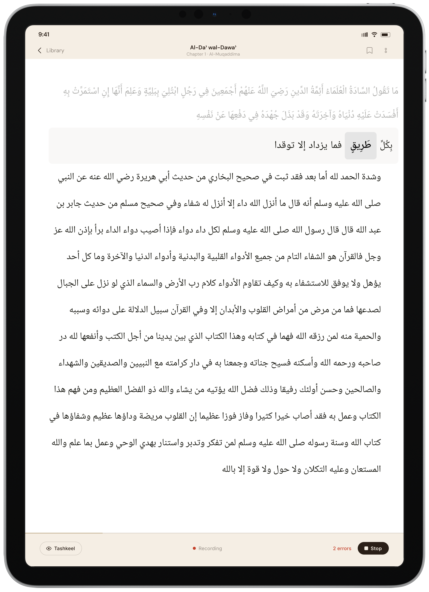
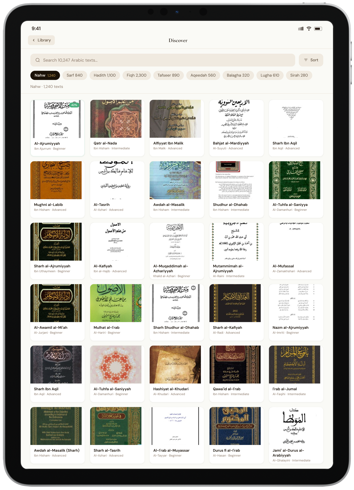

# Suhuf

**A reading and recitation platform for classical Arabic and Islamic texts.** Suhuf turns any classical Arabic book into an interactive reader: fully diacritized text you can tap for instant grammar and translation, and a live "read-aloud" engine that listens to you recite and corrects your mistakes in *tashkeel* (vowels), *i'rab* (case endings), and wrong words — in real time.

> Think **Tarteel, but for any Arabic text** — not just Qur'an.

🎥 **Demo video:** _(link here)_ &nbsp;•&nbsp; 💻 **Repo:** https://github.com/yousefh409/suhuf

Built solo for **Stanford CS 153 — "The One-Person Frontier Lab."** Track: **Application / Product** (with a substantial **Research** component in the recitation engine and ingestion pipeline). ~3 months, 349 commits, built almost entirely with Claude Code — see [AI Usage Disclosure](#ai-usage-disclosure).

| | |
|---|---|
|  |  |
| **The reader** — clean, diacritized, Scheherazade New typography. | **Tap any word** → full i'rab (إعراب): role, case, why. |
|  |  |
| **Translation tab** — sentence meaning + same-root vocabulary. | **Discover** — browse the catalog of ingested books. |

---

## Table of contents

- [The problem & the insight](#the-problem--the-insight)
- [What it does](#what-it-does)
- [How it works (architecture)](#how-it-works-architecture)
  - [1. Ingestion — turning a raw book into structured, diacritized data](#1-ingestion--turning-a-raw-book-into-structured-diacritized-data)
  - [2. Recitation — the live read-aloud correction engine](#2-recitation--the-live-read-aloud-correction-engine)
  - [3. The web reader — where it all surfaces](#3-the-web-reader--where-it-all-surfaces)
- [Evaluation & evidence](#evaluation--evidence)
- [What we tried and abandoned (and current limitations)](#what-we-tried-and-abandoned-and-current-limitations)
- [Reproducing this](#reproducing-this)
- [Monorepo layout](#monorepo-layout)
- [The `suhuf` CLI & verification](#the-suhuf-cli--verification)
- [AI usage disclosure](#ai-usage-disclosure)
- [Credits, sources & licenses](#credits-sources--licenses)

---

## The problem & the insight

Students of classical Arabic — and the millions of Muslims who read Islamic texts — hit two walls every day:

1. **You can't tell if you're reading the harakat correctly.** Classical Arabic is written without short vowels. The *same consonants* can be read a dozen ways, and the correct vowelization (*tashkeel*) and case endings (*i'rab*) carry the meaning. A teacher catches your mistakes; without one, you have no feedback loop. **Tarteel** solved this for the Qur'an. *Nothing exists for everything else* — Ajrumiyyah, Alfiyyah, hadith collections, tafsir, fiqh.

2. **The texts themselves are locked up.** The world's largest open corpus of classical Arabic ([OpenITI](https://github.com/OpenITI), ~7,000+ books) is undiacritized, structurally flat, and written in a markup format meant for scholars, not readers. There's no "clean edition" you can actually read on a phone, tap a word in, or recite along to.

**The insight:** these two problems share a key property that makes them tractable — **for a known book, the correct answer is already known.** We're not doing open-ended transcription or open-ended diacritization in the loop. We know exactly what the reader *should* say, so error detection collapses from "transcribe Arabic" (hard) to "score a small set of hypotheses against the audio" (much easier, and — critically — controllable for false positives). The same "the text is known" property lets us pour expensive offline AI into the ingestion pipeline *once* per book, then serve a clean reading experience cheaply forever.

This is what makes a one-person version of "Tarteel for everything" actually buildable.

## What it does

- **A clean reader for classical Arabic.** Ingested books render as a real reading surface — proper diacritized typography (Scheherazade New), hadith structure (isnād/matn), Qur'an verses set apart, poetry in hemistich columns, footnotes, paged or scroll layout, and paper/sepia/night themes.
- **Tap a word, get a tutor.** Every word is tappable: **I'rab** (full grammatical parse — part of speech, role, case, the *marker*, and *why*), **Translation** (sentence meaning + words sharing the same root), and **Ask AI** (a chat thread about that word). All Claude-powered, on demand.
- **Recite and get corrected, live.** Hit *Recite* and read aloud. The engine follows you word-by-word and colors each word as you go: **green** = correct, **red strikethrough** = wrong word, **blue underline** = i'rab error, **orange underline** = tashkeel error, **grey** = skipped. A legitimate pause (sukoon/waqf) is never flagged.
- **Memorization mode.** *Hide text* blanks every not-yet-read word and reveals each one only when you recite it correctly — recall practice with a safety net.
- **Discover + dashboard.** Browse the catalog, track reading progress, save books, resume where you left off.

## How it works (architecture)

Suhuf is a monorepo of three subsystems that hand off cleanly:

```
 OpenITI raw book                          a student's microphone
        │                                          │
        ▼                                          ▼
┌─────────────────┐   diacritized,        ┌──────────────────────┐
│  ingestion/     │   structured book     │  recitation/         │
│  (Python)       │ ───────────────────▶  │  (Python · PyTorch · │
│  parse→tashkeel │   (Supabase / JSON)   │   FastAPI)           │
│  →structure→LLM │                       │  XLS-R CTC + Whisper │
└─────────────────┘            │          └──────────────────────┘
                               ▼                    │ WebSocket (scores)
                       ┌────────────────────────────▼─────┐
                       │  web/ (Next.js · React · CF)      │
                       │  reader · word-tap agents · recite│
                       └───────────────────────────────────┘
```

### 1. Ingestion — turning a raw book into structured, diacritized data

`ingestion/` (Python) takes an OpenITI book and runs a multi-stage pipeline. The whole thing is one command (`python -m ingestion ingest <uri>`):

1. **Source selection** — finds the best-quality file in an OpenITI release (`.mARkdown` > `.completed` > raw).
2. **Parse** — OpenITI mARkdown → typed blocks + word tokens + chapters; extracts page markers, headings, poetry (hemistichs), and **inline Qur'an citations**.
3. **Deterministic hadith-structure detection** — a rule-based detector tags isnād / matn / takhrīj spans (see the headline result below). **This is where most of the engineering insight lives.**
4. **Tashkeel (diacritization)** — OpenITI text is largely undiacritized, so a neural diacritizer adds the harakat.
5. **LLM annotation** — Claude adds entity spans (people, places, book/hadith references, Hijri dates) and corrects low-confidence structural spans.
6. **Qur'an-reference resolution** — each Qur'an span is matched to an exact `sura:ayah` against a bundled Uthmani index.
7. **Upload** — the finished book lands in Supabase in the "tagged" format the reader consumes.

**The deterministic hadith detector — the standout result.** OpenITI books carry *no semantic tags*: there is no machine-readable marker for "this is the chain of narrators" vs "this is the Prophet's words." A naïve approach — ask an LLM to label structure — gave **~8% coverage** on *Bulugh al-Maram* (1,573 hadith): the model triaged under its token budget, skipped most, and mislabeled boundaries.

The fix was a linguistic insight, not more AI. Marker prevalence varies wildly across collections, so we anchored on the *universal* one — the prophetic-speech marker (`قال رسول الله ﷺ`), which reliably divides the isnād from the matn in *every* collection:

| Collection | `«…»` quotes | رواه/أخرجه | قال رسول/عن النبي | حدثنا |
|---|---:|---:|---:|---:|
| Bukhari | **0** | 135 | 2,561 | 18,641 |
| Muslim | 7,759 | 30 | 2,325 | 23,329 |
| Tirmidhi | **0** | 327 | 2,365 | 10,781 |
| Bulugh | 1,347 | 1,389 | 508 | 1 |

A four-tier matcher (prophetic-marker → quote-fallback → narrator-`قال:` hinge → cross-reference/grading) plus cross-block stitching took coverage from **8% → 99.4%** with **zero matn truncations**. The remaining ~10 blocks are numbering artifacts and scholarly notes. Tier-by-tier in the commit history: 57% → 73% → 87% → 94% → 97% → ~99%.

**Human/AI division of labor (confidence-gated merge).** Deterministic high-confidence boundaries are *locked*; the LLM is restricted to entity tagging and may only *correct* boundaries the rules themselves flagged as uncertain (`confidence < 0.9`). Rules and Claude cooperate instead of competing — and we moved the expensive judgment (entities, ambiguous boundaries) to the model while keeping the cheap, near-perfect work (structure) deterministic and free.

**The format rewrite.** We originally stored books as word tokens + integer-index spans and asked the LLM to emit those indices. It failed three measurable ways: chunks truncated at **7,999 / 8,192 output tokens**, nested entities got dropped (**1 vs 12** person-spans survived inside structured blocks), and integer boundary precision was **47% vs 96%** for the marker tier (counting is exactly what LLMs are worst at). We redesigned the storage format to compact HTML-style boundary *tags* (`<isnad>…<person>…</person>…</isnad>`), which fixed all three and let us upgrade the annotator from Haiku to Sonnet. Crossing spans (an entity straddling a structural edge) are handled by a close-and-reopen renderer that emits valid nested markup for *any* span set.

Details: [`docs/reader/ingestion-pipeline.md`](docs/reader/ingestion-pipeline.md), [`docs/reader/book-format.md`](docs/reader/book-format.md), [`docs/reader/dev-loop.md`](docs/reader/dev-loop.md).

### 2. Recitation — the live read-aloud correction engine

`recitation/` (Python · PyTorch · FastAPI) is the research heart of the project. The product brief is [`recitation/ONE-PAGER.md`](recitation/ONE-PAGER.md); the architecture is [`recitation/ARCHITECTURE.md`](recitation/ARCHITECTURE.md).

**Two models, because neither does both jobs.** This is the core design idea:

- **Whisper** (`whisper-small`, 244M) answers *"where in the text is the reader?"* It recognizes what was said but outputs **undiacritized** text — useless for vowel assessment, perfect for position tracking.
- **A fine-tuned XLS-R 300M CTC model** (Wav2Vec2, 58 diacritized Arabic character tokens, trained on the ClArTTS classical-Arabic corpus) answers *"did they say the right diacritics?"* It can distinguish فَ from فُ from فِ, but its raw decode is too noisy to track position.

The split plays to each model's strength.

**Reference-known hypothesis scoring (why false positives stay low).** Because we know the exact diacritized text, we never transcribe freely. For each word we score the *expected* form against a small set of deliberately-wrong alternatives generated from [`arabic.py`](recitation/arabic.py) (every case ending; every internal vowel swap). If a wrong hypothesis out-scores the expected form by enough, we flag it. The whole pipeline is tuned around one principle, stated in [`recitation/CLAUDE.md`](recitation/CLAUDE.md):

> **False negatives ≫ false positives.** Flagging a correct reading destroys trust. When in doubt, assume the student is correct. Target FP rate **< 2%** — this is sacred text.

The keystone is the **sukoon escape hatch**: a pausal/waqf form (sukoon on the final letter) is always valid, so `effective_score = max(expected, sukoon)` and every threshold compares against that. A reader who pauses is never wrong.

**An ensemble of ~10 signals, routed by where each is trustworthy.** Rather than one score, each word accumulates ~10 independent signals — per-frame CTC scores, i'rab/tashkeel hypothesis deltas, a per-character "peak-frame" diacritic margin (CTC concentrates diacritic evidence in 1–2 frames, so we hunt the peak), a phrase-differential re-score, a greedy-decode consonant match for wrong-word detection, and a segmentation-free goodness-of-pronunciation posterior. Crucially, the decision rules are **stratified**: a signal is only trusted in the score band where it was empirically verified at ~0% false positive, rather than blindly OR-ing signals together (which reintroduces false positives). Forced alignment is a hand-written CTC Viterbi.

**Streaming.** A `StreamingSession` keeps an 8-second audio ring buffer, tracks the cursor with careful guardrails (Whisper garbles Arabic proper nouns, common particles appear everywhere, readers backtrack), locks a word's score after 3 consistent cycles to stop flicker, and re-scores on full audio with tighter thresholds when you hit "done." First feedback lands in **~1.2s**.

The web reader talks to this engine over a WebSocket; the contract is token IDs (the engine never learns about blocks/pages — the reader maps scores onto the right words).

Details: [`docs/recitation/system.md`](docs/recitation/system.md), [`docs/recitation/dev-loop.md`](docs/recitation/dev-loop.md).

### 3. The web reader — where it all surfaces

`web/` is a **Next.js 16 / React 19 / Tailwind 4** app deployed on **Cloudflare Workers** via OpenNext, backed by **Supabase**.

- **The reader** (`/reader/<openiti_id>`) renders the tagged book with a "Clean Edition" design (hierarchy via type and space, not color): muted isnād with accented transmission verbs, bold matn, green Qur'an verses, poetry hemistich grids, footnotes, hadith cards, scroll/paged layouts.
- **Word-tap agents** — tapping a word builds a `{word, sentence context, position}` selection and calls one of three Next.js API routes (`/api/agents/irab`, `/translate`, `/ask-ai`), each hitting Claude Sonnet with a task-specific prompt and returning structured JSON.
- **Recite mode** — captures mic audio via an AudioWorklet (16 kHz mono PCM), streams it to the recitation engine, and paints per-token error colors as scores arrive, auto-extending the passage window as you scroll. Includes pause/resume/end and the hide-text memorization mode. The *Recite* button is disabled on books without tashkeel.
- **Dev vs prod data** — in dev the reader reads `web/data/*.json` dumped straight from the ingestion CLI (fast iteration, no upload); in prod it reads Supabase. Same in-memory shape either way.
- **Auth & theming** — Supabase email auth with invite-code-gated signup (cohort code `CS153`), route gating enforced at both the route-group layout and Edge middleware, and a cookie-driven theme system that stamps `data-app-theme` server-side for no-flash paper/sepia/night.

Details: [`docs/reader/app.md`](docs/reader/app.md), [`docs/preferences-theming.md`](docs/preferences-theming.md), [`docs/auth/`](docs/auth).

## Evaluation & evidence

We evaluated the two AI-heavy subsystems independently. **All numbers below come from committed eval scripts and reports you can re-run.**

### Recitation accuracy (`recitation/eval.py` → [`recitation/eval_baseline.json`](recitation/eval_baseline.json))

The methodology is **mutation-based**: hold the real audio fixed and *mutate the reference text* to induce errors on demand (every case ending, every internal-vowel swap, combos, word substitutions). This generates unlimited labeled errors at every position without re-recording. Two data sources: real human **sessions** (in-domain speaker) and an external **corpus** (held-out second MSA speaker from the [Arabic Speech Corpus](https://en.arabicspeechcorpus.com/) — leakage-free, since the model trained on ClArTTS).

| Metric | Sessions (in-domain) | Corpus (unseen speaker) | Target |
|---|---:|---:|---:|
| **False-positive rate** | **0.0%** (0/83) | **3.77%** (2/53) | < 2% |
| Overall detection | 74.1% | 83.4% | — |
| Wrong-word | **100%** (20/20) | **100%** (6/6) | > 95% |
| I'rab | 76.9% (333/433) | 86.4% (242/280) | > 90% |
| Tashkeel | 56.6% (94/166) | 66.0% (70/106) | > 90% |
| Combo errors | 88.8% (71/80) | 100% (53/53) | — |

**Before/after.** The committed baseline from early development ([`recitation/experiments.md`](recitation/experiments.md), 2026-04-01) was **FP 5.2%, i'rab 51%, tashkeel 61%, word 52%.** Iteration drove wrong-word detection to 100% and FP to ~0% on the in-domain speaker, trading some raw vowel recall for false-positive safety. Streaming tests ([`recitation/test_streaming.py`](recitation/test_streaming.py)) show ~0% FP on correct readings, ~1.2s to first response, no flicker.

**Honesty notes (so the numbers aren't cherry-picked):**
- The committed baseline above is a small config (10 items/source). On a larger in-domain run, false positives were **1.8% (12/652)**, not literally zero — so read in-domain FP as *near-zero, ~0–2%*, and treat the **unseen-speaker FP (3.77%)** as the real generalization signal, which is *above* our 2% target.
- Mutation-based detection is an *upper bound* — perturbing text against correct audio is easier than catching a real human mispronunciation.
- We commit our own blind spots: internal **dropped-vowel** detection sits near **0%**, the direct, measured cost of the sukoon-lenient policy. See [limitations](#what-we-tried-and-abandoned-and-current-limitations).

### Ingestion quality

- **Hadith structural coverage:** **8% → 99.4%** on Bulugh al-Maram (1,573 hadith), 0 matn truncations ([`docs/superpowers/specs/2026-06-03-deterministic-hadith-structure-design.md`](docs/superpowers/specs/2026-06-03-deterministic-hadith-structure-design.md)).
- **LLM-as-judge accuracy** (`ingestion/eval/llm_judge.py` → [`ingestion/eval/judge_results.json`](ingestion/eval/judge_results.json)) — Claude Sonnet 4.6 grading the Haiku annotations, n=12/category:

| Category | Accuracy |
|---|---:|
| Qur'an spans | 100% |
| Structural spans (isnād/matn/takhrīj) | 95.8% |
| Poetry detection | 91.7% |
| Person + role | 83.3% |
| Block relabel | 66.7% (0 *incorrect*; partials are a labeling convention) |

- **No human ground truth exists** for hadith structure (OpenITI carries none), so structural precision is an LLM-judge *estimate* — explicitly disclaimed in the code. Qur'an refs *are* checked deterministically against the Uthmani index (`ingestion/eval/check_quran_refs.py`).
- **258 tests across 24 files** in `ingestion/tests/`.

## What we tried and abandoned (and current limitations)

Honest failure analysis — these are the dead ends and the known gaps.

**Recitation — the model graveyard.** Before the current architecture, the recitation engine was a separate **NVIDIA NeMo Conformer** model fine-tuned on PCD/ClArTTS (~8 GB of checkpoints still on disk, a 3 MB training log). It was abandoned in a from-scratch rewrite to a leaner HuggingFace Wav2Vec2 + CTC-hypothesis-scoring path; only the fine-tuned XLS-R checkpoint was carried over. On top of that, the XLS-R model itself went through ~a dozen fine-tune iterations (`v3 → v4 → v5 → mixed`) plus a wave of same-week **specialist experiments** (consonant-fix, contrastive, i'rab- and tashkeel-specialist variants) that aren't wired into the live engine. A **MixGoP** GMM scorer (Gaussian mixtures on intermediate SSL layers, NAACL 2025) was built but underdelivered — GMMs only fit 4 of 6 diacritics and the signal isn't used by any live rule. The learned **GBM** error-classifiers survive only as a thin batch-only fallback; the real intelligence is hand-tuned thresholds.

**Recitation — the acoustic ceiling.** The deep finding from iteration: internal-vowel (tashkeel) detection plateaus around **57–66%** no matter how we stack signals, while i'rab (~77–86%) and wrong-word (100%) are reliably high. This is an **acoustic limit, not a model limit** — a dropped or under-articulated internal vowel produces a near-sukoon form that is genuinely ambiguous in the signal, especially for casual/connected speech, and our sukoon-lenient policy deliberately lets those pass to protect the FP budget. The honest takeaway: the engine is strong on the errors that *matter most and are acoustically distinct*, and the bottleneck on the rest is the signal, not the network.

**The data bottleneck.** The committed in-domain eval runs on a single speaker on a laptop mic, and only a handful of real recitation sessions exist. The model has far more capacity than our labeled data exercises. Real usage data — not a bigger model — is the constraint.

**Ingestion gaps.** Two parallel book formats currently coexist (legacy token-index + the new tagged format, the intended replacement). Diacritization quality has no committed benchmark — the original "Sadeed" diacritizer never shipped (weights not public) and the default Shakkala engine silently falls back to a FLAN-T5 model in our environment. Only OpenITI is wired (a turath.io adapter is specced, not built). Most entity resolvers (person/place/book refs) detect-and-style but don't yet link to external datasets. Some docs are stale (e.g. `docs/reader/app.md` describes an earlier iOS concept; live code points at `xlsr_mixed` while some docs still say `ssl_xls_r_v5`).

**Product gaps.** Recite needs diacritized text, and Supabase-served books may lack it (demo via local-mode + a tashkeel'd dump). The invite-code gate is client-side by design tradeoff. There's no caching layer on the word-tap Claude calls yet.

## Reproducing this

```bash
git clone https://github.com/yousefh409/suhuf.git && cd suhuf
cp .env.example .env   # fill in SUPABASE_URL, SUPABASE_SERVICE_ROLE_KEY, OPENROUTER_API_KEY, etc.
```

**Web reader (the easiest thing to run):**
```bash
cd web && npm install && npm run dev      # http://localhost:3000
```

**Ingest a book and read it locally (the core dev loop):**
```bash
cd ingestion
python -m venv venv && source venv/bin/activate && pip install -r requirements.txt
# parse + tashkeel + Claude enrichment, dump JSON straight into the reader (no upload):
python -m ingestion ingest <openiti_uri> --dump ../web/data --dry-run --tashkeel-engine shakkala
# then open http://localhost:3000/reader/<openiti_id>  (or /inspector/<openiti_id>)
```
Requires `OPENROUTER_API_KEY`. Full dev loop: [`docs/reader/dev-loop.md`](docs/reader/dev-loop.md).

**Recitation engine:**
```bash
cd recitation
pip install -r requirements.txt
python -m uvicorn server:app --host 0.0.0.0 --port 8000   # http://localhost:8000
python eval.py --report eval_baseline.json                 # reproduce the eval table
```
The fine-tuned XLS-R model lives under `recitation/models/` (large; gitignored). Recitation dev loop: [`docs/recitation/dev-loop.md`](docs/recitation/dev-loop.md).

## Monorepo layout

| Package | Stack | Purpose |
|---|---|---|
| [`web/`](web) | Next.js 16, React 19, Tailwind 4, Cloudflare (OpenNext) | Reader, word-tap agents, recite UI, dashboard, marketing site. |
| [`ingestion/`](ingestion) | Python | OpenITI mARkdown → parse → tashkeel → deterministic structure → Claude annotation → Supabase. |
| [`recitation/`](recitation) | Python, PyTorch, FastAPI | Live read-along engine: XLS-R 300M CTC + Whisper, reference-known hypothesis scoring. |
| [`supabase/`](supabase) | SQL | Schema and migrations for the shared backend. |
| [`scripts/suhuf/`](scripts/suhuf) | Node | Internal shipping/verify CLI. |
| [`docs/`](docs) | Markdown | Architecture docs + the full plan/spec history (19 plans, 18 specs). |

## The `suhuf` CLI & verification

All shipping goes through `./bin/suhuf` (raw `git push` on `main` is blocked by a hook):

```
suhuf ship             Rebase feature branch onto origin/main, verify, force-with-lease push
suhuf quickfix "msg"   Commit on main → push temp branch → wait for CI green → fast-forward main
suhuf verify [--all]   Lint / typecheck / test packages affected by the diff vs origin/main
suhuf status           Branch + worktree + drift summary
suhuf worktree new <branch> | finish | prune | sync-worktrees
```

Per-package verify steps live in [`scripts/suhuf/src/lib/packages.mjs`](scripts/suhuf/src/lib/packages.mjs): `web/` runs lint + `tsc --noEmit` + `next build`; the Python packages run `compileall` + `pytest --co`. CI is [`.github/workflows/verify.yml`](.github/workflows). See [`CLAUDE.md`](CLAUDE.md) for the enforced project rules.

## AI usage disclosure

Per CS 153 policy, here is exactly how AI was used.

**This project was built almost entirely with [Claude Code](https://www.anthropic.com/claude-code)** (Anthropic's agentic CLI), driven by a human-in-the-loop "superpowers" skills workflow (a set of Claude Code skills that enforce spec/plan/TDD/review discipline): every feature went through *brainstorming → written spec → written plan → test-driven implementation → verification → code review*. The full paper trail is committed — **19 plans and 18 specs** in [`docs/superpowers/`](docs/superpowers) — and the 349-commit history shows the iteration. I made all the architectural decisions, wrote the prompts, recorded the recitation test audio, defined the evaluation methodology, and reviewed and redirected the AI at each step (for example, choosing the deterministic-detector-over-LLM approach for hadith structure, and the from-scratch rewrite of the recitation engine).

The recitation engine in particular was built in long autonomous research loops. My longest single session was ~12 hours: I had Claude Code iterate against my own test recordings — research a new architecture, implement it, score it on the eval harness, repeat — until it hit a target accuracy and false-positive rate. I ran several of these, checked the results each morning, and pointed it in a new direction until it landed somewhere solid. What survived wasn't a single clever trick: it's a fine-tuned speech model with a handful of complementary signals layered on top, which turned out to be the only way to get the false-positive rate low enough to actually trust.

**AI is also a runtime component of the product**, not just a build tool:
- **Claude** (Haiku 4.5 + Sonnet) annotates books in the ingestion pipeline (entities, structure correction, metadata) and powers the live word-tap I'rab / Translation / Ask-AI features.
- **A fine-tuned XLS-R 300M CTC model** + **Whisper** power the recitation engine.
- **Neural diacritizers** (Shakkala / FLAN-T5) add tashkeel during ingestion.

The recitation engine is a **from-scratch rewrite**; only the fine-tuned XLS-R model checkpoint was carried over from the author's earlier prototype (the deleted NeMo implementation is not part of this codebase). All other code is original to this project.

## Credits, sources & licenses

- **Source texts:** the [OpenITI corpus](https://github.com/OpenITI) (classical Arabic / Islamic texts in mARkdown).
- **Inspiration:** [Tarteel](https://www.tarteel.ai/) — Suhuf generalizes its Qur'an read-along idea to any Arabic text.
- **Recitation models:** [XLS-R 300M](https://huggingface.co/facebook/wav2vec2-xls-r-300m) (Meta/Wav2Vec2) fine-tuned on the ClArTTS classical-Arabic corpus; [Whisper](https://github.com/openai/whisper) (OpenAI) for position tracking; eval on the [Arabic Speech Corpus](https://en.arabicspeechcorpus.com/) (Nawar Halabi). The intermediate-layer GMM scorer follows the **MixGoP** approach (NAACL 2025).
- **Diacritization:** [Shakkala](https://github.com/Barqawiz/Shakkala) and an Arabic FLAN-T5 tashkeel model, via the `arabic_vocalizer` library.
- **LLM:** [Anthropic Claude](https://www.anthropic.com/claude) (annotation + word-tap agents) and **Claude Code** (development).
- **Built solo** by [@yousefh409](https://github.com/yousefh409) for **Stanford CS 153**.

External corpora, model weights, and API keys are **not** redistributed in this repo; see `.env.example` and the per-package docs for how to obtain them.
