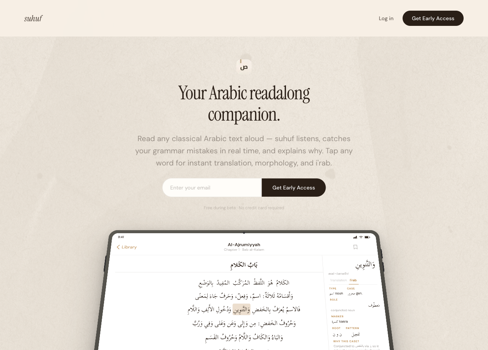
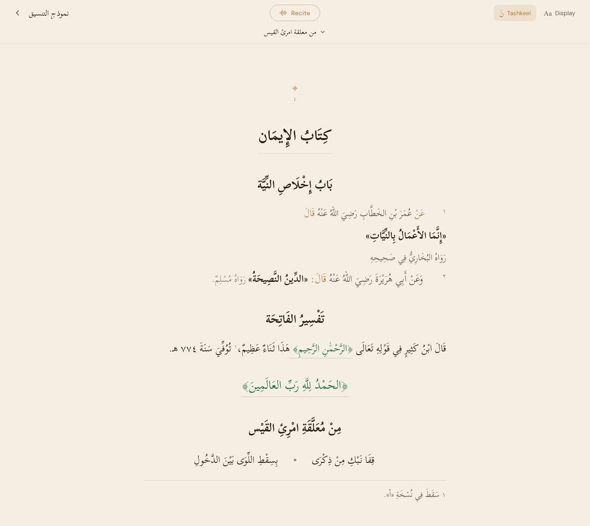
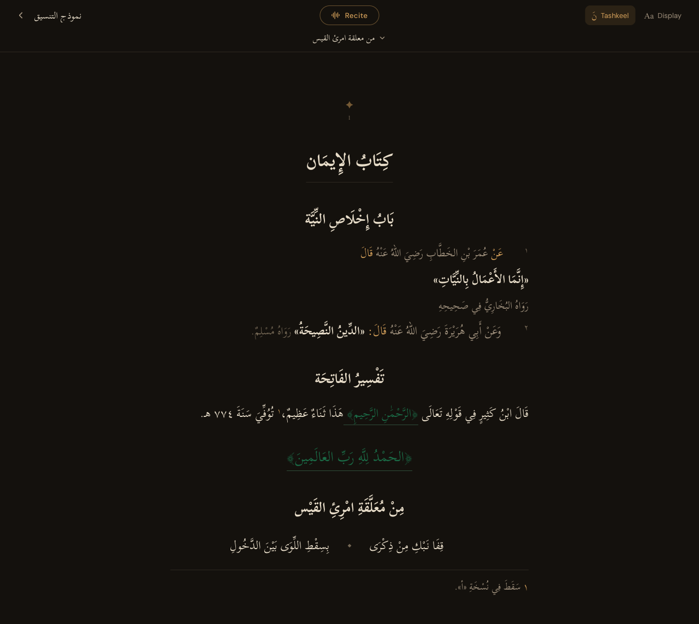
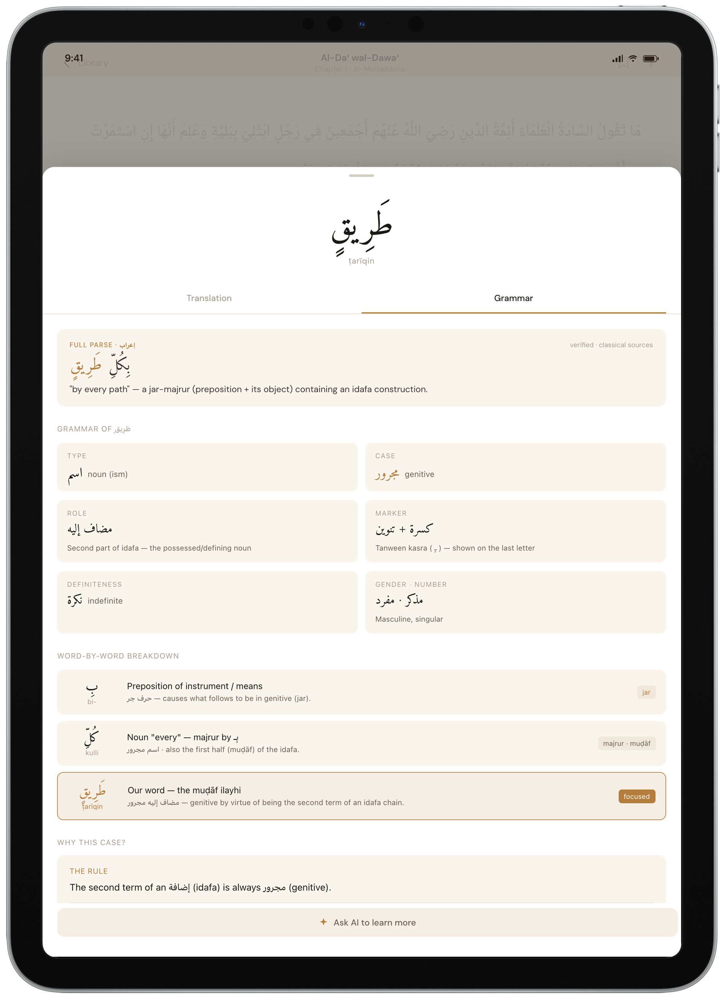
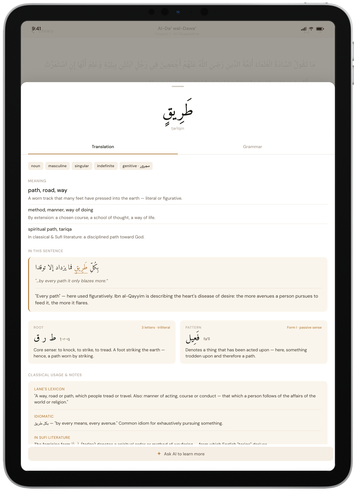

# Suhuf

**A reading and recitation platform for classical Arabic and Islamic texts.** Suhuf turns any classical Arabic book into an interactive reader — fully diacritized text you can tap for instant grammar and translation — and a live engine that listens to you read aloud and corrects your *tashkeel* (vowels), *i'rab* (case endings), and wrong words in real time.

> Think **Tarteel, but for any Arabic text** — not just Qur'an.

🚀 **Try it live:** [**suhuf.ai**](https://suhuf.ai) — sign up with invite code **`CS153`**.

💻 https://github.com/yousefh409/suhuf &nbsp;•&nbsp; Built solo for **Stanford CS 153** (Application / Product + Research). 349 commits, built almost entirely with Claude Code — see [AI usage](#ai-usage-disclosure).



| | |
|---|---|
|  |  |
| The reader rendering an ingested book — headings, isnād/matn, Qur'an verses, poetry, footnotes. | The same book in night theme. |
|  |  |
| Tap any word → full i'rab. | Translation + same-root words. |

<sub>Reader and landing shots are live captures from the running app; the word panels show the in-app word-tap feature.</sub>

## The problem

- **No feedback loop.** Classical Arabic is written without short vowels; the same letters can be read many ways, and the vowels carry the meaning. Without a teacher beside you, you can't tell if you're reading it right. Tarteel solved this for the Qur'an — nothing exists for everything else (grammar texts, hadith, tafsir).
- **The texts are locked up.** The largest open corpus, [OpenITI](https://github.com/OpenITI) (~7,000+ books), is undiacritized and written in scholarly markup — there's no clean edition you can read on a phone or recite along to.

**The insight:** for a *known* book the right answer is already known. That turns "transcribe Arabic" and "diacritize Arabic" (hard, open-ended) into "score a few hypotheses against the audio" (easy, and controllable for false positives) — which is what makes a one-person version buildable.

## What it does

- **A clean reader** — diacritized typography, hadith structure, Qur'an verses set apart, poetry, footnotes, paper/sepia/night themes.
- **Tap any word** → **I'rab** (full parse + why), **Translation** (sentence + same-root words), **Ask AI** (a tutor chat). Claude-powered, on demand.
- **Recite live** — read aloud and each word colors as you go: green = correct, red = wrong word, blue = i'rab error, orange = tashkeel error. A natural pause is never flagged.
- **Memorization mode** — hide the text; each word reveals only when you recite it correctly.

## How it works

```
 OpenITI book ──▶ ingestion/ ──▶ (Supabase / JSON) ──▶ web/ reader ◀── recitation/
                  parse·diacritize                       word-tap · recite   XLS-R CTC
                  ·Claude annotate                       (Next.js · CF)      + Whisper
```

- **`ingestion/`** (Python) — picks the best OpenITI source file, parses the mARkdown into structured blocks, adds diacritics with a neural diacritizer, has Claude tag entities (people, places, references) and resolve Qur'an citations to exact `sura:ayah`, then uploads the clean book.
- **`recitation/`** (Python · PyTorch · FastAPI) — the research core. **Two models, because neither does both jobs:** Whisper tracks *where* you are (it drops the vowels), and a fine-tuned **XLS-R 300M CTC** model grades *which vowels* you said. Because the text is known, it never transcribes — it scores the correct reading against a few deliberately-wrong alternatives, with one rule above all (`recitation/CLAUDE.md`): **false negatives ≫ false positives — target FP < 2%, this is sacred text.** A pausal/sukoon form is always accepted.
- **`web/`** (Next.js 16 · React 19 · Cloudflare) — renders the book, the word-tap agents (Claude Sonnet via API routes), and recite mode (mic → WebSocket → per-word colors). Supabase auth + invite codes; cookie-based theming.

## Evaluation & evidence

The recitation engine is where most of the iteration went. Evaluation is **mutation-based**: hold real audio fixed and mutate the known text to generate labeled errors on demand. The full log is [`recitation/experiments.md`](recitation/experiments.md).

**Datasets** (referenced by name in every table below, so the numbers stay comparable):

| Name | What it is | Role |
|---|---|---|
| **ClArTTS** | studio classical-Arabic speech | the base model's fine-tune data |
| **ASC** (Arabic Speech Corpus) | a held-out studio MSA speaker | generalization signal (leakage-free) |
| **in-house sessions** | ~206 words of real human reading, laptop mic | the realistic, noisy operating point |
| **Common Voice / Iqra_train** | 71k everyday read-aloud clips (Qur'an-filtered) | the "natural reading" domain |

Constraint throughout: **false positives < 2%** (sacred text — wrongly flagging a correct reading is the cardinal sin).

### Everything I tried

| Approach | What it is | Result | Status |
|---|---|---|---|
| **Whisper-small** (244M) | position tracking ("where am I?") | reliable cursor; but drops vowels | **kept** |
| **XLS-R 300M CTC** `ssl_xls_r_v5` | diacritic scorer, 58 tokens, fine-tuned on ClArTTS | the core scorer | **kept (primary)** |
| **Hypothesis scoring** | score the known reference vs error alternatives (no free transcription) | the FP-safe core | **kept** |
| **Sukoon/waqf escape hatch** | `eff = max(expected, sukoon)` | a legitimate pause is never flagged | **kept** |
| **Hand-tuned signals S0–S6** | consonant-match, per-char peak-frame, greedy mismatch, phrase-differential, shadda… | the working discriminators | **kept** |
| **MixGoP GMM scorer** | goodness-of-pronunciation GMMs on XLS-R hidden layers 14/16/18 | only fit 4/6 diacritics (fatḥa ~8.2k, kasra ~3.4k, ḍamma ~1.6k, fatḥatān ~240 samples; the two tanwīn too sparse); unused by any live rule | **demoted to optional signal** |
| **GBM classifiers** | gradient-boosted error + error-type classifiers | batch-only fallback @ p≥0.75; trainers later deleted | **demoted to fallback** |
| **Dropped-vowel split + pd-gap fill + FP floors** | Phase-2 accuracy push | fixed a 0%-detection blind spot; in-house FP **4% → 1.8%** | **kept** |
| **Qwen2-Audio-7B** | audio-LLM second-opinion judge | no usable signal | **parked** |
| **NeMo ClArTTS diacritizer** | free-prediction second opinion / confirm-rescue | ~90% agreement on the final diacritic → **8–10% standalone FP** (4–5× budget); alignment collapses under noise (64%→21%→7%); ~0 gain | **parked** |
| **NeMo + XLS-R agreement** | Tarteel-style two-model agreement | FP-safe but capped | **parked** |
| **w2v-bert-2.0 600M CTC** | bigger CTC backbone | blank-collapse (fixed via `add_adapter`); under noise-aug FP-prone, discrimination degraded (**Cohen's d 0.91 → 0.18; detection 37% → 13%**) | **parked** |
| **MUSAN noise augmentation** | noise + music + babble + speed perturb | hurt fine-detail discrimination | **parked** |
| **IqraEval phoneme-CTC** | wav2vec2-base MDD, Common-Voice-trained | Common Voice i'rab 79 / tash 56 / **cons 99**; studio i'rab 23–38 | **deferred member** (best consonant model) |
| **Common-Voice-only fine-tune** | adapt to everyday reading | big CV gains but **catastrophic studio-i'rab forgetting (→31)** | **superseded** |
| **Mixed fine-tune** `xlsr_mixed` | ClArTTS + Common Voice | best single model for everyday reading | **kept (best single model)** |
| **Contrastive-margin fine-tune** | hard-negative margin loss | no CV-vowel gain (proved the ceiling); small studio-consonant gain | **`contr1000` → consonant member** |
| **RoutedEnsemble** | per-error decorrelated members, flag on ≥k agreement | the shipped detector (below) | **shipped** |

### The shipped detector — RoutedEnsemble

On the **in-house sessions** (206 words), thresholds **jointly recalibrated so the combined per-word FP holds < 2%** (copying the per-cell thresholds instead stacks to 4.85%):

| @ < 2% combined FP — in-house sessions (206 words) | i'rab | tashkeel | consonant |
|---|--:|--:|--:|
| base model alone | 49 | 72 | 57 |
| **shipped ensemble** (`base` + `i3rab_contr` + `contr1000`) | **80** | **91** | **64** |

Combined FP **1.94%**. Routing: i'rab = `base` + `i3rab_contr` (2-of-2 agreement); tashkeel = `base`; consonant = `contr1000`. The deferred IqraEval member would push i'rab → ~94 / consonant → ~92.

**Generalization** (single base model, mutation suite, all phrases): on the **ASC** held-out studio speaker, ~**87%** detection at ~**1.7%** FP. **Wrong-word ~100%** everywhere (the audio is obviously different).

### Fine-tune search — detection % @ < 2% FP

| Model | CV i'rab | CV tash | CV cons | studio i'rab | studio tash | studio cons |
|---|--:|--:|--:|--:|--:|--:|
| base `ssl_xls_r_v5` | 32 | 37 | 64 | 84–97 | 78–99 | — |
| Common-Voice-only FT | 42 | 71 | 92 | 31 ⚠️ | 90 | 71 |
| **mixed `xlsr_mixed`** | **45** | **76** | **94** | 61 | 90 | 79 |
| contrastive-margin FT | 43 | 76 | 94 | 61 | 89 | **88** |

*CV = Common Voice (everyday reading); studio = held-out ClArTTS/ASC-style reading, per error type.* Each model is strongest on its own training domain — none crosses both, which is exactly why the shipped system **routes per error type** rather than using one model. (These per-error studio numbers run at a looser per-cell FP than the stricter combined-FP, noisy operating point of the shipped table above — that's why `base` looks higher here.)

### The acoustic ceiling (Common Voice, `xlsr_mixed`)

| Error | clearly articulated | under-articulated | overall |
|---|--:|--:|--:|
| i'rab | **86.7%** (n=278) | 9% (n=132) | 45% |
| tashkeel | **97.1%** (n=553) | 51% (n=143) | 76% |

When the vowel is actually in the audio it's caught **87–97%**. The misses are vowels everyday readers *drop* — not physically present, so (by the sukoon rule) they must not be flagged. *Every* fine-tune plateaus identically: it's the **signal, not the model**.

### Why the shipped numbers are conservative

A larger 9-member tuned ensemble looked better — i'rab **94.0** / tashkeel 93.5 / consonant 91.8 on the sessions — but nested 5-fold cross-validation exposed overfitting (i'rab 94.0 → **92.0**, tashkeel 93.5 → **86.2**) and combined FP creeping to **2.5–2.9%**. The shipped 3-member ensemble (80/91/64 at **1.94%** combined FP) is the version that actually holds the budget. **The binding constraint is now provably data, not model** — only ~206 words of real in-house audio exist.

### From the start

[`experiments.md`](recitation/experiments.md) baseline (2026-04-01): FP **5.2%**, i'rab **51%**, tashkeel **61%**, word **52%** → the journey above.

### Early traction & expert feedback

Two Arabic teachers reviewed it — one called it very useful; the other gave detailed praise (it "links reading, correction, and comprehension at once… and brings the experience close to learning directly with a teacher"; full quote in [`docs/video-qa.md`](docs/video-qa.md)). Beyond that: an Arabic-language expert with **10k+ followers** has agreed to come on board and help market it, and the **waitlist has 30+ signups** — early signal the demand is real.

### Ingestion

Qur'an citations resolve to exact `sura:ayah` (checked deterministically against a Uthmani index), book annotations are spot-graded by an LLM-as-judge harness, and the package ships **258 tests** across 24 files.

### Known limits

The in-house audio is essentially one speaker (~206 words) — too small to certify >95% detection or <2% FP; diacritization quality has no committed benchmark (the default Shakkala engine falls back to FLAN-T5 in our env); recite needs diacritized text (Supabase books may lack it); only OpenITI is wired so far.

## Reproducing this

```bash
git clone https://github.com/yousefh409/suhuf.git && cd suhuf
cp .env.example .env   # SUPABASE_URL, SUPABASE_SERVICE_ROLE_KEY, OPENROUTER_API_KEY, …

cd web && npm install && npm run dev          # reader at http://localhost:3000

# ingest a book and read it locally (no upload):
cd ingestion && pip install -r requirements.txt
python -m ingestion ingest <openiti_uri> --dump ../web/data --dry-run --tashkeel-engine shakkala
# → open http://localhost:3000/reader/<openiti_id>

# recitation engine + reproduce the eval:
cd recitation && pip install -r requirements.txt
python -m uvicorn server:app --port 8000
python eval.py --report eval_baseline.json
```

Dev loops: [`docs/reader/dev-loop.md`](docs/reader/dev-loop.md), [`docs/recitation/dev-loop.md`](docs/recitation/dev-loop.md). Model weights and corpora are large/gitignored — see the per-package docs.

## Layout & tooling

| Package | Stack | Purpose |
|---|---|---|
| [`web/`](web) | Next.js 16, React 19, Cloudflare | Reader, word-tap agents, recite UI, dashboard. |
| [`ingestion/`](ingestion) | Python | OpenITI → parse → diacritize → Claude annotate → Supabase. |
| [`recitation/`](recitation) | Python, PyTorch, FastAPI | Live read-along: XLS-R CTC + Whisper, hypothesis scoring. |
| [`supabase/`](supabase) | SQL | Schema + migrations. |
| [`docs/`](docs) | Markdown | Architecture docs + the full plan/spec history. |

Shipping goes through `./bin/suhuf` (raw `git push` to `main` is hook-blocked): `suhuf ship` / `quickfix` / `verify` / `status` / `worktree …`. See [`CLAUDE.md`](CLAUDE.md).

## Project Q&A

<details>
<summary>The four project-video questions, answered in full (also in <a href="docs/video-qa.md"><code>docs/video-qa.md</code></a>).</summary>

### Q1 — Why did you build this?

Two bottlenecks:

- **No feedback loop for reading classical Arabic.** It's written without short vowels; the same letters can be read several ways, and the vowels (*tashkeel*) and case endings (*i'rab*) carry the meaning. Without a teacher beside you, you can't tell if you're reading it right. **Tarteel** solved this for the Qur'an — nothing existed for everything else (grammar primers, hadith, tafsir, fiqh).
- **The texts are locked up.** The largest open corpus, [OpenITI](https://github.com/OpenITI) (~7,000+ books), is undiacritized and written in scholarly markup — there's no clean edition you can read on a phone or recite along to.

**Inspiration:** Tarteel, plus the CS 153 premise that one person + AI can now build what used to take a team. The unlock was realizing that **for a known book the correct answer is already known** — which turns "transcribe / diacritize Arabic" (hard, open-ended) into "score a few hypotheses against the audio" (easy, and controllable for false positives). That's what makes a one-person read-along feasible.

### Q2 — How exactly does it work?

A **domain-specific product** with a real research core, in three layers.

**[1] Research — the recitation engine.**
- **Two models, because neither does both jobs:** Whisper (`whisper-small`) tracks *where* you are in the text (it throws away the vowels); a fine-tuned **XLS-R 300M CTC** model (58 diacritized Arabic tokens) grades *which vowels* you actually said.
- **Reference-known hypothesis scoring:** because the text is known, it never transcribes — it scores the correct reading against deliberately-wrong alternatives. One rule governs everything: **false negatives ≫ false positives, target FP < 2%** (this is sacred text; wrongly flagging a correct reading destroys trust).
- **Training & eval data:** fine-tuned on **ClArTTS** (studio classical Arabic), with **Common Voice / Iqra_train** added for the everyday-reading variants; evaluated with a **mutation-based** harness (hold real audio fixed, mutate the known text to make labeled errors) against a held-out **Arabic Speech Corpus** speaker and ~206 words of **in-house** recordings. Development ran through a long graveyard of architectures (a NeMo Conformer, MixGoP GMMs, GBM classifiers, a Qwen2-Audio LLM judge, w2v-bert 600M, noise augmentation, per-error contrastive fine-tunes) and landed on a fine-tuned model + a decorrelated-agreement ensemble. Key finding: **everyday-reading vowel detection is acoustically capped**, not model-limited — if a reader drops a vowel, the "error" isn't physically in the audio.

**[2] Application / Product — architecture & deployment.**
- **`ingestion/`** (Python): OpenITI book → parse the markup into structured blocks → add diacritics with a neural model → **Claude** tags entities (people, places, references) and resolves Qur'an citations to exact `sura:ayah` → upload to Supabase.
- **`web/`** (Next.js 16 / React 19, deployed on **Cloudflare Workers** via OpenNext, **Supabase** backend): the reader, the word-tap features, recite mode (mic → WebSocket → per-word colors), auth, and theming.
- **`recitation/`** (FastAPI + PyTorch): a separate service running the models (GPU in production); the web app talks to it over a WebSocket and maps scores back onto the exact words on screen. (Production GPU deploy on **Modal** is in progress.)

**[3] Agents.** Claude annotates the books (Haiku + Sonnet) and powers the live word-tap **I'rab / Translation / Ask-AI** features (Sonnet). The whole project was built with **Claude Code** on a strict spec → plan → test → review workflow (19 plans + 18 specs committed).

### Q3 — Use cases, impact, and how people use it

**Who it's for:** students of Arabic and Islamic studies — especially non-native learners — who can't always get a teacher; people memorizing texts; and anyone who wants to actually *read* the classical library instead of staring at bare consonants.

**How people use it:** open any ingested book → read aloud and get live correction → tap a word you don't know for its grammar, meaning, and root → switch on hide-text to memorize. Every OpenITI book becomes interactive and recitable.

**Impact:** it puts a teacher-in-the-loop feedback experience in front of anyone, and opens a corpus that is currently unreadable to most people. It teaches i'rab *practically* (by correcting you as you read) and grammar *by understanding* (every word explained with its reason), instead of by rote.

**Expert feedback (evidence).** Two Arabic teachers reviewed the site. One called it very useful. The second gave detailed written feedback — translated:

> "A very distinctive idea for teaching Arabic to non-native speakers. Its standout is that it links reading, correction, and comprehension at the same time: the student reads aloud and receives immediate correction of pronunciation and harakat, which helps him master i'rab practically. It also gives a clear grammatical (*nahw*) and morphological (*sarf*) analysis of each word, with the reason explained — helping you understand the rules rather than just memorize them. And being able to see a word's meaning, root, and usage right while reading adds great value for building vocabulary. In my view it can be a powerful support for studying the *matns* (classical texts), and it brings the learning experience close to direct instruction with a teacher."

He also suggested teaching-oriented additions (graded levels, end-of-lesson quizzes, audio rule explanations, per-student progress tracking) — a good fit for classroom use, though Suhuf is built for independent readers rather than teachers. (Full feedback in Arabic in the appendix.)

**Early traction.** Beyond expert review: an Arabic-language expert with **10k+ followers** has agreed to come on board and help market the product, and the **waitlist already has 30+ signups** — early signal that the demand is real.

### Q4 — What I'd add next

**Catalog & reading:**
- **Open the full library** — scale the AI ingestion pipeline to the **~10,000 books** already available, so the catalog is the whole classical corpus (every title diacritized, structured, and recitable) instead of a handful of titles.
- **Notes & highlights** — let readers annotate passages, save favorites, and keep their own marginalia while reading.
- **A personal vocabulary** — save tapped words with their root and meaning into review lists / flashcards, so reading itself builds vocabulary over time.
- **Mobile** — a phone app for reading and reciting anywhere.

**Recitation engine:**
- **Gather real recitation data** — collect real user reading sessions. Accuracy and false-positive certification are now *data*-limited, not model-limited (~206 words of in-house audio today), so this is the single biggest lever.
- **Keep training the model to be better** — fine-tune on that new data and expand the ensemble (e.g. ship the deferred IqraEval member → i'rab ~94, consonant ~92) to push detection higher while holding FP < 2%.
- **Better diacritization** quality, with a committed benchmark.
- Finish the **decorrelated-ensemble + GPU (Modal)** deployment already in progress.

#### Appendix — original expert feedback (Arabic)

> اطلعت على الموقع، وأراه فكرة مميزة جدًا في تعليم العربية لغير الناطقين بها.
> أبرز ما فيه أنه يربط بين القراءة والتصحيح والفهم في وقت واحد؛ فالطالب يقرأ بصوته، ويتلقى تصحيحًا فوريًا للنطق والحركات، مما يساعده على ضبط الإعراب عمليًا.
> كذلك يوفّر تحليلًا نحويًا وصرفيًا واضحًا لكل كلمة مع بيان السبب، وهذا يعين على فهم القواعد بدل الاكتفاء بحفظها.
> وإمكانية معرفة معنى الكلمة وجذرها واستخدامها مباشرة أثناء القراءة تضيف قيمة كبيرة في بناء الحصيلة اللغوية.
> في نظري، الموقع يصلح أن يكون أداة قوية مساندة لدراسة المتون، ويقرّب تجربة التعلم من التلقي المباشر مع معلم.
>
> ومن باب التطوير، يمكن إضافة بعض المزايا مثل:
> - إدراج مستويات متدرجة تناسب المبتدئ والمتوسط والمتقدم.
> - توفير اختبارات قصيرة بعد كل درس لقياس الفهم.
> - إضافة شرح صوتي لبعض القواعد أو النماذج التطبيقية.
> - إتاحة تتبع تقدم الطالب وتحليل نقاط القوة والضعف.

</details>

## AI usage disclosure

Per CS 153 policy: **this project was built almost entirely with [Claude Code](https://www.anthropic.com/claude-code)** on a strict *brainstorm → spec → plan → test-driven implementation → review* workflow. The paper trail is committed — **19 plans + 18 specs** in [`docs/superpowers/`](docs/superpowers), across 349 commits. I made the architectural calls, wrote the prompts, recorded the test audio, and designed the evals.

The recitation engine especially was built in long overnight loops: Claude Code would try an architecture, score it on the harness, and repeat; I'd check the results each morning and redirect it. What survived isn't one clever trick — it's a fine-tuned speech model with several complementary signals on top, the only way to get the false-positive rate low enough to trust.

**AI is also a runtime component:** Claude (Haiku + Sonnet) annotates books and powers the word-tap features; a fine-tuned XLS-R CTC model + Whisper power recitation; neural diacritizers (Shakkala / FLAN-T5) add tashkeel. The recitation engine is a from-scratch rewrite — only the fine-tuned XLS-R checkpoint carried over from an earlier prototype.

## Credits & sources

- **Texts:** [OpenITI](https://github.com/OpenITI). **Inspiration:** [Tarteel](https://www.tarteel.ai/).
- **Models:** [XLS-R 300M](https://huggingface.co/facebook/wav2vec2-xls-r-300m) fine-tuned on the ClArTTS corpus; [Whisper](https://github.com/openai/whisper) for position; held-out and everyday-reading eval data from the [Arabic Speech Corpus](https://en.arabicspeechcorpus.com/) and Common Voice / IqraEval; the GMM scorer follows the MixGoP approach (NAACL 2025).
- **Diacritization:** [Shakkala](https://github.com/Barqawiz/Shakkala) + an Arabic FLAN-T5 model. **LLM:** [Anthropic Claude](https://www.anthropic.com/claude).
- Built solo by [@yousefh409](https://github.com/yousefh409). External weights/corpora/keys are not redistributed; see `.env.example`.
