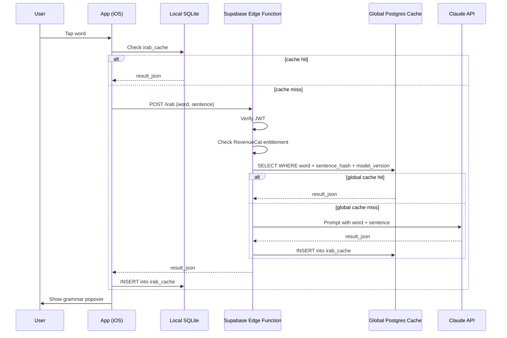

# I'rab Agents

The **i'rab** feature provides on-demand Arabic grammar analysis: a user taps any word in a book and receives a grammatical breakdown -- case, role, parsing -- powered by Claude Sonnet. A three-tier cache (local SQLite, shared Supabase Postgres, Claude API) means that first lookups are ~1-2s while subsequent lookups across all users are instant.

---

## Request Flow



---

## Three-Tier Cache

| Tier | Store | Key | Latency | Scope |
|------|-------|-----|---------|-------|
| 1 -- Local | SQLite `irab_cache` on device | `(word, sentence_hash, model_version)` | 0ms | Per device |
| 2 -- Global | Supabase Postgres `irab_cache` | `(word, sentence_hash, model_version)` | ~50-100ms (network) | All users |
| 3 -- Cold | Claude Sonnet API | N/A | ~1-2s | N/A |

The global cache is the key scaling property: one user's first lookup permanently caches the result for every future user reading the same word in the same sentence. Over time, the cold path becomes rare.

**Cache key** -- `(word, sentence_hash, model_version)` -- uniquely identifies a lookup. `sentence_hash` captures the full surrounding sentence to disambiguate the same word appearing in different grammatical contexts. `model_version` allows cache invalidation when the prompt or model changes without manual purging.

---

## Supabase Schema

The global cache table lives in Postgres:

```sql
irab_cache (
  id UUID PRIMARY KEY DEFAULT gen_random_uuid(),
  word TEXT NOT NULL,
  sentence_hash TEXT NOT NULL,
  model_version TEXT NOT NULL DEFAULT 'sonnet-1',
  result_json JSONB NOT NULL,
  created_at TIMESTAMPTZ DEFAULT NOW(),
  UNIQUE(word, sentence_hash, model_version)
);
```

The local SQLite `irab_cache` mirrors this schema on-device. It is never synced to Supabase -- the global Postgres cache is the shared store.

---

## Edge Function

The Edge Function receives a word tap and returns a grammar result. It runs on Supabase's Deno runtime.

**Request body:**
```json
{
  "word": "الرَّحِيمِ",
  "sentence": "بِسْمِ اللَّهِ الرَّحْمَٰنِ الرَّحِيمِ"
}
```

**Response body:**
```json
{
  "result_json": {
    "role": "نعت",
    "case": "مجرور",
    "case_reason": "تبع للمنعوت اللَّهِ",
    "parsing": "صفة مجرورة وعلامة جرها الكسرة الظاهرة على آخره"
  },
  "model_version": "sonnet-1",
  "cached": false
}
```

**Execution order:**

1. Verify JWT -- reject unauthenticated requests with 401.
2. Check RevenueCat subscription -- reject free-tier users with 402 (triggers paywall in app).
3. Query global `irab_cache` -- return immediately on hit.
4. Call Claude API on miss.
5. Insert result into global `irab_cache`.
6. Return result to app.

---

## Claude Prompt Design

Claude receives the **target word** and its **surrounding sentence** as context. The prompt instructs Claude to respond strictly in structured JSON using classical Arabic grammar terminology.

**Output fields in `result_json`:**

| Field | Description |
|-------|-------------|
| `role` | Grammatical role (e.g., فاعل, مفعول به, نعت) |
| `case` | Case (مرفوع, منصوب, مجرور, مجزوم) |
| `case_reason` | Why this case applies in context |
| `parsing` | Full parsing statement (إعراب) in classical form |

The prompt is versioned via `model_version`. Bumping `model_version` (e.g., `'sonnet-1'` → `'sonnet-2'`) makes existing cache entries invisible to new lookups via the unique constraint, effectively invalidating the cache without deleting rows.

---

## Cache Invalidation

Cache invalidation is passive. The `UNIQUE(word, sentence_hash, model_version)` constraint means that queries for a new `model_version` find no rows and fall through to Claude. Old rows for prior versions remain in the table but are never queried -- they can be purged at any time with a simple `DELETE WHERE model_version != 'current'`.

**When to bump `model_version`:**
- The system prompt changes in any way that affects grammar output.
- The underlying Claude model version changes.
- A known systematic error in cached results is discovered.

Do not bump `model_version` for changes unrelated to grammar output (e.g., response format that resolves to identical `result_json`).

---

## Subscription Gating

I'rab analysis is a **premium feature**. The gate sits entirely in the Edge Function, not in the app -- the app can show a paywall, but it cannot grant access.

```
App <-> RevenueCat SDK   (purchase, restore, check entitlements)
              |
              | webhook
              v
         Supabase        (stores user subscription status)
              |
              | checked by
              v
         Edge Function   (rejects if not subscribed)
```

The Edge Function reads the user's subscription status from Supabase (populated by RevenueCat webhooks) and rejects the request with HTTP 402 if the entitlement is absent. The app receives 402 and presents the paywall.

Free-tier users can read all books, bookmark, and search -- they cannot tap words for grammar analysis.

---

## Key Files

| File | Purpose |
|------|---------|
| `reader/TECHNICAL_SPEC.md` lines 201-222 | I'rab flow and Edge Function responsibilities |
| `reader/TECHNICAL_SPEC.md` lines 93-103 | `irab_cache` Postgres schema |
| `reader/TECHNICAL_SPEC.md` lines 289-305 | Monetization and RevenueCat integration |
| `useIrab.ts` | React hook -- manages tap handling, local cache reads/writes, Edge Function calls |
| `irab-api.ts` | Edge Function client -- constructs request, handles 401/402 responses |
| `supabase/functions/irab/index.ts` | Supabase Edge Function -- JWT verify, subscription check, cache logic, Claude call |

---

## Gotchas

**`sentence_hash` must capture the full sentence.** Hashing only the target word causes cache collisions: the same word in different sentences gets the same key, returning wrong grammar. Hash the entire surrounding sentence, not a substring.

**Bump `model_version` on any prompt change.** Stale cache entries for prior prompt versions silently return wrong analyses. There is no automated check -- it is a manual discipline when editing the system prompt.

**Edge Function cold start adds latency.** Supabase Edge Functions on Deno have a ~200-500ms cold start. Users on the cold path experience this on top of the Claude API latency. The global cache means the cold path is hit once per unique word-sentence pair per `model_version`.

**Claude grammar analysis degrades on rare constructions.** Classical Arabic has edge cases (non-standard poetic meter, archaic vocabulary, abbreviated isnads) where the model produces plausible but incorrect parsing. These errors get cached and affect all future users. A `model_version` bump is the only recovery path without manual row deletion.

**Local cache is not synced.** The on-device SQLite `irab_cache` is a local performance cache only. Uninstalling the app or switching devices requires re-fetching from the global Postgres cache (still fast -- no Claude call needed).

---

## Related Docs

- [`../reader/book-format.md`](../reader/book-format.md) -- page and annotation data structures that provide the sentence context for i'rab lookups
- [`../reader/app.md`](../reader/app.md) -- reader architecture, offline-first model, local SQLite schema
- [`../testing/irab-agents.md`](../testing/irab-agents.md) -- test strategy for i'rab cache hits, misses, and subscription gating
