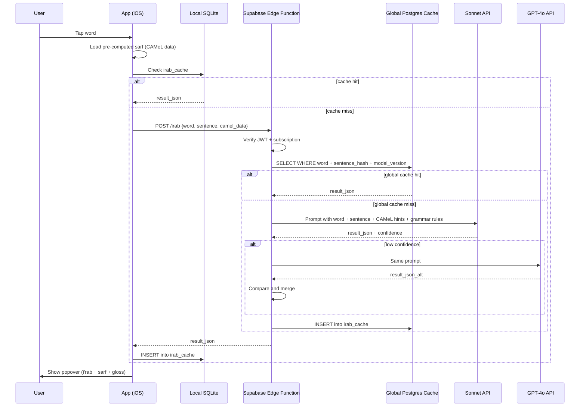

# I'rab + Sarf Agents

On-demand Arabic grammar and morphology analysis. A user taps any word in a book and receives a detailed grammatical breakdown: syntactic role (i'rab), morphological analysis (sarf), case ending, English explanation, root-derived vocabulary, and contextual notes. The feature serves both students learning Arabic grammar and scholars referencing classical texts.

The system uses a two-stage architecture: **sarf is pre-computed** during book ingestion via CAMeL Tools (instant), while **i'rab is generated on-demand** via Claude with CAMeL hints (1-2s on cold path). A three-tier cache ensures repeated lookups across all users are instant.

---

## Popover Content

When a user taps a word, the popover displays:

### 1. Grammatical Role (I'rab)

The syntactic role in both Arabic and English:

- **Role**: Arabic term + English label (e.g., "فاعل -- Subject")
- **Case**: Arabic term + English label (e.g., "مرفوع -- Nominative")
- **Case reason**: English explanation of why this case applies ("because it is the doer of the verb")

For مبني (indeclinable) words like particles (في, إنّ, لم), the popover shows "حرف جر مبني -- Preposition, indeclinable" with an explanation noting that the word does not change form.

For hidden case endings (إعراب تقديري), the popover explicitly calls this out: "The case ending is estimated/hidden because the word ends in alif maqsura."

### 2. Morphology (Sarf)

Pre-computed from CAMeL Tools during ingestion:

- **Root**: e.g., ك-ت-ب
- **Pattern/wazn**: e.g., فَاعِل
- **Verb form**: e.g., Form IV (derived from wazn via lookup table)
- **POS**: Part of speech
- **Gender, number, person**

### 3. Dictionary Meaning

English gloss from CAMeL Tools (e.g., "book; writing"). Pre-computed, instant.

### 4. Related Words from the Same Root

4-6 common derivatives of the word's root (e.g., for ك-ت-ب: كتاب, كاتب, مكتوب, مكتبة, كتابة). Source: CAMeL Tools lexicon if available, Claude as fallback.

### 5. English Explanation Paragraph

A plain-English paragraph tying the analysis together:

> "This word is the subject (فاعل) of the verb 'wrote'. It takes the nominative case (مرفوع) because the subject of a verb is always nominative in Arabic. The root is ك-ت-ب, and the word follows the pattern فَاعِل, indicating the doer of the action."

The explanation does not include transliteration. Arabic terms appear in Arabic script with English translations.

### 6. Ambiguous Parses

When genuine grammatical ambiguity exists, the popover shows the most likely parse as the primary analysis, with an "Other possible parses" section listing alternatives. This teaches students that grammar is not always black-and-white and gives scholars the full picture.

### 7. Multi-Part Analysis (Attached Pronouns/Clitics)

Words with attached pronouns or particles receive segmented analysis. For example, "كتابُهُ" (his book):

- **كتاب**: مبتدأ مرفوع -- Subject, nominative
- **هُ**: ضمير متصل في محل جر بالإضافة -- Attached pronoun, genitive (possessor in idafa)

Each segment gets its own role, case, and explanation.

### 8. Ask AI Button

Opens a multi-turn chatbot scoped to the tapped word and its context. The user can ask anything: grammar rules, why a different parse wouldn't work, related examples, broader linguistic questions.

Architecture: client-side context accumulation. The app stores conversation history locally and sends the full thread with each new message to the Edge Function. No server-side session state.

Context payload per Ask AI call: the word, its sentence, its i'rab analysis, its sarf data, the surrounding paragraph, book title and author, and conversation history (last N messages).

Ask AI is gated by the same subscription check as i'rab analysis.

### 9. Report Incorrect Analysis Button

Users can flag incorrect parses. Reports write to a simple `irab_reports` Supabase table:

```sql
irab_reports (
  id UUID PRIMARY KEY DEFAULT gen_random_uuid(),
  word TEXT NOT NULL,
  sentence_hash TEXT NOT NULL,
  model_version TEXT NOT NULL,
  result_json JSONB NOT NULL,
  user_id UUID REFERENCES auth.users(id),
  created_at TIMESTAMPTZ DEFAULT NOW()
);
```

Reports are reviewed manually. No automated correction pipeline.

---

## Model Strategy (Tier 2: Hints + Escalation)

I'rab analysis uses a tiered model strategy that balances accuracy with cost.

### Primary Path: Sonnet with CAMeL Hints

When a user taps a word:

1. Pull the pre-computed CAMeL sarf data (root, pattern, POS, case, state, mood, voice, gender, number, attached clitics, diacritized form)
2. Send to Claude Sonnet along with the word, the full sentence, and a grammar rules reference in the system prompt
3. Claude interprets the CAMeL features into a full i'rab analysis with English explanation

CAMeL provides the morphological features (e.g., "this word is nominative"). Claude's job is to determine the grammatical role (e.g., "it's nominative because it's the subject").

### Grammar Rules Reference

The system prompt includes a structured i'rab decision tree compiled from two classical grammar sources:

- **Al-Ajrumiyyah** -- foundational rules for المرفوعات, المنصوبات, المجرورات
- **Alfiyyat Ibn Malik** -- comprehensive coverage of edge cases and rare constructions

The reference is organized as a lookup:

```
المرفوعات (Nominative roles):
- فاعل: noun after active verb, doer of action
- نائب فاعل: noun after passive verb, standing in for subject
- مبتدأ: noun starting a nominal sentence
- خبر: predicate completing the مبتدأ
- اسم كان وأخواتها: subject of كان group
- خبر إن وأخواتها: predicate of إن group
...
```

This reference narrows Claude's search space and ensures consistent terminology.

### Escalation Path: GPT-4o on Low Confidence

Sonnet self-reports confidence in its analysis. When confidence is low (ambiguous constructions, rare grammatical forms, competing valid parses), the system escalates to GPT-4o for a second opinion.

- GPT-4o receives the same CAMeL hints + grammar rules + sentence context
- If Sonnet and GPT-4o agree, return the shared analysis
- If they disagree, return both parses with the "Other possible parses" section

**Why GPT-4o for escalation:** The point of the shura is diversity of opinion. GPT comes from different training data than Claude, so it provides a genuinely independent second perspective rather than echoing the same biases.

### Cost Breakdown

| Path | When | Cost per word |
|------|------|---------------|
| Sonnet (primary) | ~70-80% of words | ~$0.004 |
| Sonnet + GPT-4o (escalation) | ~20-30% of words | ~$0.01 |
| **Blended average** | | **~$0.006** |

---

## Sarf Pre-Computation (CAMeL Tools)

Morphological analysis is pre-computed during book ingestion using CAMeL Tools (`camel_tools` Python package). This runs locally in the ingestion pipeline.

### What CAMeL Outputs

| Field | Description | Example |
|-------|-------------|---------|
| `pos` | Part of speech | noun, verb, adj, prep |
| `cas` | Case ending | n (nominative), a (accusative), g (genitive) |
| `stt` | State | d (definite), i (indefinite), c (construct/idafa) |
| `mod` | Mood (verbs) | i (indicative), j (jussive), s (subjunctive) |
| `vox` | Voice | a (active), p (passive) |
| `gen` | Gender | m, f |
| `num` | Number | s (singular), d (dual), p (plural) |
| `per` | Person | 1, 2, 3 |
| `root` | Root | k.t.b |
| `pattern` | Morphological pattern (wazn) | kitAb |
| `lex` | Lemma | kitAb_1 |
| `gloss` | English dictionary meaning | book;writing |
| `diac` | Fully diacritized form | kitAbu |
| `enc0` | Enclitic (attached pronoun) | 3ms (his) |
| `prc0-3` | Proclitics (prepositions, conjunctions) | bi (in/with) |

### What CAMeL Does NOT Output

CAMeL does NOT provide grammatical roles (i'rab). It tells you a word is nominative but not WHY (subject? predicate? topic?). The same case maps to many possible roles:

- Nominative: فاعل, نائب فاعل, مبتدأ, خبر, اسم كان, خبر إن ...
- Accusative: مفعول به, حال, تمييز, مفعول مطلق, مفعول لأجله, خبر كان, اسم إن ...
- Genitive: مجرور بالحرف, مضاف إليه ...

This is why i'rab role identification requires Claude.

### Verb Form Derivation

CAMeL outputs the wazn pattern but not the verb form number (I-X). A deterministic lookup table maps wazn to form:

| Wazn | Form |
|------|------|
| فَعَلَ | I |
| فَعَّلَ | II |
| فَاعَلَ | III |
| أَفْعَلَ | IV |
| تَفَعَّلَ | V |
| تَفَاعَلَ | VI |
| اِنْفَعَلَ | VII |
| اِفْتَعَلَ | VIII |
| اِفْعَلَّ | IX |
| اِسْتَفْعَلَ | X |

### Processing Speed

CAMeL disambiguates ~1,000-5,000 words/sec depending on hardware. A typical book (50K-200K words) processes in 10-200 seconds. Sarf is computed per-book during ingestion, not batched across the full corpus.

---

## Request Flow



---

## Three-Tier Cache

| Tier | Store | Key | Latency | Scope |
|------|-------|-----|---------|-------|
| 1 -- Local | SQLite `irab_cache` on device | `(word, sentence_hash, model_version)` | 0ms | Per device |
| 2 -- Global | Supabase Postgres `irab_cache` | `(word, sentence_hash, model_version)` | ~50-100ms | All users |
| 3 -- Cold | Sonnet API (+ GPT-4o escalation) | N/A | ~1-2s | N/A |

The global cache is the key scaling property: one user's first lookup permanently caches the result for every future user reading the same word in the same sentence.

---

## Supabase Schema

### `irab_cache` Table

```sql
irab_cache (
  id UUID PRIMARY KEY DEFAULT gen_random_uuid(),
  word TEXT NOT NULL,
  sentence_hash TEXT NOT NULL,
  model_version TEXT NOT NULL DEFAULT 'sonnet-1',
  result_json JSONB NOT NULL,
  created_at TIMESTAMPTZ DEFAULT NOW(),
  UNIQUE(word, sentence_hash, model_version)
);
```

### `result_json` Schema

```json
{
  "segments": [
    {
      "text": "كتاب",
      "role": "مبتدأ",
      "role_en": "Subject (topic)",
      "case": "مرفوع",
      "case_en": "Nominative",
      "case_reason": "Because it is the topic of a nominal sentence",
      "is_mabni": false,
      "is_taqdiiri": false,
      "sarf": {
        "root": "ك-ت-ب",
        "pattern": "فِعَال",
        "form": "I",
        "pos": "noun",
        "gender": "masculine",
        "number": "singular",
        "state": "construct",
        "gloss": "book; writing"
      },
      "related_words": [
        {"word": "كاتب", "gloss": "writer"},
        {"word": "مكتوب", "gloss": "written; letter"},
        {"word": "مكتبة", "gloss": "library"},
        {"word": "كتابة", "gloss": "writing"}
      ]
    },
    {
      "text": "هُ",
      "role": "ضمير متصل في محل جر بالإضافة",
      "role_en": "Attached pronoun, genitive (possessor)",
      "case": "في محل جر",
      "case_en": "Genitive (positional)",
      "case_reason": "Because it is the possessor in an idafa construction",
      "is_mabni": true,
      "is_taqdiiri": false,
      "sarf": {
        "pos": "pronoun",
        "person": "3rd",
        "gender": "masculine",
        "number": "singular"
      }
    }
  ],
  "explanation": "This word is the subject (مبتدأ) of a nominal sentence. It takes the nominative case (مرفوع) because the topic of a nominal sentence is always nominative. The attached pronoun 'hu' (his) is the possessor in an idafa (possessive) construction, placing it in the genitive case. The root is ك-ت-ب (to write), and the word follows a noun pattern meaning 'book' or 'writing'.",
  "alternative_parses": [],
  "confidence": "high"
}
```

---

## Edge Function

**Request body:**

```json
{
  "word": "كتابُهُ",
  "sentence": "كتابُهُ على المكتبِ",
  "camel_data": {
    "pos": "noun",
    "cas": "n",
    "stt": "c",
    "root": "k.t.b",
    "pattern": "kitAb",
    "gloss": "book;writing",
    "enc0": "3ms",
    "diac": "kitAbuhu"
  }
}
```

**Response body:**

```json
{
  "result_json": { "..." },
  "model_version": "sonnet-1",
  "cached": false,
  "escalated": false
}
```

**Execution order:**

1. Verify JWT -- reject unauthenticated requests with 401.
2. Check RevenueCat subscription -- reject free-tier users with 402 (triggers paywall in app).
3. Query global `irab_cache` -- return immediately on hit.
4. Call Sonnet with CAMeL hints + grammar rules reference.
5. If confidence is low, escalate to GPT-4o and merge results.
6. Insert result into global `irab_cache`.
7. Return result to app.

---

## Cache Invalidation

Cache invalidation is passive. The `UNIQUE(word, sentence_hash, model_version)` constraint means queries for a new `model_version` find no matching rows and fall through to Claude. Old rows remain but are never queried.

**When to bump `model_version`:**
- The system prompt or grammar rules reference changes
- The underlying model changes
- The escalation logic changes
- A systematic error in cached results is discovered

Old rows can be purged with `DELETE WHERE model_version != 'current'`.

---

## Subscription Gating

I'rab, sarf, Ask AI, and translation are all premium features gated by RevenueCat subscription status. The gate sits in the Edge Function, not the app.

The Edge Function reads subscription status from Supabase (populated by RevenueCat webhooks) and rejects with HTTP 402 if the entitlement is absent. The app receives 402 and presents the paywall.

Free-tier users can read all books, bookmark, and search. They cannot tap words for grammar analysis, use Ask AI, or request translations.

---

## Key Files

| File | Purpose |
|------|---------|
| Supabase Edge Function (planned) | JWT check, subscription gate, cache lookup, Sonnet call, GPT-4o escalation, cache write |
| `irab_cache` table (planned) | Global Supabase Postgres cache |
| `irab_reports` table (planned) | User-submitted error reports |
| Reader hook (planned) | Client-side tap handling, local cache, popover rendering |
| CAMeL ingestion step (planned) | Sarf pre-computation during book ingestion |
| Grammar rules reference (planned) | Structured i'rab decision tree from Ajrumiyyah + Alfiyyah for system prompt |

---

## Gotchas

**`sentence_hash` must capture the full sentence.** Hashing only the target word causes cache collisions: the same word in different sentences gets the same key, returning wrong grammar.

**Bump `model_version` on any prompt change.** Stale cache entries for prior prompt versions silently return wrong analyses.

**CAMeL disambiguation is not perfect.** Accuracy is ~0.80-0.81 on classical Arabic. When CAMeL gets the case wrong, Claude inherits the error. The grammar rules reference and Claude's own reasoning can sometimes catch this, but not always. The report button is the user-facing correction mechanism.

**Attached pronouns complicate caching.** The word "كتابه" and "كتابها" are different cache entries despite sharing a root. The `word` field in the cache key is the full surface form including clitics.

**Edge Function cold start adds latency.** ~200-500ms on first call after idle, on top of Claude API latency. The global cache means the cold path is hit once per unique word-sentence pair per `model_version`.

**Escalation adds latency for hard words.** When Sonnet escalates to GPT-4o, the user waits for two sequential API calls (~2-4s total). This only happens on genuinely ambiguous constructions.

**The grammar rules reference consumes prompt tokens.** The Ajrumiyyah + Alfiyyah reference is ~2,000-3,000 tokens added to every Sonnet call. This is a fixed cost per request.

---

## Related Docs

- [Translation Agents](translation.md) -- on-demand sentence translation, tab in the same popover
- [Reader App](../reader/app.md) -- reader architecture, offline-first model, local SQLite schema
- [Book Format](../reader/book-format.md) -- page and annotation data structures
- [Testing: I'rab Agents](../testing/irab-agents.md) -- test strategy
