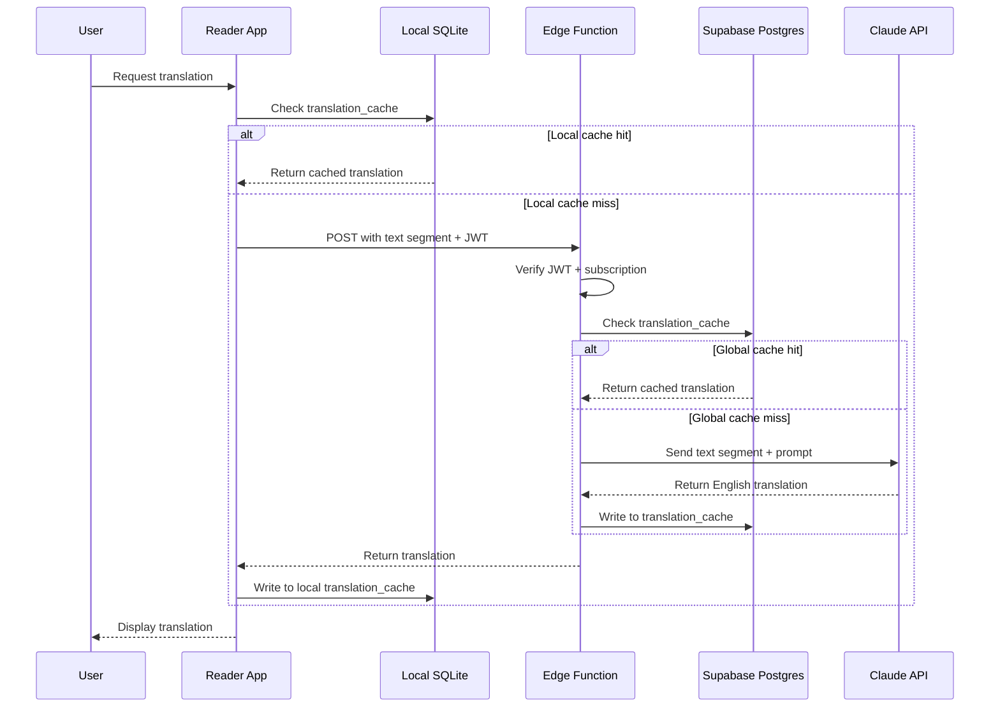

# Translation Agents

On-demand Arabic-to-English translation powered by Claude via Supabase Edge Function. Users request translations while reading in the reader app; results are cached globally so repeated lookups across all users are instant. The design is structurally parallel to the I'irab agent -- same three-tier cache, same subscription gating, separate Edge Function and cache table.

## Request Flow

The translation request resolves through three tiers in order: local SQLite, Supabase Postgres, Claude API. A cache hit at any tier short-circuits the rest.



## Translation Scope

**Granularity** is per-sentence or per-paragraph -- not individual words. Word-level analysis is I'irab territory. Translation operates on contiguous text segments selected from the current page.

- **Input:** Arabic text segment from the active page (one sentence or one paragraph)
- **Output:** English translation that preserves the meaning and register of classical Arabic prose
- **Timing:** Generated on demand; not pre-computed during ingestion

The sentence-level granularity is intentional. Word-level input loses syntactic context and produces poor translations. Page-level input is slow, expensive per call, and produces cache keys that are too coarse -- a single change anywhere on the page busts the entire page's cache entry.

## Edge Function

The translation Edge Function follows the same structure as the I'irab Edge Function. It handles one request per invocation.

Processing order:

1. Verify JWT (user must be authenticated)
2. Check RevenueCat subscription status in Supabase (translation is a premium feature)
3. Compute `text_hash` from the input segment
4. Look up `(text_hash, model_version)` in the global `translation_cache` table
5. On cache miss: call Claude with the translation prompt
6. Write the result to `translation_cache`
7. Return the translation to the app

**Request format:** the Arabic text segment as a string, plus the JWT in the `Authorization` header.

**Response format:** plain English text string.

The translation Edge Function is separate from the I'irab Edge Function -- different prompt, different cache table, different input granularity.

## Cache Design

**Cache key:** `(text_hash, model_version)`

- `text_hash` -- a hash of the raw Arabic text segment. Identical text across any book, any user, any session produces the same cache key.
- `model_version` -- a version string (e.g., `'claude-1'`) that tracks the prompt and model in use.

### `translation_cache` Table

```sql
translation_cache (
  id UUID PRIMARY KEY DEFAULT gen_random_uuid(),
  text_hash TEXT NOT NULL,
  model_version TEXT NOT NULL DEFAULT 'claude-1',
  result_text TEXT NOT NULL,
  created_at TIMESTAMPTZ DEFAULT NOW(),
  UNIQUE(text_hash, model_version)
);
```

The global cache in Supabase Postgres is shared across all users. One user's translation lookup populates the cache for every subsequent user who requests the same segment. The local SQLite mirror on each device stores the translations the user has requested in the current session, enabling instant re-display without a network call.

### Cache Invalidation

Bump `model_version` when the prompt or the underlying Claude model changes. Old entries remain in the table but are never matched -- the unique constraint on `(text_hash, model_version)` means new requests populate fresh rows. Stale rows are dead weight but harmless and can be pruned in bulk if needed.

## Prompt Design

The translation prompt instructs Claude to produce a **faithful translation** -- one that carries over the register, tone, and meaning of the original classical Arabic prose without paraphrase or simplification.

Handling of untranslatable terms:

| Term category | Strategy |
|---------------|----------|
| Hadith sciences terminology (e.g., _mursal_, _sahih_) | Transliterate + parenthetical gloss |
| Islamic legal terms (fiqh vocabulary) | Transliterate + parenthetical gloss |
| Proper names and honorifics | Transliterate; do not translate |
| Quranic phrases | Translate with established English equivalents where they exist |

The output is plain English text with no markup -- no brackets, no footnotes, no HTML. Glosses appear inline in parentheses.

## Subscription Gating

Translation is a **premium feature** gated by RevenueCat subscription status.

The Edge Function checks the `subscription_status` field on the Supabase user record before processing the request. It does not call the RevenueCat API directly -- RevenueCat webhooks keep the Supabase record current.

Free users receive a paywall response from the Edge Function (no translation data). The app renders the RevenueCat paywall prompt on receipt of that response.

The same pattern applies to I'irab analysis, cloud sync, and Apple Pencil annotations.

## Key Files

| Path | Purpose |
|------|---------|
| Supabase Edge Function (planned) | Server-side translation logic: JWT check, subscription gate, cache lookup, Claude call, cache write |
| `translation_cache` table (planned) | Global Supabase Postgres cache keyed on `(text_hash, model_version)` |
| Reader hook (planned) | Client-side hook managing the request lifecycle: local cache check, Edge Function call, result display |

## Gotchas

**Sentence-level granularity is the sweet spot.** Word-level loses context and produces incoherent output. Page-level is slow per call, expensive, and has a low cache hit rate because any variation on a page produces a new cache key. Sentence or short-paragraph segments balance translation quality against cache efficiency.

**Classical Arabic domain vocabulary needs transliterate-plus-gloss, not force-translation.** Terms from fiqh, hadith sciences, and Sufi literature have no accurate English equivalents. Forcing a translation (e.g., rendering _isnad_ as "chain") discards meaning. The prompt must explicitly instruct Claude to handle these terms by transliterating and glossing.

**Cache key must use `text_hash`, not positional offset.** Character offsets within a page shift when a book is re-ingested with content edits. A position-based key would produce a cache miss on the same text after re-ingestion. Hashing the text itself keeps the cache valid across re-ingestion.

**Cache hit rate depends on passage overlap across users.** Unlike I'irab (which caches per-word and benefits from high reuse of common words), translation caches per-text-segment. Hit rate is high for popular passages read by many users and lower for obscure sections. Do not expect the same near-zero cold-path rate that I'irab achieves at scale.

**Edge Function cold start adds latency on the first call after idle.** A cold start adds roughly 1-2 seconds. Subsequent calls within the same warm window are fast. This is the same behavior as the I'irab Edge Function.

---

Related docs: [I'irab Agents](irab.md) -- [Reader App](../reader/app.md) -- [Book Format](../reader/book-format.md)
