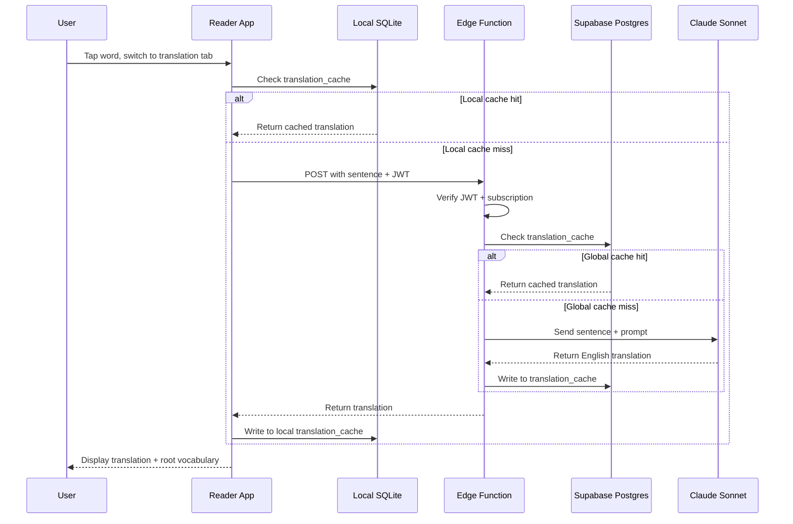

# Translation Agents

On-demand Arabic-to-English translation powered by Claude Sonnet via Supabase Edge Function. Users request translations while reading in the reader app; results are cached globally so repeated lookups across all users are instant. The translation agent lives in a tab alongside the i'rab agent in the same popover -- users switch between grammar analysis and translation without leaving the word context.

---

## How It Works

Translation operates at **sentence level**. When a user taps a word and switches to the translation tab, the full sentence containing that word is translated. Word-level input loses syntactic context and produces poor translations. Page-level input is slow, expensive, and has low cache hit rates.

The translation tab also shows:

- **Root-derived vocabulary**: 4-6 words sharing the same root as the tapped word (e.g., for ك-ت-ب: كتاب, كاتب, مكتوب, مكتبة). Source: CAMeL Tools lexicon if available, Claude as fallback. This builds vocabulary through the Arabic root system.
- **The sentence translation itself**: faithful English rendering of the full sentence.

---

## Request Flow

The translation request resolves through three tiers in order: local SQLite, Supabase Postgres, Claude API. A cache hit at any tier short-circuits the rest.



---

## Edge Function

The translation Edge Function handles one request per invocation. It is separate from the i'rab Edge Function -- different prompt, different cache table, different input granularity.

**Request body:**

```json
{
  "sentence": "بِسْمِ اللَّهِ الرَّحْمَٰنِ الرَّحِيمِ"
}
```

**Response body:**

```json
{
  "translation": "In the name of God, the Most Gracious, the Most Merciful.",
  "model_version": "sonnet-1",
  "cached": false
}
```

**Execution order:**

1. Verify JWT -- reject unauthenticated requests with 401.
2. Check RevenueCat subscription -- reject free-tier users with 402 (triggers paywall in app).
3. Compute `text_hash` from the input sentence.
4. Look up `(text_hash, model_version)` in the global `translation_cache` table.
5. On cache miss: call Claude Sonnet with the translation prompt.
6. Write the result to `translation_cache`.
7. Return the translation to the app.

---

## Cache Design

**Cache key:** `(text_hash, model_version)`

- `text_hash` -- a hash of the raw Arabic sentence. Identical text across any book, any user, any session produces the same cache key.
- `model_version` -- a version string (e.g., `'sonnet-1'`) that tracks the prompt and model in use.

### `translation_cache` Table

```sql
translation_cache (
  id UUID PRIMARY KEY DEFAULT gen_random_uuid(),
  text_hash TEXT NOT NULL,
  model_version TEXT NOT NULL DEFAULT 'sonnet-1',
  result_text TEXT NOT NULL,
  created_at TIMESTAMPTZ DEFAULT NOW(),
  UNIQUE(text_hash, model_version)
);
```

The global cache in Supabase Postgres is shared across all users. One user's translation lookup populates the cache for every subsequent user who requests the same sentence. The local SQLite mirror stores translations the user has requested, enabling instant re-display without a network call.

### Cache Invalidation

Bump `model_version` when the prompt or the underlying Claude model changes. Old entries remain in the table but are never matched. Stale rows can be pruned in bulk if needed.

---

## Prompt Design

The translation prompt instructs Claude Sonnet to produce a **faithful translation** -- one that carries over the register, tone, and meaning of the original classical Arabic prose without paraphrase or simplification.

Handling of untranslatable terms:

| Term category | Strategy |
|---------------|----------|
| Hadith sciences terminology (e.g., mursal, sahih) | Transliterate + parenthetical gloss |
| Islamic legal terms (fiqh vocabulary) | Transliterate + parenthetical gloss |
| Proper names and honorifics | Transliterate; do not translate |
| Quranic phrases | Translate with established English equivalents where they exist |

The output is plain English text with no markup. Glosses appear inline in parentheses.

---

## Model Choice

**Claude Sonnet** for translation. Classical Arabic prose requires genuine understanding of context, register, and domain-specific vocabulary. Haiku risks flattening nuance. Since translation operates at sentence-level (far fewer calls than word-level i'rab), the per-call cost difference is acceptable.

---

## Subscription Gating

Translation is a **premium feature** gated by RevenueCat subscription status. Same mechanism as i'rab: the Edge Function checks `subscription_status` from Supabase, rejects free users with HTTP 402, and the app presents the paywall.

---

## Key Files

| Path | Purpose |
|------|---------|
| Supabase Edge Function (planned) | Server-side translation logic: JWT check, subscription gate, cache lookup, Claude call, cache write |
| `translation_cache` table (planned) | Global Supabase Postgres cache keyed on `(text_hash, model_version)` |
| Reader hook (planned) | Client-side hook managing the request lifecycle: local cache check, Edge Function call, result display |

---

## Gotchas

**Sentence-level granularity is the sweet spot.** Word-level loses context and produces incoherent output. Page-level is slow per call, expensive, and has a low cache hit rate because any variation on a page produces a new cache key.

**Classical Arabic domain vocabulary needs transliterate-plus-gloss, not force-translation.** Terms from fiqh, hadith sciences, and Sufi literature have no accurate English equivalents. Forcing a translation (e.g., rendering isnad as "chain") discards meaning.

**Cache key must use `text_hash`, not positional offset.** Character offsets shift when a book is re-ingested. Hashing the text keeps the cache valid across re-ingestion.

**Cache hit rate depends on passage overlap across users.** Unlike i'rab (which caches per-word and benefits from high reuse of common words), translation caches per-sentence. Hit rate is high for popular passages and lower for obscure sections.

**Edge Function cold start adds latency on the first call after idle.** ~200-500ms on top of Claude API latency.

---

Related docs: [I'rab + Sarf Agents](irab.md) -- [Reader App](../reader/app.md) -- [Book Format](../reader/book-format.md)
