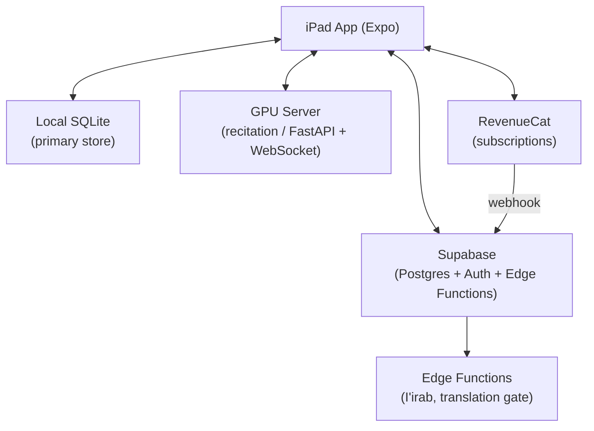
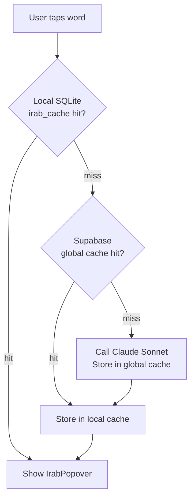
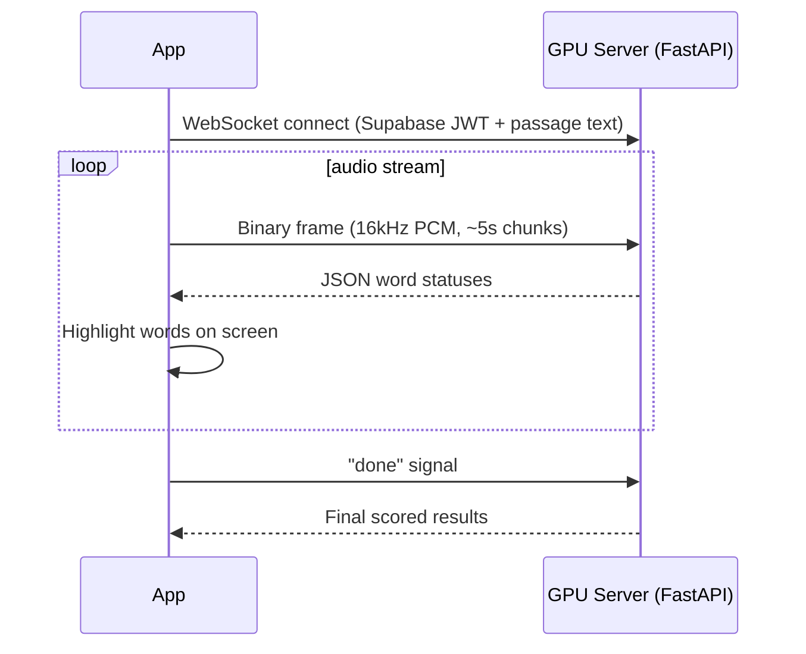
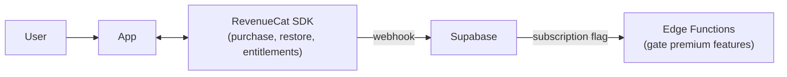

# Reader App

Suhoof Reader is an iPad app for reading classical Arabic and Islamic texts offline. It downloads books to local SQLite and layers grammar analysis (I'irab), translation, and live recitation assessment on top of the text. The backend is Supabase -- the app syncs user data there, but the reading experience never depends on a live connection after a book is downloaded.

## Architecture



**Offline-first** means the app works fully after a book is downloaded. The three exceptions are: first-time I'irab lookups (Edge Function + Claude), translation (Edge Function), and live recitation (WebSocket to GPU server).

## Stack

| Layer | Technology |
|---|---|
| App framework | Expo SDK 54, TypeScript, Expo Router v6 |
| Navigation | Expo Router v6 (file-based) |
| Local database | Expo SQLite |
| Backend | Supabase (Auth, Postgres, Edge Functions) |
| Payments | RevenueCat |
| I'irab engine | Claude Sonnet via Supabase Edge Function |
| Recitation engine | Python/FastAPI, WebSocket, Whisper + XLS-R CTC |
| Book source | OpenITI mARkdown, processed by ingestion pipeline |

## Screens

Three screens cover the full user journey.

### Library -- `app/index.tsx`

Entry point. Displays the book catalog fetched from local SQLite (populated on app open from Supabase). Users browse, search within the catalog, and tap "Download" to pull a book's pages and chapters to device.

### Reader -- `app/reader/[bookId].tsx`

Main reading surface. Renders RTL Arabic text page by page from local SQLite. Handles:
- Word-tap I'irab lookup via `useIrab` hook
- Highlight, bookmark, and text note creation
- Apple Pencil stroke capture
- Recitation mode (microphone + word highlighting)
- Translation toggle (English below Arabic)

### Settings -- `app/settings.tsx`

User preferences (font, size, theme), account info (Apple Sign In), and subscription management (RevenueCat paywall).

## Data Model

### SQLite -- source of truth

Local SQLite is the **primary data store**. Supabase is the sync target, not the source. All reads at runtime go to SQLite.

```
books       -- downloaded catalog entries
pages       -- full page content with content_hash
chapters    -- TOC entries with level and sort_order
annotations -- AI-tagged spans (hadith, quran, poetry, etc.)

bookmarks       -- user-created, synced=0/1 flag
highlights      -- user-created, synced=0/1 flag
text_notes      -- user-created, synced=0/1 flag
pencil_strokes  -- BLOB, synced=0/1 flag
reading_positions -- current page + scroll_offset per book

irab_cache  -- local copy of global I'irab results
user_prefs  -- key/value for display preferences
```

The `synced` column (0 = pending, 1 = sent) drives all outbound sync. Every write to a user data table sets `synced = 0`. The `useSync` hook pushes `synced=0` rows to Supabase on connectivity and marks them synced.

See [book-format.md](book-format.md) for the full schema and `content_hash` / anchor behavior.

### Supabase schema

Mirrors the local schema with UUIDs and `TIMESTAMPTZ`. User tables use `deleted_at` for soft deletes (tombstones). The `irab_cache` table is global -- shared across all users, keyed on `(word, sentence_hash, model_version)`.

## Reading Experience

Arabic text renders RTL. `PageView.tsx` applies user preferences as inline style props at render time.

### Display preferences

Stored in the local `user_prefs` table (key/value).

| Key | Options | Default |
|---|---|---|
| `fontSize` | 18, 20, 22, 24, 28, 32 | 22 |
| `lineHeight` | 1.8, 2.0, 2.2 | 2.0 |
| `theme` | `light`, `sepia`, `dark` | `light` |
| `fontFamily` | `NotoNaskhArabic`, `Amiri`, `ScheherazadeNew` | `NotoNaskhArabic` |

### Annotation rendering

The ingestion pipeline tags text spans with semantic types. `AnnotatedSegment.tsx` renders each type differently at read time.

| Type | Rendering | Key metadata |
|---|---|---|
| `hadith` | Card with save button | `hadith_number`, `source_book`, `grade` |
| `isnad` | Smaller, muted text | `narrators[]` |
| `matn` | Prominent, larger text | -- |
| `quran` | Special font, ornamental frame | `surah`, `ayah` |
| `poetry` | Centered hemistich layout | `meter`, `poet` |
| `biography` | Collapsible section | `person_name`, `birth_ah`, `death_ah` |

## I'irab Integration

**I'irab** is the grammatical parsing of a word -- its case, role, and inflection. Tapping a word triggers the `useIrab` hook, which runs a three-tier cache lookup before ever calling the API.



The Edge Function also verifies the user's JWT and checks their RevenueCat subscription before returning a result. Over time, as the global cache fills, the vast majority of taps return instantly with no API call.

`IrabPopover.tsx` renders the result as a popover anchored to the tapped word.

See [../agents/irab.md](../agents/irab.md) for the Edge Function implementation and prompt design.

## Translation Integration

Translation is a premium feature. A toggle in the reader shows English sentence translations below each Arabic sentence. Translations are fetched on demand from the Edge Function and cached locally. The `pages` table has a `translation` column (populated by the ingestion pipeline) that the Edge Function reads from.

See [../agents/translation.md](../agents/translation.md) for caching behavior and the ingestion step that generates translations.

## Recitation Integration

**Recitation mode** lets a user read aloud and receive real-time per-word feedback. It is a premium feature.



### Word highlight colors

| Status | UI |
|---|---|
| Correct | Green |
| Wrong word (skipped, substituted, added) | Red strikethrough |
| I'rab error (wrong case ending) | Blue underline |
| Tashkeel error (wrong internal vowel) | Orange underline |

Audio capture uses a 16kHz PCM `AudioWorklet`. The passage text (what the user should be reading) is sent as the first WebSocket message so the server can align recognition output.

See [../recitation/system.md](../recitation/system.md) for the server architecture, model details, and deployment options.

## Sync Strategy

Local SQLite is always written first. Supabase receives changes when the device is online.

| Data | Direction | Trigger |
|---|---|---|
| Book catalog | Supabase → local | On app open |
| Book download | Supabase → local | User taps "Download" |
| Reading position | Local → Supabase | Debounced on page change |
| Bookmarks, highlights, notes | Bidirectional | On write (outbound); on app open (inbound) |
| Pencil strokes | Local → Supabase | Background (blobs can be large) |
| I'irab cache | Edge Function → local | On each lookup |

**Conflict resolution:** Last-write-wins on `updated_at`. Acceptable for V1 -- simultaneous edits to the same annotation on two devices are rare.

**Deletes:** Soft-delete via `deleted_at` tombstone. Tombstoned rows sync to other devices so they can remove local copies. Tombstones are purged after 90 days.

## Monetization

**Free tier** -- read all books, browse catalog, download, search within a book, add bookmarks.

**Premium tier** (RevenueCat subscription) -- I'irab analysis, AI annotations, cloud sync across devices, Apple Pencil annotations, translation, recitation.



The Edge Function checks the Supabase subscription flag on every premium request. RevenueCat webhooks update that flag -- there is a brief lag between purchase and flag update (see Gotchas).

## Folder Structure

```
reader/
  app/
    _layout.tsx
    index.tsx                    # Library screen
    reader/[bookId].tsx          # Reader screen
    settings.tsx                 # Settings screen
  components/
    arabic/
      TappableText.tsx           # Tap-to-analyze word wrapper
      IrabPopover.tsx            # Grammar analysis popover
      PageView.tsx               # Full page renderer
      AnnotatedSegment.tsx       # Type-aware annotation renderer
    library/
      BookCard.tsx
  hooks/
    useIrab.ts                   # Three-tier cache + Edge Function caller
    useReadingPosition.ts
    useBookPages.ts
    useAnnotations.ts
    useUserPrefs.ts
    useSync.ts                   # Bidirectional Supabase sync
  lib/
    db.ts                        # Local SQLite client
    supabase.ts                  # Supabase client
    irab-api.ts                  # Edge Function caller
    arabic.ts                    # Arabic text utilities
    download.ts                  # Book download + local storage
    constants.ts
  types/
    book.ts
    irab.ts
    annotations.ts

ingestion/
  parse.ts                       # mARkdown → pages + chapters
  tashkeel.ts                    # Add vocalization
  annotate.ts                    # AI-tag hadith, quran, poetry spans
  upload.ts                      # Push to Supabase
  ingest.ts                      # Orchestrator
```

---

## Key Files

| File | Purpose |
|---|---|
| `reader/TECHNICAL_SPEC.md` | Authoritative spec -- schema, sync, recitation, monetization |
| `reader/app/reader/[bookId].tsx` | Main reading screen |
| `reader/hooks/useIrab.ts` | I'irab cache logic and Edge Function integration |
| `reader/hooks/useSync.ts` | Bidirectional sync with Supabase |
| `reader/lib/db.ts` | Local SQLite client -- all reads/writes go through here |
| `reader/lib/download.ts` | Book download and local storage |
| `reader/components/arabic/AnnotatedSegment.tsx` | Renders annotation types differently |
| `recitation/server.py` | FastAPI + WebSocket recitation server |
| `recitation/engine.py` | Position tracking and error scoring |

## Gotchas

**SQLite is the source of truth, not Supabase.** Never read user data from Supabase at runtime. Reads always go to SQLite. Supabase is the sync target.

**Pencil strokes are large blobs.** `drawing_data` is serialized `PKDrawing`. Sync is background and intentionally deferred -- do not block on it. Monitor blob sizes; very large pages can cause sync timeouts.

**`content_hash` re-anchoring.** When the ingestion pipeline re-processes a book (e.g., tashkeel corrections), page content changes and `content_hash` changes. Bookmarks and highlights stored by character offset can become misaligned. The `anchor_context` column (~30 chars of surrounding text) enables fuzzy re-anchoring -- but it is not automatic. See [book-format.md](book-format.md) for the re-anchoring algorithm.

**RTL quirks in React Native.** Flex direction, text alignment, and gesture directions all flip in RTL. Test every new layout component with a real RTL string. `I18nManager.forceRTL(true)` is set at app startup -- toggling it requires a reload.

**RevenueCat webhook lag.** After a user completes a purchase, the RevenueCat webhook to Supabase can take a few seconds. Edge Functions check the Supabase subscription flag, so there is a window where the purchase succeeded but premium features still show as gated. Implement a client-side entitlement check via the RevenueCat SDK as a fast path, with the Edge Function as the authoritative gate.

**I'irab cache key includes `model_version`.** Changing the Claude prompt or model bumps `model_version` (e.g., `sonnet-1` → `sonnet-2`), which invalidates cached results and triggers re-calls. Do this intentionally -- a version bump means all users will hit the API again on next lookup.

---

## Related Docs

- [book-format.md](book-format.md) -- full SQLite/Supabase schema, `content_hash` behavior, anchor re-alignment
- [ingestion-pipeline.md](ingestion-pipeline.md) -- how OpenITI books are parsed, vocalized, annotated, and uploaded
- [../agents/irab.md](../agents/irab.md) -- I'irab Edge Function, Claude prompt, and cache design
- [../agents/translation.md](../agents/translation.md) -- translation pipeline and caching
- [../recitation/system.md](../recitation/system.md) -- GPU server architecture, models, deployment
- [../testing/reader-app.md](../testing/reader-app.md) -- testing strategy for the reader
