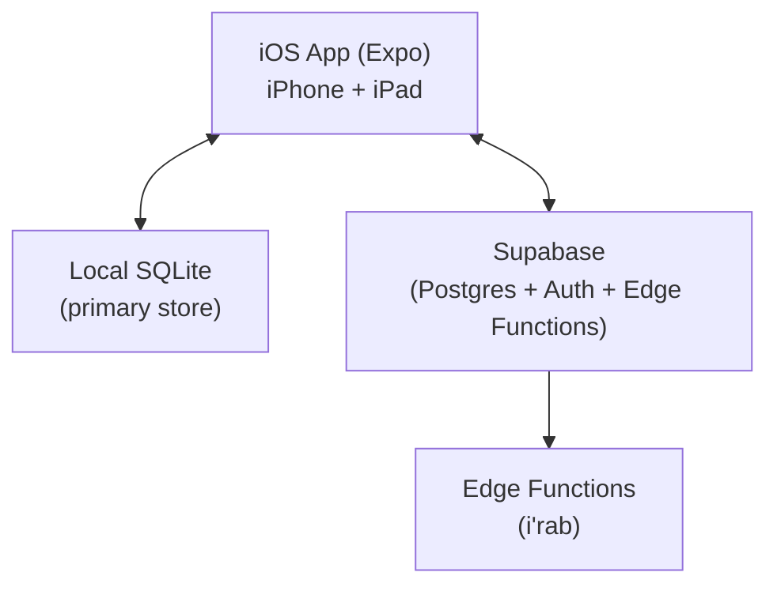
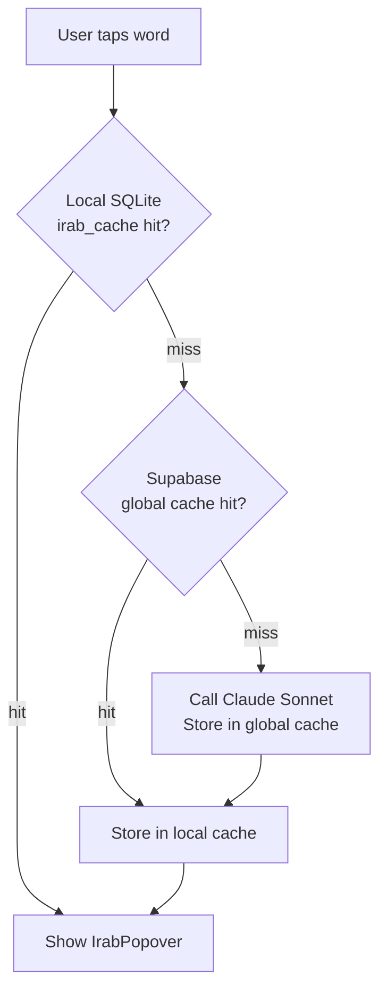

# Reader App

Suhuf Reader is a universal iOS app (iPhone + iPad) for reading classical Arabic and Islamic texts offline. It downloads books to local SQLite and layers grammar analysis (i'rab) on top of the text via word-level tap targets. The backend is Supabase. The reading experience never depends on a live connection after a book is downloaded; i'rab lookups require internet.

## Architecture



**Offline-first** means the app works fully after a book is downloaded. The one exception requiring internet: first-time i'rab lookups (Edge Function + Claude). Cached lookups work offline.

## Stack

| Layer | Technology |
|---|---|
| App framework | Expo SDK 54, TypeScript, Expo Router v6 |
| Navigation | Expo Router v6 (file-based) |
| Local database | Expo SQLite |
| Backend | Supabase (Auth, Postgres, Edge Functions) |
| Auth | Apple Sign In + Email/password via Supabase Auth |
| I'rab engine | Claude Sonnet via Supabase Edge Function |
| Book source | OpenITI mARkdown, processed by ingestion pipeline |

## Screens

Three screens cover the full user journey.

### Library -- `app/index.tsx`

Entry point. Three sections:

1. **Start Here** (first-time users only) -- curated selection of popular, well-tagged books marked `is_starter = true`. Disappears once user has downloaded their first book.
2. **My Books** -- user's in-progress, favorited, and downloaded books from local `library` table. Shown instantly on app open, zero network.
3. **Catalog** -- all available books, browsable by genre category (Hadith, Fiqh, Tarikh, etc.). Loaded from local `catalog` table (cached), background-synced from Supabase. Paginated (20 per page).

Each catalog entry shows: title (ar), author name + death year, genre tags, word count. Tapping an entry shows a detail view with full author profile (from `authors` table), book description, and related works. Downloaded books show a checkmark; others show a "Download" button. Tapping "Download" starts a paginated fetch (first 50 pages, then background batches). The book is openable immediately after the first batch.

Users can delete downloaded books to free storage (swipe action). Only page content is removed; bookmarks, highlights, and notes persist in Supabase and reattach on re-download.

### Reader -- `app/reader/[bookId].tsx`

Main reading surface. Renders RTL Arabic text page-by-page (paginated, swipe to turn) from local SQLite. Handles:
- Word-tap i'rab lookup via `useIrab` hook
- Highlight creation via native selection overlay
- Bookmark and text note creation
- Block-type-aware rendering (hadith, poetry, quran styled differently)

### Settings -- `app/settings.tsx`

User preferences (font, size, theme, language), account info.

## Data Model

### Content: continuous tagged document, page-sliced

Each page stores its fragment of a continuous tagged document. Tags may open on one page and close on a later one. See [book-format.md](book-format.md) for the full content model.

```
pages.tagged   -- this page's fragment of the continuous tagged document
pages.open_tags -- tag stack open at this page's start: [{"name","id"}, ...]
pages.content_plain -- plain text of this page (tags stripped)
pages.start_offset  -- this page's start position in the book plain text
```

The tag vocabulary is `<hadith>`, `<isnad>`, `<matn>`, `<takhrij>`, `<person>`, `<place>`, `<quran>`, `<book_ref>`, `<hadith_ref>`, `<date_hijri>`. Entity tags carry a stable `id` attribute. A separate `annotations` table stores the metadata layer (one row per tag id, keyed by `book_id` and `tag_id`), plus standoff `heading` rows that drive heading block splitting in the reader.

The reader reconstructs a logical unit by concatenating page fragments: `open_tags` seeds the tag parser so any page can be rendered without re-reading prior pages.

### SQLite -- source of truth

Local SQLite is the **primary data store**. Supabase is the sync target, not the source. All reads at runtime go to SQLite.

```
authors            -- author profiles (synced from Supabase)
catalog            -- all book metadata with author_id FK (synced from Supabase)
pages              -- tagged + open_tags + content_plain + start_offset (downloaded books only)
chapters           -- TOC entries with level and sort_order (downloaded books only)
annotations        -- metadata layer: tag id, label, offsets, meta (downloaded books only)

library            -- user's book states: reading, favorited, downloaded, download_progress
bookmarks          -- token_id (derived word id '{blockKey}:{wordIndex}')
highlights         -- start_token_id / end_token_id (derived word ids)
text_notes         -- token_id (derived word id)
reading_positions  -- current page per book

irab_cache         -- local copy of global i'rab results
user_prefs         -- key/value for display preferences
```

User data anchors to **token ids**: the reader's derived word handles of the form `{blockKey}:{wordIndex}` (e.g. `b0:3`), produced at render time by `convertNewBook` (`web/src/lib/reader/newFormat.ts`), not stored per-word. `anchor_context` stores ~30 surrounding characters as a re-anchoring fallback if a token id shifts. Migrating onto durable plain-text offsets is a planned follow-up tied to the sharing feature (see [book-format.md](book-format.md)).

The `synced` column (0 = pending, 1 = sent) drives all outbound sync. Every write to a user data table sets `synced = 0`. The `useSync` hook pushes `synced=0` rows to Supabase on connectivity.

See [book-format.md](book-format.md) for full Supabase and SQLite schemas.

## Reading Experience

### Paginated rendering

The reader uses paginated (swipe left/right) navigation. Each page is rendered from its `tagged` fragment. `flowFormat.ts` `parseFlowPage` seeds the open-tag stack with the page's `open_tags`, parses the fragment, and closes any still-open tags at the page end, yielding the page text and character-offset spans. `flowToNewBook` then splits each page into `heading` and `prose` blocks using the standoff `heading` annotations. The existing renderer handles the blocks from there.

### Block-type rendering

Blocks from the flow parser get distinct visual treatment:

| Type | Rendering |
|---|---|
| `prose` | Default paragraph text; inline `isnad`/`matn`/`person`/etc. spans style runs within it |
| `heading` | Section header (level derived from the `heading` annotation) |
| `poetry` | Centered hemistich layout (where poetry blocks are present) |

Hadith unit identity lives in `annotations` (each `<hadith>` has a tag id and metadata row). The `<hadith>` container itself is dropped at render time; styling for isnad/matn comes from inline span labels on the prose text.

### Word-tap and highlighting

Word-tap, highlight, and recitation key off a `{blockKey}:{wordIndex}` token id derived at render time from the rendered word list. There are no stored per-word tokens; the id is derived from the rendered plain text. Highlights, bookmarks, and notes are stored against these token ids (`start_token_id`/`end_token_id`, `token_id`) with `anchor_context` as a re-anchoring fallback.

Highlight selection uses a **native selection overlay** -- a transparent selectable text layer over the block text. The selection range maps to start/end token ids for storage.

### Display preferences

Stored in the local `user_prefs` table (key/value).

| Key | Options | Default |
|---|---|---|
| `fontSize` | 18, 20, 22, 24, 28, 32 | 22 |
| `lineHeight` | 1.8, 2.0, 2.2 | 2.0 |
| `theme` | `light`, `sepia`, `dark` | `light` |
| `fontFamily` | `Amiri`, `ScheherazadeNew`, `NotoNaskhArabic` | TBD |
| `uiLanguage` | `ar`, `en` | `ar` |

Arabic font is user-configurable. The app bundles 2-3 high-quality Naskh fonts suitable for classical Arabic with tashkeel.

### Design direction

Modern with classical touches -- clean layout with tasteful traditional elements (borders, color palette, typography). Not ornate, not sterile.

## I'rab Integration

Tapping a word triggers the `useIrab` hook with the token text and surrounding block text (sentence context). Three-tier cache lookup before any API call:



The block's rendered plain text provides sentence context to the i'rab agent.

See [../agents/irab.md](../agents/irab.md) for the Edge Function implementation and prompt design.

## Loading Flow

### App open

1. **Instant** (local SQLite): show My Books (in-progress, favorites, downloaded) from `library` table
2. **Instant** (local SQLite): show cached catalog from `catalog` table
3. **Background**: sync catalog metadata from Supabase (new/updated books only)
4. **Background**: sync user data (bookmarks, highlights, notes) bidirectionally

### Book download

Paginated download with read-while-downloading:

1. User taps "Download" on a catalog entry
2. Fetch chapters (tiny payload, instant)
3. Fetch annotations (small, one request) + first 50 pages -> insert into SQLite
4. Book opens immediately (pages 1-50 readable)
5. Background: fetch remaining pages in batches of 50
6. `library.download_progress` updates as batches complete
7. If user navigates past downloaded pages, show a loading state

### Book open

1. Set `library.status = 'reading'`, update `last_opened_at`
2. Read `reading_positions` for last page
3. Fetch page row from SQLite (`tagged`, `open_tags`, `content_plain`, `start_offset`)
4. Parse `tagged` with `open_tags` seed -> page text + spans -> blocks -> render

## Sync Strategy

Local SQLite is always written first. Supabase receives changes when the device is online.

| Data | Direction | Trigger |
|---|---|---|
| Catalog metadata | Supabase -> local | On app open (background) |
| Book pages (download) | Supabase -> local | User taps "Download" (paginated) |
| Library state | Bidirectional | On status change (outbound); on app open (inbound) |
| Reading position | Bidirectional | Push: debounced on page change. Pull: on app open (latest wins). |
| Bookmarks, highlights, notes | Bidirectional | On write (outbound); on app open (inbound) |
| I'rab cache | Edge Function -> local | On each lookup |

**Conflict resolution:** Last-write-wins on `updated_at`. Acceptable for V1.

**Deletes:** Soft-delete via `deleted_at` tombstone. Tombstoned rows sync to other devices. Tombstones purged after 90 days.

## UI Language

The app UI (buttons, menus, settings) is **bilingual** -- Arabic and English, toggled by the user in settings. Book content is always Arabic. The app defaults to Arabic UI.

## Folder Structure

```
reader/
  app/
    _layout.tsx
    index.tsx                    # Library screen
    reader/[bookId].tsx          # Reader screen
    settings.tsx                 # Settings screen
  components/
    arabic/
      TappableText.tsx           # Nested <Text> word renderer
      IrabPopover.tsx            # Grammar analysis popover
      PageView.tsx               # Full page renderer (dispatches by block type)
      ProseBlock.tsx             # Prose block renderer
      PoetryBlock.tsx            # Hemistich layout renderer
      IsnadBlock.tsx             # Isnad renderer (muted)
      MatnBlock.tsx              # Matn renderer (prominent)
      HighlightOverlay.tsx       # Native selection overlay for highlights
    library/
      BookCard.tsx
  hooks/
    useIrab.ts                   # Three-tier cache + Edge Function caller
    useLibrary.ts                # User's books: reading, favorited, downloaded
    useCatalog.ts                # Paginated catalog with genre filtering
    useBookDownload.ts           # Paginated download with progress tracking
    useReadingPosition.ts
    useBookPages.ts
    useUserPrefs.ts
    useSync.ts                   # Bidirectional Supabase sync
  lib/
    db.ts                        # Local SQLite client
    supabase.ts                  # Supabase client
    irab-api.ts                  # Edge Function caller
    arabic.ts                    # Arabic text utilities
    download.ts                  # Book download + local storage
    constants.ts
  types/
    book.ts
    irab.ts
    blocks.ts                    # Block and token type definitions
  i18n/
    ar.json                      # Arabic UI strings
    en.json                      # English UI strings

ingestion/                         # Python pipeline
  __main__.py                    # CLI entry point (python -m ingestion flow ...)
  pipeline_flow.py               # Orchestrator
  parse.py                       # mARkdown -> typed blocks + chapters
  tashkeel.py                    # Diacritize block tokens
  assemble.py                    # Concatenate pages into one plain-text string
  chunk.py                       # Split at unit boundaries
  annotate_flow.py               # AI structure pass (tags plain chunks)
  tag_transfer.py                # Align AI tags to exact source on character drift
  number_ids.py                  # Assign sequential ids to id-bearing tags
  flow_format.py                 # FlowBook/FlowPage models + build_annotations
  page_slice.py                  # Slice tagged document at page offsets
  enrich.py                      # AI catalog enrichment (book + author metadata)
  upload_flow.py                 # Write FlowBook to Supabase
```

---

## Gotchas

**SQLite is the source of truth, not Supabase.** Never read user data from Supabase at runtime. Reads always go to SQLite. Supabase is the sync target.

**`open_tags` enables random-access page jumps.** Without it, jumping to a mid-book page would require re-parsing from the chapter start to know which tags are open. The `open_tags` stack is loaded from the page row and seeds the parser, so any page renders independently.

**Highlights may cross page seams.** A highlight's `start_token_id`/`end_token_id` can land on different page rows. The renderer must find which page(s) the range spans and apply the highlight across the concatenated view.

**RTL quirks in React Native.** Flex direction, text alignment, and gesture directions all flip in RTL. Test every layout component with real Arabic text. `I18nManager.forceRTL(true)` is set at app startup.

**Tashkeel rendering in React Native.** React Native uses the platform's native text engine, which handles Arabic diacritics correctly. Some edge cases with combining characters can produce unexpected glyph rendering. Test with the chosen fonts (Amiri, Scheherazade New, Noto Naskh) on real devices.

**I'rab cache key includes `model_version`.** Changing the Claude prompt or model bumps `model_version`, invalidating cached results. Do this intentionally.

---

## V1 Scope

Included:
- Library, book download, offline reading (paginated)
- Word-tap i'rab (via existing agents)
- Bookmarks, highlights, notes
- Auth (Apple Sign In + email/password)
- Bidirectional sync
- Bilingual UI (Arabic + English)
- Configurable Arabic font
- Block-type-aware annotation rendering (hadith, poetry, isnad styled differently)

Not in V1:
- Search (within book or across library)
- Apple Pencil strokes
- Recitation mode
- Translation
- Monetization / paywall
- Public website
- Scroll reading mode (paginated only)

---

## Related Docs

- [book-format.md](book-format.md) -- full schema, tag vocabulary, annotations table, sharing model
- [ingestion-pipeline.md](ingestion-pipeline.md) -- how OpenITI books are parsed, tagged, and uploaded
- [../agents/irab.md](../agents/irab.md) -- i'rab Edge Function, Claude prompt, and cache design
