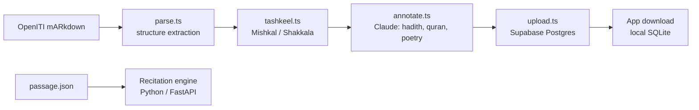

# Suhoof Book Format

Arabic text flows from **OpenITI mARkdown** source files through an ingestion pipeline into Supabase Postgres, then mirrors to a local SQLite database on the device. Each stage serves a distinct purpose -- source preservation, canonical storage, and offline reading. The recitation engine uses a separate `passage.json` format that is independent of this pipeline.

## Format Lifecycle



The ingestion pipeline runs as a local Node.js script. The recitation path is entirely separate -- `passage.json` is hand-curated and consumed directly by the GPU server.

---

## Source Format: OpenITI mARkdown

**OpenITI mARkdown** is a plain-text markup convention for digitized classical Arabic texts. The Suhoof ingestion pipeline reads these files and extracts structure.

| mARkdown element | Maps to |
|---|---|
| Header markers | `chapters` rows (level 1/2/3) |
| Page break markers | `pages` rows |
| Poetry hemistich separators | `\t` delimiter in `pages.content` |
| All other tags | Stripped -- structure captured in schema |

The source text is stored nowhere in the app schema -- parsing is destructive by design. Only the extracted structure and normalized content survive ingestion.

---

## Recitation Format: `passage.json`

`passage.json` lives at `recitation/passage.json` and is consumed exclusively by the Python recitation backend. It is not part of the reader pipeline and does not appear in any database schema.

**Top-level shape:**

```json
{
  "passages": [
    {
      "id": "ajrumiyyah",
      "title": "المقدمة الآجرومية",
      "source": "usul.ai",
      "text": "...",
      "phrases": ["...", "..."]
    }
  ]
}
```

| Field | Type | Purpose |
|---|---|---|
| `id` | string | Stable identifier used by the backend to reference a passage |
| `title` | string | Display name (Arabic) |
| `source` | string | Origin of the text |
| `text` | string | Full diacritized passage text, paragraphs separated by `\n` |
| `phrases` | string[] | Text broken into streaming-friendly segments for word-by-word feedback |

The file contains three passages:

| Passage ID | Title | Phrase count |
|---|---|---|
| `ajrumiyyah` | المقدمة الآجرومية | 18 |
| `daa-dawa` | الداء والدواء | 14 |
| `ihya` | إحياء علوم الدين | 44 |

Phrase segmentation determines the granularity of real-time recitation feedback. Phrases are sized to give the CTC model enough audio context without introducing latency.

---

## Storage Format: Supabase Schema

Supabase Postgres is the canonical store for book data and the sync target for user data. The ingestion pipeline writes to Supabase; the app reads from it only at download time.

### Book data

```sql
books (
  id UUID PRIMARY KEY DEFAULT gen_random_uuid(),
  openiti_id TEXT UNIQUE NOT NULL,
  title TEXT NOT NULL,
  author TEXT,
  category TEXT,
  total_pages INTEGER,
  has_tashkeel BOOLEAN DEFAULT FALSE,
  created_at TIMESTAMPTZ DEFAULT NOW()
);

pages (
  id UUID PRIMARY KEY DEFAULT gen_random_uuid(),
  book_id UUID REFERENCES books(id),
  page_number INTEGER NOT NULL,
  volume INTEGER DEFAULT 1,
  content TEXT NOT NULL,          -- paragraphs separated by \n\n, poetry hemistichs by \t
  content_hash TEXT,              -- for detecting changes and re-anchoring
  UNIQUE(book_id, volume, page_number)
);

chapters (
  id UUID PRIMARY KEY DEFAULT gen_random_uuid(),
  book_id UUID REFERENCES books(id),
  title TEXT NOT NULL,
  level INTEGER NOT NULL,         -- 1 = chapter, 2 = section, 3 = subsection
  page_id UUID REFERENCES pages(id),
  parent_id UUID REFERENCES chapters(id),
  sort_order INTEGER NOT NULL
);

annotations (
  id UUID PRIMARY KEY DEFAULT gen_random_uuid(),
  book_id UUID REFERENCES books(id),
  page_id UUID REFERENCES pages(id),
  start_offset INTEGER NOT NULL,  -- character offset within page content
  end_offset INTEGER NOT NULL,
  type TEXT NOT NULL,              -- hadith | isnad | matn | quran | poetry | biography
  metadata_json JSONB             -- type-specific: hadith number, surah/ayah, poet, etc.
);
```

**Page content format:** `content` stores normalized text only. Paragraphs are separated by `\n\n`. Poetry hemistichs within a paragraph are separated by `\t`. All mARkdown tags are stripped -- structural information lives in `chapters` and `annotations`.

`content_hash` is a hash of the page text at ingestion time. When a book is re-ingested after a source correction, user annotations compare their stored `anchor_context` against the new hash to detect drift and re-anchor.

### I'rab cache

```sql
irab_cache (
  id UUID PRIMARY KEY DEFAULT gen_random_uuid(),
  word TEXT NOT NULL,
  sentence_hash TEXT NOT NULL,
  model_version TEXT NOT NULL DEFAULT 'sonnet-1',
  result_json JSONB NOT NULL,
  created_at TIMESTAMPTZ DEFAULT NOW(),
  UNIQUE(word, sentence_hash, model_version)
);
```

The cache key is `(word, sentence_hash, model_version)`. `model_version` allows invalidation when the prompt or model changes without dropping the entire cache. This table is global -- all users share it.

### User data

```sql
user_bookmarks (
  id UUID PRIMARY KEY DEFAULT gen_random_uuid(),
  user_id UUID REFERENCES auth.users(id),
  book_id UUID REFERENCES books(id),
  page_id UUID REFERENCES pages(id),
  start_offset INTEGER,
  end_offset INTEGER,
  label TEXT,
  anchor_context TEXT,            -- ~30 chars for re-anchoring if content changes
  created_at TIMESTAMPTZ DEFAULT NOW(),
  updated_at TIMESTAMPTZ DEFAULT NOW(),
  deleted_at TIMESTAMPTZ           -- tombstone for sync (NULL = active)
);

user_highlights (
  id UUID PRIMARY KEY DEFAULT gen_random_uuid(),
  user_id UUID REFERENCES auth.users(id),
  book_id UUID REFERENCES books(id),
  page_id UUID REFERENCES pages(id),
  start_offset INTEGER NOT NULL,
  end_offset INTEGER NOT NULL,
  color TEXT DEFAULT 'yellow',
  note TEXT,
  anchor_context TEXT,
  created_at TIMESTAMPTZ DEFAULT NOW(),
  updated_at TIMESTAMPTZ DEFAULT NOW(),
  deleted_at TIMESTAMPTZ           -- tombstone for sync
);

user_notes (
  id UUID PRIMARY KEY DEFAULT gen_random_uuid(),
  user_id UUID REFERENCES auth.users(id),
  book_id UUID REFERENCES books(id),
  page_id UUID REFERENCES pages(id),
  anchor_offset INTEGER NOT NULL,
  content TEXT NOT NULL,
  anchor_context TEXT,
  created_at TIMESTAMPTZ DEFAULT NOW(),
  updated_at TIMESTAMPTZ DEFAULT NOW(),
  deleted_at TIMESTAMPTZ           -- tombstone for sync
);

user_reading_positions (
  user_id UUID REFERENCES auth.users(id),
  book_id UUID REFERENCES books(id),
  page_id UUID REFERENCES pages(id),
  scroll_offset REAL DEFAULT 0,
  updated_at TIMESTAMPTZ DEFAULT NOW(),
  PRIMARY KEY (user_id, book_id)
);

user_pencil_strokes (
  id UUID PRIMARY KEY DEFAULT gen_random_uuid(),
  user_id UUID REFERENCES auth.users(id),
  book_id UUID REFERENCES books(id),
  page_id UUID REFERENCES pages(id),
  drawing_data BYTEA NOT NULL,    -- serialized PKDrawing
  viewport_json JSONB NOT NULL,
  created_at TIMESTAMPTZ DEFAULT NOW(),
  updated_at TIMESTAMPTZ DEFAULT NOW()
);
```

The **tombstone pattern** -- `deleted_at TIMESTAMPTZ` -- lets deletes propagate across sync boundaries without requiring immediate connectivity. A row with a non-null `deleted_at` is logically deleted but physically present until purged.

---

## Local Format: SQLite Mirror

The device stores a full local copy of downloaded book data in SQLite. This is the primary data source during reading -- the app reads from SQLite, not from Supabase.

```sql
-- Downloaded book data (mirrors Supabase)
books (id TEXT PK, openiti_id, title, author, category, total_pages, downloaded_at INTEGER);
pages (id TEXT PK, book_id, page_number, volume, content, content_hash);
chapters (id TEXT PK, book_id, title, level, page_id, parent_id, sort_order);
annotations (id TEXT PK, book_id, page_id, start_offset, end_offset, type, metadata_json);

-- User data (local-first, syncs to Supabase)
bookmarks (id TEXT PK, book_id, page_id, start_offset, end_offset, label, anchor_context, created_at INTEGER, updated_at INTEGER, deleted_at INTEGER, synced INTEGER DEFAULT 0);
highlights (id TEXT PK, book_id, page_id, start_offset, end_offset, color, note, anchor_context, created_at INTEGER, updated_at INTEGER, deleted_at INTEGER, synced INTEGER DEFAULT 0);
text_notes (id TEXT PK, book_id, page_id, anchor_offset, content, anchor_context, created_at INTEGER, updated_at INTEGER, deleted_at INTEGER, synced INTEGER DEFAULT 0);
pencil_strokes (id TEXT PK, book_id, page_id, drawing_data BLOB, viewport_json TEXT, created_at INTEGER, updated_at INTEGER, synced INTEGER DEFAULT 0);
reading_positions (book_id TEXT PK, page_id TEXT, scroll_offset REAL, updated_at INTEGER);

-- I'rab cache (local copy of global cache + user's own lookups)
irab_cache (id TEXT PK, word TEXT, sentence_hash TEXT, model_version TEXT DEFAULT 'sonnet-1', result_json TEXT, UNIQUE(word, sentence_hash, model_version));

-- Preferences
user_prefs (key TEXT PK, value TEXT);
```

Key differences from the Supabase schema:

| Difference | Detail |
|---|---|
| `downloaded_at INTEGER` | Unix timestamp added to `books` -- not in Supabase |
| Timestamps as `INTEGER` | Unix epoch instead of `TIMESTAMPTZ` |
| `synced INTEGER DEFAULT 0` | User data rows carry a sync flag: 0 = needs push, 1 = pushed |
| No `user_id` on local tables | Local data is implicitly owned by the device user |
| `text_notes` vs `user_notes` | Table is renamed in SQLite |

On connectivity, the app pushes all rows where `synced = 0` to Supabase, then sets `synced = 1`.

---

## Annotation Types

The `annotations` table marks spans of page content by type. Each type has a distinct rendering style and a type-specific `metadata_json` shape.

| Type | Rendering style | Metadata fields |
|---|---|---|
| `hadith` | Card with save button | `hadith_number`, `source_book`, `grade` |
| `isnad` | Smaller, muted text | `narrators[]` |
| `matn` | Prominent, larger text | -- |
| `quran` | Special font, ornamental frame | `surah`, `ayah` |
| `poetry` | Centered, hemistich layout | `meter`, `poet` |
| `biography` | Collapsible section | `person_name`, `birth_ah`, `death_ah` |

Annotations are populated by `annotate.ts` during ingestion using Claude. `start_offset` and `end_offset` are character offsets into the page `content` string.

---

## Key Files

| File | Purpose |
|---|---|
| `ingestion/parse.ts` | mARkdown parser -- produces pages and chapters rows |
| `ingestion/tashkeel.ts` | Runs Mishkal or Shakkala on unvocalized text |
| `ingestion/annotate.ts` | Claude-powered annotation of hadith, quran, poetry, etc. |
| `ingestion/upload.ts` | Pushes processed data to Supabase |
| `ingestion/ingest.ts` | Orchestrator: parse → tashkeel → annotate → upload |
| `recitation/passage.json` | Hand-curated diacritized passages for recitation -- not part of reader pipeline |
| `reader/TECHNICAL_SPEC.md` | Full technical spec including schema DDL and i'rab flow |

---

## Gotchas

**Unicode diacritic ordering.** Arabic diacritics (tashkeel) must follow their base letter in Unicode codepoint order. Mis-ordered diacritics produce identical visual output but different byte sequences, which breaks `content_hash` comparisons and offset arithmetic. Normalize Unicode before hashing or comparing.

**`content_hash` and re-anchoring.** When a book is re-ingested after a source correction, page content can shift. User annotations store `anchor_context` -- roughly 30 characters of surrounding text -- to allow fuzzy re-anchoring. If `content_hash` changes on a page, the app attempts to re-anchor all annotations on that page using `anchor_context` before rendering.

**Tombstone 90-day purge.** Rows with a non-null `deleted_at` are kept for sync propagation. The sync layer should purge tombstones older than 90 days to prevent unbounded table growth. Without this, tombstones accumulate indefinitely.

**`passage.json` is not part of the reader pipeline.** The recitation passages are separate from any book in the Supabase catalog. There is no foreign key, no `book_id`, and no ingestion step -- `passage.json` is consumed directly by the Python backend. Do not attempt to ingest it through the Node pipeline.

**Pencil strokes have no tombstone.** `user_pencil_strokes` in Supabase and `pencil_strokes` in SQLite have no `deleted_at` column. Deletion of strokes requires a hard delete, not a tombstone.

---

## Related Docs

- `ingestion-pipeline.md` -- step-by-step ingestion pipeline reference
- `../agents/irab.md` -- i'rab edge function, three-tier cache, and Claude prompt
- `app.md` -- reader app architecture, offline sync flow, and recitation integration
