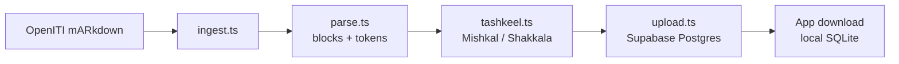
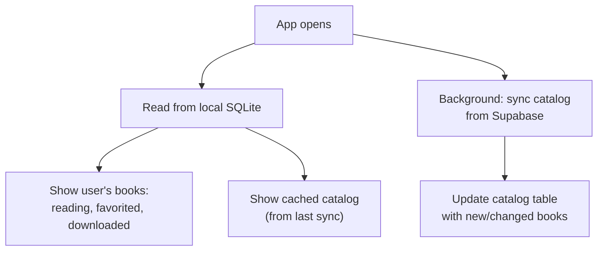
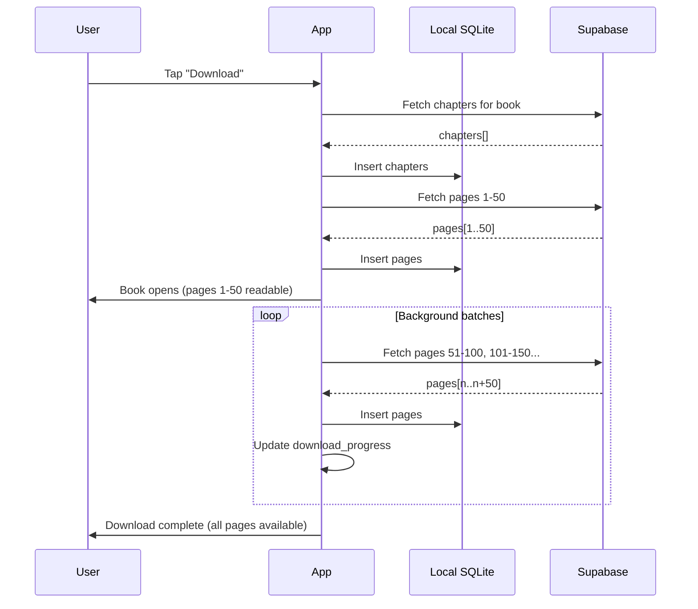

# Suhuf Book Format

Arabic text flows from **OpenITI mARkdown** source files through an ingestion pipeline into Supabase Postgres, then downloads to a local SQLite database on the device. The content model is **block-based with word-level tokens**: each page stores a JSON array of typed blocks (prose, isnad, poetry, quran, etc.), and each block contains an array of word tokens with stable IDs for tap targets and user data anchoring.

## Format Lifecycle



The annotate stage (Claude-powered semantic detection) **runs by default** and supplies the bulk of the semantic structure. Although the OpenITI mARkdown *spec* defines hadith/isnad/biography tags (`$RWY$` / `@MATN@` / `$BIO_*`), the mainstream corpus does **not** carry them: a direct grep found **zero** across Sahih al-Bukhari (`.completed`), Sahih Muslim (top-tier `.mARkdown`), Sunan al-Tirmidhi, and Bulugh al-Maram — all of which have only the universal **structural** markup (thousands of `PageV` page markers and `### |` headings). So the parser builds blocks from that structural markup, and the Claude pass supplies `isnad`/`matn`/`takhrij` spans, person/place/qur'an labels, gradings, etc. The native-tag path in `parse.py` exists for the rare annotated text but almost never fires on real books.

---

## Source Format: OpenITI mARkdown

**OpenITI mARkdown** is a plain-text markup convention for digitized classical Arabic texts. The Suhuf ingestion pipeline reads these files and extracts structure into typed blocks.

### Tag-to-Block Mapping

| mARkdown tag | Block type | Description |
|---|---|---|
| `# $RWY$` | `hadith` | Hadith report paragraph |
| `@MATN@` | Splits `isnad` / `matn` | Isnad-matn boundary within a hadith |
| `### $BIO_MAN$` / `### $BIO_WOM$` | `biography` | Biographical entry |
| `### $` / `### $$` | `biography` | Simplified biography markers |
| `%~%` | `poetry` hemistich divider | Poetry hemistich boundary |
| `### \|` | Chapter heading (level 1) | Maps to `chapters` table |
| `### \|\|` | Section heading (level 2) | Maps to `chapters` table |
| `### \|\|\|` | Subsection heading (level 3) | Maps to `chapters` table |
| `PageV##P###` | Page boundary | Drives `page_number` and `volume` |
| `### \|EDITOR\|` | Stripped | Editorial content not part of the text |
| `@YB####` / `@YD####` | Metadata | Birth/death years captured in biography block metadata |
| All other tags | Stripped | Unrecognized tags are removed; text preserved as `prose` blocks |

**The file extension reflects structural-conversion quality, not semantic tagging.** `.mARkdown` > `.completed` > `.inProgress` > raw is about how well the *structural* markup (page markers, headings, paragraphs) was vetted — none of the tiers implies semantic hadith/biography tags, which are absent even from top-tier `.mARkdown` files (e.g. Sahih Muslim). Prefer `.mARkdown` for the cleanest structure, but the isnad/matn/etc. layer comes from the Claude annotation pass regardless of tier.

---

## Content Model: Blocks + Tokens

Each page stores a `content_blocks` JSON array. Every block has a `type`, a stable `key`, and contains word-level `tokens`. Each token is an object with an `id` and `text`.

### Block Types

| Type | Description | Token structure |
|---|---|---|
| `prose` | Default paragraph text | `tokens[]` |
| `hadith` | Hadith report (contains isnad + matn as sub-structure) | `tokens[]` |
| `isnad` | Chain of narrators | `tokens[]` |
| `matn` | Body text of a hadith | `tokens[]` |
| `poetry` | Verse with hemistich pairs | `hemistichs[]` (each hemistich is a `tokens[]`) |
| `biography` | Biographical entry | `tokens[]` |
| `heading` | Section heading (also stored in `chapters` table) | `tokens[]` |

### Example Page

```json
[
  {
    "key": "b1",
    "type": "isnad",
    "tokens": [
      {"id": "p42_b1_w0", "text": "حَدَّثَنَا"},
      {"id": "p42_b1_w1", "text": "عَبْدُ"},
      {"id": "p42_b1_w2", "text": "اللَّهِ"},
      {"id": "p42_b1_w3", "text": "بْنُ"},
      {"id": "p42_b1_w4", "text": "يُوسُفَ"}
    ]
  },
  {
    "key": "b2",
    "type": "matn",
    "tokens": [
      {"id": "p42_b2_w0", "text": "إِنَّمَا"},
      {"id": "p42_b2_w1", "text": "الْأَعْمَالُ"},
      {"id": "p42_b2_w2", "text": "بِالنِّيَّاتِ"}
    ]
  },
  {
    "key": "b3",
    "type": "poetry",
    "metadata": {"meter": "طويل", "poet": "امرؤ القيس"},
    "hemistichs": [
      [
        [{"id": "p42_b3_w0", "text": "قِفَا"}, {"id": "p42_b3_w1", "text": "نَبْكِ"}],
        [{"id": "p42_b3_w2", "text": "بِسِقْطِ"}, {"id": "p42_b3_w3", "text": "اللِّوَى"}]
      ]
    ]
  },
  {
    "key": "b4",
    "type": "prose",
    "tokens": [
      {"id": "p42_b4_w0", "text": "وَهَذَا"},
      {"id": "p42_b4_w1", "text": "يَدُلُّ"},
      {"id": "p42_b4_w2", "text": "عَلَى"},
      {"id": "p42_b4_w3", "text": "أَنَّ"},
      {"id": "p42_b4_w4", "text": "النِّيَّةَ"},
      {"id": "p42_b4_w5", "text": "شَرْطٌ"}
    ]
  }
]
```

### Token IDs

Token IDs are deterministic, generated from source position:

```
p{page_number}_b{block_index}_w{word_index}
```

Example: `p42_b3_w7` = page 42, block 3 (0-indexed), word 7 (0-indexed).

This makes IDs stable across re-ingestion as long as the source content doesn't change. If source content changes, user data (highlights, bookmarks, notes) stores `anchor_context` (~30 characters of surrounding text) as a fallback for re-anchoring token references that have drifted.

### Word Tokenization

Tokenization is **whitespace-based**. Arabic words are space-separated in the source text. Clitics stay attached to their host word (e.g., `والكتاب` is one token, not three). This matches what the user sees and taps. The i'rab agent handles clitic decomposition in its analysis response.

---

## Storage Format: Supabase Schema

Supabase Postgres is the canonical store for book data. The ingestion pipeline writes to Supabase; the app reads from it at download time only.

### Authors

```sql
authors (
  id UUID PRIMARY KEY DEFAULT gen_random_uuid(),
  openiti_id TEXT UNIQUE NOT NULL,     -- e.g., '0748Dhahabi'

  -- Names
  shuhra_ar TEXT NOT NULL,             -- Famous name in Arabic (most recognizable form)
  shuhra_lat TEXT,                     -- Famous name in Latin transliteration
  ism_ar TEXT,                         -- Given name (ism)
  nasab_ar TEXT,                       -- Patronymic chain (ibn/bin)
  kunya_ar TEXT,                       -- Honorific epithet (Abu...)
  laqab_ar TEXT,                       -- Title (Shams al-Din, etc.)
  nisba_ar TEXT,                       -- Geographic/professional affiliation
  full_name_ar TEXT,                   -- Composite: ism + nasab + kunya + laqab + nisba

  -- Dates
  birth_ah INTEGER,                    -- Hijri birth year
  death_ah INTEGER,                    -- Hijri death year

  -- Geography (from Althurayya URIs)
  birthplace TEXT,
  deathplace TEXT,
  places_visited TEXT[],
  places_resided TEXT[],

  -- Scholarly network (OpenITI author URIs)
  teachers TEXT[] DEFAULT '{}',
  students TEXT[] DEFAULT '{}',

  -- External IDs
  wikidata_id TEXT,                    -- e.g., 'Q293554'
  external_ids JSONB DEFAULT '{}',     -- VIAF, EI2, etc.

  -- System
  created_at TIMESTAMPTZ DEFAULT NOW(),
  updated_at TIMESTAMPTZ DEFAULT NOW()
);
```

### Book data

```sql
books (
  id UUID PRIMARY KEY DEFAULT gen_random_uuid(),
  openiti_id TEXT UNIQUE NOT NULL,
  author_id UUID REFERENCES authors(id) NOT NULL,

  -- Title
  title_ar TEXT NOT NULL,              -- Arabic title (from 10#BOOK#TITLEA#AR)
  title_lat TEXT,                      -- Latin transliteration
  description TEXT,                    -- Book description / summary

  -- Classification
  genres TEXT[] NOT NULL DEFAULT '{}',  -- OpenITI genre tags: HADITH, FIQH, TARIKH, etc.

  -- Metrics
  word_count INTEGER,                  -- From 00#VERS#LENGTH###
  char_count INTEGER,                  -- From 00#VERS#CLENGTH##
  total_pages INTEGER,                 -- Derived from page markers during ingestion
  total_volumes INTEGER DEFAULT 1,

  -- Source provenance
  version_status TEXT,                 -- 'pri' (primary) or 'sec' (secondary)
  source_edition_url TEXT,             -- Worldcat permalink to print edition
  quality_issues TEXT[] DEFAULT '{}',  -- NO_MAJOR_ISSUES, MANY_TYPOS, etc.
  language TEXT DEFAULT 'ara',         -- ISO 639-2 language code
  composition_date_ah INTEGER,         -- Hijri year of composition (from 30#BOOK#WROTE##AH)

  -- Related works (OpenITI URIs)
  commentary_on TEXT,                  -- OpenITI URI of commented work
  abridgement_of TEXT,                 -- OpenITI URI of abridged work

  -- Starter catalog
  is_starter BOOLEAN DEFAULT FALSE,    -- shown in "Start here" for new users

  -- System
  has_tashkeel BOOLEAN DEFAULT FALSE,
  created_at TIMESTAMPTZ DEFAULT NOW(),
  updated_at TIMESTAMPTZ DEFAULT NOW()
);

pages (
  id UUID PRIMARY KEY DEFAULT gen_random_uuid(),
  book_id UUID REFERENCES books(id),
  page_number INTEGER NOT NULL,
  volume INTEGER DEFAULT 1,
  content_blocks JSONB NOT NULL,   -- block array with tokens (see Content Model)
  content_plain TEXT NOT NULL,     -- flat text for future full-text search
  content_hash TEXT,               -- hash of content_plain for change detection
  UNIQUE(book_id, volume, page_number)
);

chapters (
  id UUID PRIMARY KEY DEFAULT gen_random_uuid(),
  book_id UUID REFERENCES books(id),
  title TEXT NOT NULL,
  level INTEGER NOT NULL,          -- 1 = chapter, 2 = section, 3 = subsection
  page_id UUID REFERENCES pages(id),
  parent_id UUID REFERENCES chapters(id),
  sort_order INTEGER NOT NULL
);
```

**No separate annotations table.** Semantic structure (hadith, isnad, poetry, biography) is encoded directly in block types within `content_blocks`. A future Claude enrichment pass may add a metadata table keyed on block keys.

### I'rab cache

```sql
irab_cache (
  id UUID PRIMARY KEY DEFAULT gen_random_uuid(),
  word TEXT NOT NULL,
  sentence_hash TEXT NOT NULL,
  model_version TEXT NOT NULL DEFAULT 'sonnet-1',
  result_json JSONB NOT NULL,
  created_at TIMESTAMPTZ DEFAULT NOW(),
  UNIQUE(word, sentence_hash, model_version)
);
```

Global table shared across all users. Cache key is `(word, sentence_hash, model_version)`.

### User library state

```sql
user_library (
  user_id UUID REFERENCES auth.users(id),
  book_id UUID REFERENCES books(id),
  status TEXT NOT NULL DEFAULT 'none', -- none | downloading | downloaded | reading | favorited
  download_progress REAL DEFAULT 0,    -- 0.0 to 1.0 (pages downloaded / total pages)
  last_opened_at TIMESTAMPTZ,
  created_at TIMESTAMPTZ DEFAULT NOW(),
  updated_at TIMESTAMPTZ DEFAULT NOW(),
  PRIMARY KEY (user_id, book_id)
);
```

The `user_library` table tracks per-user book state. On app open, the app queries this table (local SQLite mirror) to show the user's in-progress, downloaded, and favorited books instantly before loading the full catalog.

### User data

```sql
user_bookmarks (
  id UUID PRIMARY KEY DEFAULT gen_random_uuid(),
  user_id UUID REFERENCES auth.users(id),
  book_id UUID REFERENCES books(id),
  page_id UUID REFERENCES pages(id),
  token_id TEXT,                   -- optional: specific word bookmarked
  label TEXT,
  anchor_context TEXT,             -- ~30 chars for re-anchoring if content changes
  created_at TIMESTAMPTZ DEFAULT NOW(),
  updated_at TIMESTAMPTZ DEFAULT NOW(),
  deleted_at TIMESTAMPTZ           -- tombstone for sync (NULL = active)
);

user_highlights (
  id UUID PRIMARY KEY DEFAULT gen_random_uuid(),
  user_id UUID REFERENCES auth.users(id),
  book_id UUID REFERENCES books(id),
  page_id UUID REFERENCES pages(id),
  start_token_id TEXT NOT NULL,    -- first token in highlight range
  end_token_id TEXT NOT NULL,      -- last token in highlight range
  color TEXT DEFAULT 'yellow',
  note TEXT,
  anchor_context TEXT,
  created_at TIMESTAMPTZ DEFAULT NOW(),
  updated_at TIMESTAMPTZ DEFAULT NOW(),
  deleted_at TIMESTAMPTZ
);

user_notes (
  id UUID PRIMARY KEY DEFAULT gen_random_uuid(),
  user_id UUID REFERENCES auth.users(id),
  book_id UUID REFERENCES books(id),
  page_id UUID REFERENCES pages(id),
  token_id TEXT NOT NULL,          -- token the note is anchored to
  content TEXT NOT NULL,
  anchor_context TEXT,
  created_at TIMESTAMPTZ DEFAULT NOW(),
  updated_at TIMESTAMPTZ DEFAULT NOW(),
  deleted_at TIMESTAMPTZ
);

user_reading_positions (
  user_id UUID REFERENCES auth.users(id),
  book_id UUID REFERENCES books(id),
  page_id UUID REFERENCES pages(id),
  updated_at TIMESTAMPTZ DEFAULT NOW(),
  PRIMARY KEY (user_id, book_id)
);
```

User data references **token IDs** (e.g., `p42_b3_w7`) instead of character offsets. This is stable across re-ingestion as long as source content is unchanged. The `anchor_context` column provides fuzzy re-anchoring when token IDs drift after a source correction.

The **tombstone pattern** (`deleted_at TIMESTAMPTZ`) lets deletes propagate across sync boundaries. Tombstones are purged after 90 days.

---

## Local Format: SQLite Mirror

The device stores a full local copy of downloaded book data in SQLite. SQLite is the primary data source during reading.

```sql
-- Authors (synced from Supabase)
authors (
  id TEXT PK, openiti_id TEXT UNIQUE,
  shuhra_ar, shuhra_lat, full_name_ar,
  ism_ar, nasab_ar, kunya_ar, laqab_ar, nisba_ar,
  birth_ah INTEGER, death_ah INTEGER,
  birthplace, deathplace,
  wikidata_id,
  updated_at INTEGER
);

-- Catalog (all books, synced from Supabase -- metadata only, no page content)
catalog (
  id TEXT PK, openiti_id TEXT UNIQUE,
  author_id TEXT REFERENCES authors(id),
  title_ar, title_lat, description,
  genres TEXT,              -- JSON array string: ["HADITH","FIQH"]
  word_count INTEGER, char_count INTEGER, total_pages INTEGER, total_volumes INTEGER,
  version_status, language, has_tashkeel INTEGER,
  is_starter INTEGER DEFAULT 0,
  updated_at INTEGER
);

-- Downloaded book content (only for books the user has downloaded)
pages (id TEXT PK, book_id, page_number INTEGER, volume INTEGER, content_blocks TEXT, content_plain TEXT, content_hash TEXT);
chapters (id TEXT PK, book_id, title, level INTEGER, page_id, parent_id, sort_order INTEGER);

-- User library state (local-first, syncs to Supabase)
library (
  book_id TEXT PK,
  status TEXT DEFAULT 'none',       -- none | downloading | downloaded | reading | favorited
  download_progress REAL DEFAULT 0, -- 0.0 to 1.0
  last_opened_at INTEGER,
  updated_at INTEGER,
  synced INTEGER DEFAULT 0
);

-- User data (local-first, syncs to Supabase)
bookmarks (id TEXT PK, book_id, page_id, token_id, label, anchor_context, created_at INTEGER, updated_at INTEGER, deleted_at INTEGER, synced INTEGER DEFAULT 0);
highlights (id TEXT PK, book_id, page_id, start_token_id, end_token_id, color, note, anchor_context, created_at INTEGER, updated_at INTEGER, deleted_at INTEGER, synced INTEGER DEFAULT 0);
text_notes (id TEXT PK, book_id, page_id, token_id, content, anchor_context, created_at INTEGER, updated_at INTEGER, deleted_at INTEGER, synced INTEGER DEFAULT 0);
reading_positions (book_id TEXT PK, page_id TEXT, updated_at INTEGER);

-- I'rab cache (local copy of global cache)
irab_cache (id TEXT PK, word TEXT, sentence_hash TEXT, model_version TEXT DEFAULT 'sonnet-1', result_json TEXT, UNIQUE(word, sentence_hash, model_version));

-- Preferences
user_prefs (key TEXT PK, value TEXT);
```

Key differences from Supabase: timestamps as `INTEGER` (Unix epoch), `synced` flag for outbound sync, no `user_id` (implicit), `content_blocks` stored as `TEXT` (JSON string). The `catalog` table mirrors the `books` table but is always synced (book metadata). The `pages` and `chapters` tables only contain data for downloaded books.

---

## Loading Flow

### 1. App open (instant, local)



The library screen shows the user's books (from `library` table) instantly. The full catalog loads from the local `catalog` table (cached from last sync). A background fetch syncs new/updated book metadata from Supabase.

### 2. Catalog browsing (paginated from Supabase)

The catalog is browsable by **genre category**. OpenITI provides 140+ genre tags; the app groups them into top-level categories:

| Category | OpenITI genres |
|---|---|
| Hadith | `HADITH`, `MASANID`, `SUNAN`, `SAHIH`, `CILAL` |
| Fiqh | `FIQH`, `HANAFI`, `MALIKI`, `SHAFICI`, `HANBALI`, `USUL`, `QAWACID` |
| Tafsir / Quran | `TAFSIR`, `QURAN`, `QIRAAT`, `TAJWID` |
| History | `TARIKH`, `SIRA`, `CHR_EVE` |
| Biography | `TARAJIM`, `TABAQAT`, `BIO`, `WAFAYAT`, `ANSAB` |
| Language | `NAHW`, `SARF`, `BALAGHA`, `LUGHA`, `MACAJIM` |
| Literature | `SHICR`, `CARUD`, `ADAB` |
| Aqeedah | `CAQAID`, `AKHLAQ`, `TASAWWUF` |

Catalog pagination: 20 books per page, fetched from Supabase. Each entry shows: title (ar), author (ar), death year, genre tags, word count.

### 3. Book download (paginated, read-while-downloading)



- First batch (50 pages) downloads and inserts before the book opens
- Book is immediately readable with a "downloading..." indicator
- Remaining pages download in background batches of 50
- `library.download_progress` tracks completion (0.0 to 1.0)
- If the user navigates past downloaded pages, show a loading state until that batch arrives

### 4. Opening a book

```
User taps book in library
  -> set library.status = 'reading', last_opened_at = now
  -> read reading_position for this book (last page)
  -> fetch page row from SQLite
  -> JSON.parse(content_blocks)
  -> render blocks + tokens
  -> ready for word taps and navigation
```

### 5. Deleting a downloaded book (storage management)

Users can delete downloaded books to free device storage.

```
User swipes or taps "Delete" on a downloaded book
  -> delete all pages and chapters for this book from local SQLite
  -> set library.status = 'none', download_progress = 0
  -> bookmarks, highlights, notes are NOT deleted locally or from Supabase
  -> book remains in catalog, shows "Download" button again
  -> if user re-downloads, their annotations reattach via token IDs
```

User data (bookmarks, highlights, notes) is **never deleted** when removing a downloaded book. It persists in both local SQLite and Supabase. Only the page content and chapters are removed from the device. When the book is re-downloaded, annotations reattach because token IDs are deterministic from source position.

### 6. First-time experience

New users see a **"Start here"** section at the top of the library with a curated selection of books marked `is_starter = true` in the catalog. These are popular, well-tagged classical texts across genres.

The app does not auto-download any books. The user picks what to download from the starter set or the full catalog.

---

## Curated Starter Catalog

18 classical Arabic/Islamic texts verified in the [OpenITI corpus](https://github.com/OpenITI). These are marked `is_starter = true` and shown in the "Start here" section for new users. They span 7 genres, range from ~10 pages to 10,000+ pages, and cover beginner through advanced levels.

### File quality hierarchy

OpenITI files have three quality tiers. Prefer higher tiers for ingestion:

1. **`.mARkdown`** -- Verified and structurally annotated (best)
2. **`.completed`** -- Conversion done, awaiting final vetting
3. **Raw (no extension)** -- Auto-converted, may need cleanup

### Catalog

| # | OpenITI URI | Title (Arabic) | Title (Transliterated) | Author (d. AH) | Genre | Size | File Status |
|---|---|---|---|---|---|---|---|
| 1 | `0676Nawawi.ArbacunaNawawiyya` | الأربعون النووية | al-Arba'un al-Nawawiyyah | al-Nawawi (676) | Hadith | Short (~15 pp) | `.mARkdown` |
| 2 | `0676Nawawi.RiyadSalihin` | رياض الصالحين | Riyad al-Salihin | al-Nawawi (676) | Hadith | Medium (~600 pp) | `.mARkdown` |
| 3 | `0256Bukhari.Sahih` | صحيح البخاري | Sahih al-Bukhari | al-Bukhari (256) | Hadith | Long (~2,600 pp) | `.completed` |
| 4 | `0261Muslim.Sahih` | صحيح مسلم | Sahih Muslim | Muslim (261) | Hadith | Long (~2,200 pp) | Raw |
| 5 | `0852IbnHajarCasqalani.BulughMaram` | بلوغ المرام | Bulugh al-Maram | Ibn Hajar (852) | Hadith/Fiqh | Medium (~350 pp) | Raw |
| 6 | `0774IbnKathir.TafsirQuran` | تفسير القرآن العظيم | Tafsir Ibn Kathir | Ibn Kathir (774) | Tafsir | Long (~3,000 pp) | `.mARkdown` |
| 7 | `0911Suyuti.TafsirJalalayn` | تفسير الجلالين | Tafsir al-Jalalayn | al-Suyuti (911) | Tafsir | Medium (~700 pp) | Raw |
| 8 | `0723IbnAjrum.Ajrumiyya` | المقدمة الآجرومية | al-Ajrumiyyah | Ibn Ajurrum (723) | Grammar | Short (~10 pp) | Raw |
| 9 | `0672IbnMalik.Alfiyya` | ألفية ابن مالك | Alfiyyat Ibn Malik | Ibn Malik (672) | Grammar | Short (~50 pp) | Raw |
| 10 | `0761JamalDinIbnHisham.QatrNada` | قطر الندى وبل الصدى | Qatr al-Nada | Ibn Hisham (761) | Grammar | Short-Med (~100 pp) | Raw |
| 11 | `0620IbnQudamaMaqdisi.CumdatFiqh` | عمدة الفقه | 'Umdat al-Fiqh | Ibn Qudama (620) | Fiqh | Short-Med (~150 pp) | Raw |
| 12 | `0204Shafici.Risala` | الرسالة | al-Risala | al-Shafi'i (204) | Usul al-Fiqh | Medium (~300 pp) | Raw |
| 13 | `0213IbnHisham.SiraNabawiyya` | السيرة النبوية | al-Sira al-Nabawiyya | Ibn Hisham (213) | Sira | Long (~1,500 pp) | Raw |
| 14 | `0728IbnTaymiyya.CaqidaWasitiyya` | العقيدة الواسطية | al-'Aqida al-Wasitiyya | Ibn Taymiyya (728) | Aqeedah | Short (~30 pp) | Raw |
| 15 | `0620IbnQudamaMaqdisi.LumcatIctiqad` | لمعة الاعتقاد | Lum'at al-I'tiqad | Ibn Qudama (620) | Aqeedah | Short (~15 pp) | Raw |
| 16 | `0505Ghazali.IhyaCulumDin` | إحياء علوم الدين | Ihya' 'Ulum al-Din | al-Ghazali (505) | Spirituality | Long (~2,500 pp) | `.completed` |
| 17 | `0505Ghazali.BidayatHidaya` | بداية الهداية | Bidayat al-Hidaya | al-Ghazali (505) | Spirituality | Short (~80 pp) | Raw |
| 18 | `0748Dhahabi.SiyarAclamNubala` | سير أعلام النبلاء | Siyar A'lam al-Nubala' | al-Dhahabi (748) | Biography | Very Long (~10,000 pp) | Raw |

### Genre coverage

| Genre | Count | Books |
|---|---|---|
| Hadith | 5 | Arba'un, Riyad al-Salihin, Bukhari, Muslim, Bulugh al-Maram |
| Tafsir | 2 | Ibn Kathir, Jalalayn |
| Grammar | 3 | Ajrumiyyah, Alfiyyat Ibn Malik, Qatr al-Nada |
| Fiqh | 2 | 'Umdat al-Fiqh, al-Risala |
| Sira | 1 | Ibn Hisham |
| Aqeedah | 2 | al-Wasitiyya, Lum'at al-I'tiqad |
| Spirituality / Biography | 3 | Ihya', Bidayat al-Hidaya, Siyar |

### Ingestion priority

Ingest books with `.mARkdown` or `.completed` status first (best structural tagging):

1. al-Arba'un al-Nawawiyyah (tiny, `.mARkdown`)
2. Riyad al-Salihin (medium, `.mARkdown`)
3. Tafsir Ibn Kathir (large, `.mARkdown`)
4. Sahih al-Bukhari (large, `.completed`)
5. Ihya' 'Ulum al-Din (large, `.completed`)
6. Remaining 13 texts (raw, may need additional cleanup)

---

## Data Size Estimates

Minimal word tokens (~35 bytes per word) keep payload reasonable:

| Metric | Estimate |
|---|---|
| Words per page | ~250 |
| Pages per book (average) | ~500 |
| Tokens per book | ~125,000 |
| `content_blocks` per book | ~4.4 MB |
| `content_plain` per book | ~1.2 MB |
| Total per book (with overhead) | ~6 MB |
| 20 books on device | ~120 MB |

---

## Key Files

| Path | Purpose |
|---|---|
| `ingestion/ingest.ts` | CLI orchestrator |
| `ingestion/parse.ts` | Converts mARkdown to typed blocks with word tokens |
| `ingestion/tashkeel.ts` | Adds diacritical marks to token text |
| `ingestion/annotate.ts` | Optional Claude enrichment (skipped for V1) |
| `ingestion/upload.ts` | Upserts blocks + tokens to Supabase |

---

## Gotchas

**Unicode diacritic ordering.** Arabic diacritics (tashkeel) must follow their base letter in Unicode codepoint order. Mis-ordered diacritics produce identical visual output but different byte sequences, breaking `content_hash` comparisons and token text matching. Normalize Unicode (NFC) before hashing or comparing.

**Token IDs are position-based, not content-based.** If a source file is re-ingested after an edit that inserts or removes words, all downstream token IDs on that page shift. The `anchor_context` field mitigates this but is not automatic. Prefer source-stable edits (correcting diacritics within a word) over structural edits (inserting/removing words).

**Real OpenITI files carry almost no semantic tagging — across every tier.** The `.mARkdown`/`.completed`/raw tiers reflect structural-conversion quality only. Because the source has no `$RWY$`/`@MATN@`/`$BIO_*` tags, hadith/biography content parses as `prose`, and the Claude annotate stage (which runs by default) supplies the semantic structure.

**`content_plain` must stay in sync with `content_blocks`.** The plain text column is derived from blocks during ingestion (concatenate all token text with spaces). It exists solely for future full-text search. Never write to it independently.

**Tombstone 90-day purge.** Rows with non-null `deleted_at` are kept for sync propagation. Purge tombstones older than 90 days to prevent unbounded growth.

---

## Related Docs

- [Ingestion Pipeline](ingestion-pipeline.md) -- step-by-step pipeline reference
- [Reader App](app.md) -- app architecture, rendering, offline sync
- [I'rab Agents](../agents/irab.md) -- i'rab edge function, cache, and Claude prompt
