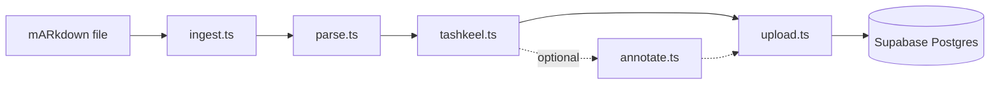

# Ingestion Pipeline

A local Node.js script that transforms OpenITI mARkdown source files into structured block-based book data in Supabase Postgres. Runs manually per book. Three stages execute in sequence for V1: parse structure into typed blocks with word tokens, add tashkeel to token text, upload to Supabase. A fourth stage (Claude annotation) exists but is optional and skipped for V1.

## Pipeline Flow

`ingest.ts` is the CLI orchestrator. It calls each stage in order and passes the output of one stage as input to the next.



## Stage 1: Parse (`parse.ts`)

**Parsing** converts a raw OpenITI mARkdown file into three structured outputs:

- **Pages array** -- each item contains `page_number`, `volume`, `content_blocks` (JSON array of typed blocks with word tokens), and `content_plain` (flat text for search)
- **Chapters tree** -- each item contains `title`, `level`, `page_id`, and `sort_order`

### OpenITI Tag-to-Block Mapping

The parser reads OpenITI's existing semantic tags and produces typed blocks. This preserves structure that the source already provides, avoiding expensive AI re-detection.

| mARkdown tag | Block type | Behavior |
|---|---|---|
| `# $RWY$` | `hadith` | Opens a hadith block. Content until the next structural marker is tokenized into this block. |
| `@MATN@` | Splits `isnad` / `matn` | Within a hadith block, everything before `@MATN@` becomes an `isnad` block, everything after becomes a `matn` block. |
| `### $BIO_MAN$` / `### $BIO_WOM$` / `### $` / `### $$` | `biography` | Biography entry. `@YB####` and `@YD####` inline tags are extracted into block `metadata`. |
| `%~%` | `poetry` hemistich divider | Builds hemistich pairs within a `poetry` block. Each hemistich is a separate token array. |
| `### \|` through `### \|\|\|\|\|` | `heading` + `chapters` row | Header text becomes a `heading` block. Also inserted into the `chapters` tree with matching `level` (1-5). |
| `PageV##P###` | Page boundary | Starts a new page. `V##` sets `volume`, `P###` sets `page_number`. |
| `### \|EDITOR\|` | Stripped | Editorial content (title pages, indices) is not ingested. |
| `#META#...` / `######OpenITI#` | Metadata | Parsed for book-level metadata (title, author) but not stored as blocks. |
| All other content | `prose` | Default block type. Plain paragraph text, tokenized into words. |

### Word Tokenization

Within each block, text is split into word tokens by whitespace. Each token gets a deterministic ID:

```
p{page_number}_b{block_index}_w{word_index}
```

Clitics stay attached (whitespace-only splitting). For example, `والكتاب` is one token, not three.

### Output Format

```json
{
  "pages": [
    {
      "page_number": 42,
      "volume": 1,
      "content_blocks": [
        {
          "key": "b0",
          "type": "isnad",
          "tokens": [
            {"id": "p42_b0_w0", "text": "حدثنا"},
            {"id": "p42_b0_w1", "text": "عبد"},
            {"id": "p42_b0_w2", "text": "الله"}
          ]
        },
        {
          "key": "b1",
          "type": "matn",
          "tokens": [
            {"id": "p42_b1_w0", "text": "إنما"},
            {"id": "p42_b1_w1", "text": "الأعمال"},
            {"id": "p42_b1_w2", "text": "بالنيات"}
          ]
        }
      ],
      "content_plain": "حدثنا عبد الله إنما الأعمال بالنيات"
    }
  ],
  "chapters": [
    {"title": "باب النية", "level": 1, "page_number": 42, "sort_order": 1}
  ]
}
```

`content_plain` is derived by concatenating all token text with spaces. It exists for future full-text search only.

## Stage 2: Tashkeel (`tashkeel.ts`)

**Tashkeel** adds Arabic diacritical marks (harakat) to unvocalized token text. The stage iterates over all tokens in all blocks and replaces each token's `text` with its diacritized form. It also updates `content_plain` to match. Sets `has_tashkeel = true` on the book record when complete.

Two candidate engines:

| Engine | Type | Strength |
|---|---|---|
| Mishkal | Rule-based Python | Classical Arabic morphology |
| Shakkala | Deep learning model | Modern Arabic |

The tashkeel stage runs a Python subprocess. Tokens are batched per page to minimize subprocess overhead.

## Stage 3 (Optional): Annotate (`annotate.ts`)

**Skipped for V1.** OpenITI's existing semantic tags provide sufficient block typing.

When enabled, this stage uses Claude to enrich blocks with metadata that the source doesn't provide:
- Quran quote detection (surah, ayah) -- OpenITI does not tag inline Quran quotes
- Hadith grading (sahih, hasan, etc.)
- Narrator chain extraction from isnad blocks
- Poetry meter and poet identification

The annotate stage reads `content_blocks`, adds metadata to matching blocks, and writes the enriched blocks back. It does not change block types or token structure.

## Stage 4: Upload (`upload.ts`)

**Upload** pushes all processed data to Supabase Postgres. Upsert operations throughout make re-ingestion idempotent.

Upload order:

1. Upsert into `books` (keyed on `openiti_id`)
2. Generate `content_hash` (hash of `content_plain`) per page and upsert into `pages` (keyed on `book_id`, `volume`, `page_number`)
3. Upsert into `chapters`

The `content_hash` stored per page enables change detection when a book is re-ingested. User data (bookmarks, highlights, notes) stores `anchor_context` for re-anchoring token references that drift after content changes.

## Orchestrator (`ingest.ts`)

`ingest.ts` is the CLI entry point. It accepts a path to an OpenITI mARkdown file and runs stages in order.

Usage:

```sh
npx ts-node ingestion/ingest.ts path/to/book.mARkdown
```

Options:

| Flag | Default | Description |
|---|---|---|
| `--annotate` | `false` | Enable the Claude annotation stage |
| `--tashkeel-engine` | `mishkal` | Tashkeel engine: `mishkal` or `shakkala` |

## Key Files

| Path | Purpose |
|---|---|
| `ingestion/ingest.ts` | CLI orchestrator |
| `ingestion/parse.ts` | Converts mARkdown to typed blocks with word tokens |
| `ingestion/tashkeel.ts` | Adds diacritical marks to token text via Python subprocess |
| `ingestion/annotate.ts` | Optional Claude enrichment (skipped for V1) |
| `ingestion/upload.ts` | Upserts all data into Supabase Postgres |

## Gotchas

**Tashkeel engine benchmarking is required.** Mishkal is the likely better fit for classical Arabic texts from OpenITI; Shakkala is stronger on modern Arabic. Run both on representative classical samples before committing to one.

**Tashkeel modifies token text in place.** After tashkeel, `content_plain` must be regenerated from token text to stay in sync. The tashkeel stage handles this automatically.

**Token IDs are position-based.** Inserting or removing content in the source file shifts token IDs on affected pages. User data referencing those IDs will need re-anchoring via `anchor_context`. Prefer correcting diacritics within words (ID-stable) over inserting/removing words (ID-breaking).

**Only ingest verified `.mARkdown` files.** OpenITI files with `.inProgress` or `.completed` extensions may have incomplete semantic tagging. Blocks derived from poorly-tagged files will default to `prose` type, losing semantic structure.

**Annotation cost scales linearly with book size.** When the annotate stage is enabled, it calls Claude once per page. A 1,000-page book means 1,000 Claude API calls. Budget accordingly.

**Unicode normalization before hashing.** Apply NFC normalization to `content_plain` before computing `content_hash`. Arabic combining characters can appear in different orders, producing different byte sequences for visually identical text.

---

Related docs: [Book Format](book-format.md) -- [Reader App](app.md) -- [I'rab Agents](../agents/irab.md)
