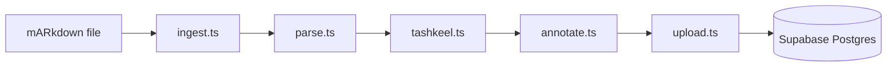

# Ingestion Pipeline

A local Node.js script that transforms OpenITI mARkdown source files into structured, diacritized, annotated book data in Supabase Postgres. Runs manually per book. Four stages execute in sequence: parse structure, add tashkeel, AI-annotate semantic boundaries, upload to Supabase.

## Pipeline Flow

`ingest.ts` is the CLI orchestrator. It calls each stage in order and passes the output of one stage as input to the next. No stage runs in parallel -- each depends on the previous stage's output.



## Stage 1: Parse (`parse.ts`)

**Parsing** converts a raw OpenITI mARkdown file into two structured outputs:

- **Pages array** -- each item contains `page_number`, `volume`, and `content`
- **Chapters tree** -- each item contains `title`, `level`, `page_id`, and `sort_order`

### mARkdown Tag Mapping

| mARkdown element | Schema target |
|-----------------|---------------|
| Header tags (levels 1-3) | `chapters` rows with matching `level` (1 = chapter, 2 = section, 3 = subsection) |
| Page break tags | `pages` row boundaries |
| Poetry hemistichs | Preserved as `\t`-separated text within `content` |
| All other tags | Stripped; not stored |

### Page Content Format

After parsing, `content` uses a minimal inline structure:

- Paragraphs separated by `\n\n`
- Poetry hemistichs separated by `\t`
- All mARkdown tags stripped -- structural data lives in the `chapters` and `annotations` tables

## Stage 2: Tashkeel (`tashkeel.ts`)

**Tashkeel** adds Arabic diacritical marks (harakat) to unvocalized source text. The stage runs a Python subprocess from the Node script and sets `has_tashkeel = true` on the book record when complete.

Two candidate engines are available:

| Engine | Type | Strength |
|--------|------|----------|
| Mishkal | Rule-based Python | Classical Arabic morphology |
| Shakkala | Deep learning model | Modern Arabic |

## Stage 3: Annotate (`annotate.ts`)

**Annotation** uses Claude to identify semantic boundaries within page content. Claude receives each page's `content` and returns an array of annotation spans.

### Annotation Types

| Type | Description |
|------|-------------|
| `hadith` | Prophetic tradition -- includes `hadith_number`, `source_book`, `grade` in `metadata_json` |
| `isnad` | Chain of narrators -- includes `narrators[]` |
| `matn` | Body text of a hadith |
| `quran` | Quranic quotation -- includes `surah`, `ayah` |
| `poetry` | Verse -- includes `meter`, `poet` |
| `biography` | Biographical entry -- includes `person_name`, `birth_ah`, `death_ah` |

Each annotation in the output array contains:

- `start_offset` -- character offset within page `content` where the span begins
- `end_offset` -- character offset where the span ends
- `type` -- one of the six types above
- `metadata_json` -- type-specific metadata object

## Stage 4: Upload (`upload.ts`)

**Upload** pushes all processed data to Supabase Postgres. The stage uses upsert operations throughout, making re-ingestion idempotent -- running the pipeline twice on the same book is safe.

Upload order:

1. Upsert into `books` (keyed on `openiti_id`)
2. Generate `content_hash` per page and upsert into `pages` (keyed on `book_id`, `volume`, `page_number`)
3. Upsert into `chapters`
4. Upsert into `annotations`

The `content_hash` stored per page enables change detection and re-anchoring of user annotations when a book is re-ingested with content edits.

## Orchestrator (`ingest.ts`)

`ingest.ts` is the CLI entry point. It accepts a path to an OpenITI mARkdown file and runs all four stages in order. Each stage reports progress and any errors before the next stage begins.

Usage:

```sh
npx ts-node ingestion/ingest.ts path/to/book.mARkdown
```

## Key Files

| Path | Purpose |
|------|---------|
| `ingestion/ingest.ts` | CLI orchestrator -- runs all four stages in sequence |
| `ingestion/parse.ts` | Converts mARkdown to pages array + chapters tree |
| `ingestion/tashkeel.ts` | Adds diacritical marks via Python subprocess |
| `ingestion/annotate.ts` | Calls Claude to identify and annotate semantic boundaries |
| `ingestion/upload.ts` | Upserts all data into Supabase Postgres |

## Gotchas

**Tashkeel engine benchmarking is required.** Mishkal is the likely better fit for classical Arabic texts from OpenITI; Shakkala is stronger on modern Arabic. Run both on representative classical samples before committing to one.

**Annotation offsets are character-level, not byte offsets.** Arabic combining characters -- diacritics (harakat) and other Unicode combining marks -- each count as a separate character. Code that computes or consumes `start_offset`/`end_offset` must treat them as character positions, not byte positions.

**Re-ingestion must not break existing user annotations.** The `content_hash` field enables the app to detect when page content has changed. User-facing data (`user_bookmarks`, `user_highlights`, `user_notes`) stores `anchor_context` -- roughly 30 characters of surrounding text -- as a fallback for re-anchoring character offsets that have drifted after a content change.

**Annotation cost scales linearly with book size.** The annotate stage calls Claude once per page. A 1,000-page book means 1,000 Claude API calls. Budget accordingly before ingesting large books.

---

Related docs: [Book Format](book-format.md) -- [I'rab Agents](../agents/irab.md) -- [Reader App](app.md)
