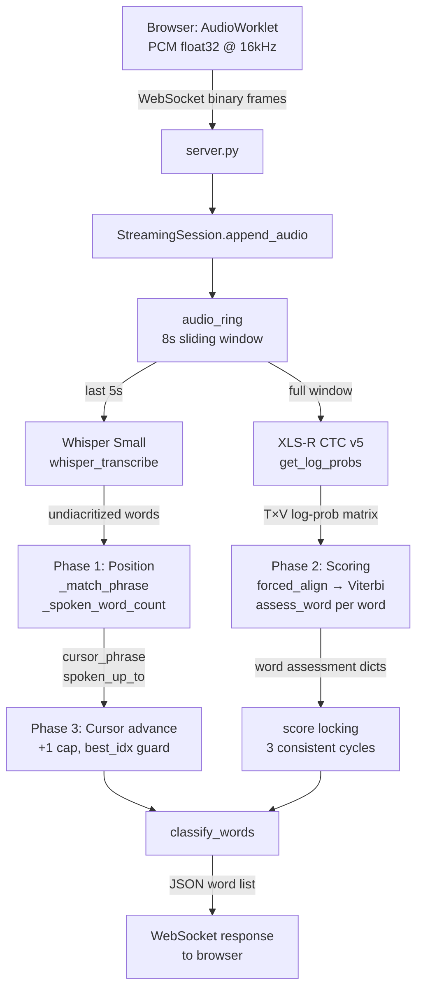
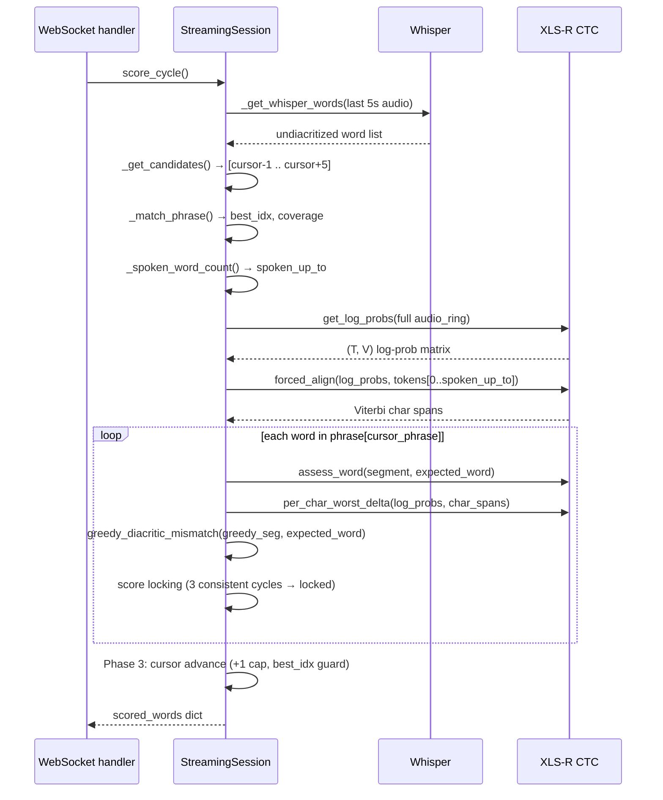

# Recitation System

Live Arabic readalong assessment system. Listens to a student read diacritized Arabic text aloud and flags errors in real time -- wrong words, wrong i'rab (case endings), wrong tashkeel (internal vowels). Uses a dual-model architecture: Whisper for position tracking, XLS-R CTC for error scoring. Conservative philosophy: false negatives are always preferable to false positives.

## Architecture

Two models handle separate concerns because neither does both jobs well. **Whisper** recognizes what was said but outputs undiacritized text -- useful for position tracking but useless for diacritic assessment. The **XLS-R CTC model** has 58 diacritized character tokens and can distinguish فَ from فُ from فِ, but its greedy decode is too noisy for reliable position tracking. The pipeline runs each model where it excels.



The REST endpoint (`POST /api/score`) uses only the CTC model via `locate_and_score()`. Whisper is lazy-loaded only when the first `StreamingSession` needs it.

## Models

### XLS-R CTC v5

| Property | Value |
|---|---|
| Architecture | `Wav2Vec2ForCTC` (HuggingFace) |
| Base model | XLS-R 300M |
| Parameters | ~300M |
| Token vocabulary | 58 Arabic character tokens (consonants + all diacritics) |
| Input format | 16 kHz mono float32 |
| Device | CPU always -- MPS produces incorrect results with wav2vec2 |
| Path | `models/ssl_xls_r_v5/` |
| Loading | Eager at server startup via `RecitationEngine.__init__` |

### Whisper Small

| Property | Value |
|---|---|
| Architecture | `WhisperForConditionalGeneration` (HuggingFace) |
| Parameters | ~244M |
| Input format | 16 kHz mono float32 |
| Device | CPU |
| Loading | Lazy -- first `StreamingSession` triggers `_ensure_whisper()` |
| Download | ~500 MB on first use from `openai/whisper-small` |
| API usage | Direct model API, NOT `pipeline()` |

Whisper outputs undiacritized Arabic words. It is used only for position tracking -- never for error detection.

## Streaming Pipeline

### StreamingSession Lifecycle

One `StreamingSession` instance is created per WebSocket connection. The server creates it after the client sends the JSON init message, then feeds it binary PCM frames.

**State variables:**

| Variable | Type | Description |
|---|---|---|
| `audio_ring` | `deque` of float32 | 8-second sliding window of raw PCM at 16kHz |
| `cursor_phrase` | `int` | Index of the phrase the reader is currently on |
| `scored_words` | `dict[int, dict]` | `{global_word_idx: assessment_dict}` accumulated across cycles |
| `_best_spoken` | `dict[int, int]` | High-water mark: `{phrase_idx: max_spoken_up_to}` |
| `_cached_whisper_words` | `list[str]` | Whisper output cache, reused if new audio < 0.5s |
| `total_audio_bytes` | `int` | Total bytes received, used for throttle logic |

### score_cycle(final=False)

Called every ~0.5--0.75 seconds from the WebSocket handler. Three sequential phases:



`final=True` overrides all score locks and uses batch thresholds in `classify_words`.

### Anti-Cursor-Jump Mechanisms

Without these guards the cursor jumps to distant phrases sharing common Arabic words (في, من, الله, صحيح, حديث).

| Mechanism | How it works |
|---|---|
| 5s Whisper window | Only the last 5s of the 8s ring buffer goes to Whisper. Old-phrase audio cannot contaminate transcription. |
| Lookbehind candidates | `_get_candidates()` includes `cursor - 1`. Ring buffer audio matching the previous phrase scores there instead of jumping forward. |
| +1 cap | `cursor_phrase` advances by at most 1 per `score_cycle` call, regardless of how far ahead a phrase matched. |
| `best_idx == cursor` guard | The `nearly_done` / `next_started` advance only fires when Whisper matched the current cursor phrase. Stale `spoken_up_to` from a different phrase cannot trigger advance. |
| High-water mark | `_best_spoken[phrase_idx]` remembers peak `spoken_up_to`. When early words of a phrase leave the 5s window, the system continues counting from the remembered peak. |

### Word Matching Functions

These module-level functions are used throughout position tracking:

| Function | Behavior |
|---|---|
| `_word_match(a, b)` | Exact match for words < 4 chars; LCS ratio > 0.6 for longer words. Short-word strictness prevents false matches on particles. |
| `_phrase_coverage(greedy_words, phrase_words)` | Order-preserving LCS normalized by phrase length. "What fraction of the phrase appeared in the Whisper output?" |
| `_spoken_word_count(whisper_words, phrase_words)` | 3-pass forward match with `_lcs_ratio > 0.5`. Pass 1: direct. Pass 2: skip 1--3 Whisper words (previous phrase bleed). Pass 3: find first phrase word anywhere. |
| `_lcs_ratio(a, b)` | `2 * LCS_len / (len_a + len_b)` -- character-level similarity. |

## Error Detection

### Overview

`classify_words()` in `server.py` takes raw engine assessment dicts and applies threshold-based rules. Rules evaluate in order; first match wins. The classifier never uses diacritic signals below `eff <= -1.5` because all signals become noise at that score level.

**`effective_score`** (`eff`) is `max(expected_score, sukoon_score)` -- the pausal form (sukoon on final letter) is always treated as correct.

### Signal Descriptions

Each word assessment dict carries multiple independent signals. The classifier combines them in a tiered decision tree calibrated to 0% FP (or near-0%) per effective-score stratum.

| Signal | Key field(s) | What it measures |
|---|---|---|
| `consonant_match` | `greedy_consonant_match` | CTC greedy decode vs expected consonants. Low = different word. |
| `frame_count` | `frame_count` | Viterbi frames assigned to this word. Very low = word skipped. |
| `i3rab_delta` | `best_alt_score - eff` | How much better the best i3rab alternative scores vs the expected form. |
| `tash_delta` | `best_tashkeel_score - eff` | How much better the best tashkeel alternative scores. |
| `pc` | `pc_worst_delta` | Per-character worst diacritic margin at the frame level. Negative = something heard differently. |
| `gfm` | `greedy_final_mismatch` | Whether greedy decode's final diacritic differs from expected. Near-perfect standalone i3rab signal. |
| `gdm` | `greedy_diac_mismatches` | Count of internal diacritic mismatches in greedy decode. |
| `pd_i3rab_delta` | `pd_i3rab_delta` | Phrase-differential: full-phrase CTC score change when expected → i3rab alternative. More context than per-word scoring. |
| `pd_tashkeel_delta` | `pd_tashkeel_delta` | Same, for tashkeel alternatives. |
| `fs_worst_delta` | `fs_worst_delta` | Frame-scan: alignment-robust diacritic evidence over ±15 frames around word. |
| `sf_worst_delta` | `sf_worst_delta` | Segmentation-free GOP: per-diacritic posterior probability, worst position. |

### Detection Rules by Error Type

**Wrong word** -- fires when consonant structure of greedy decode differs from expected:

- Primary: `len(consonant) >= 3`, `eff > -1.0`, `consonant_match < 0.35`, `frame_count` in [3, 50]
- Whisper mismatch (low eff): `whisper_match == False`, `eff < -1.6`, `frame_count >= 5`
- Whisper mismatch (higher eff): `whisper_match == False`, `eff > -1.0`, `consonant_match <= 0.40`, `frame_count >= 15`
- Phrase-differential rules A/B/C for words at `eff <= -1.5`

**Skipped word**: `frame_count < 3` and `eff < -3.5`

**I3rab error** (tiered by `eff` range, all verified at 0% FP per stratum):

| Tier | Condition | Threshold |
|---|---|---|
| gfm standalone | `gfm == True`, `eff > -1.5` | 0% FP |
| i3rab_delta, eff > -0.5 | `i3rab_delta >= 0.10` | calibrated |
| i3rab_delta, -1.0 < eff <= -0.5 | `i3rab_delta >= 0.18` | calibrated |
| i3rab_delta, -1.5 < eff <= -1.0 | `i3rab_delta >= 0.12` | calibrated |
| i3rab_delta + pc corroboration | `-1.0 < eff <= -0.5`, `i3rab_delta >= 0.05`, `pc < -5.0` | 0% FP |
| i3rab_delta + sf corroboration | `eff > -1.3`, `i3rab_delta >= 0.03`, `sf_delta < -3.0` | 0% FP |
| pd_i3rab, eff > -0.5 | `pd_i3rab >= 0.14` | calibrated |
| pd_i3rab, -1.5 < eff <= -1.0 | `pd_i3rab >= 0.20` | calibrated |

**Tashkeel error** (tiered by `eff` range):

| Tier | Condition | Threshold |
|---|---|---|
| tash_delta, eff > -0.5 | `tash_delta >= 0.25` | calibrated |
| tash_delta, -1.0 < eff <= -0.5 | `tash_delta >= 0.06` | calibrated |
| tash_delta, -1.5 < eff <= -1.0 | `tash_delta >= 0.35` | calibrated |
| pc standalone, eff > -0.5 | `pc < -5.0` | 0% FP |
| pc standalone, -1.0 < eff <= -0.5 | `pc < -5.0` | 0% FP |
| pc standalone, -1.5 < eff <= -1.0 | `pc < -4.0` | calibrated |
| gdm + tash_delta | `gdm >= 1`, `eff > -0.5`, `tash_delta >= 0.10` | 0% FP |
| sf + moderate tash_delta | `eff > -0.5`, `sf_delta < -3.0`, `tash_delta` in [0.03, 0.20) | 0% FP |
| sukoon_delta agreement | `tash_delta >= 0.03`, `sukoon_delta >= 0.15` | 0% FP |
| pd_tashkeel, -1.0 < eff <= -0.5 | `pd_t >= 0.10` | calibrated |
| pd_tashkeel, -1.5 < eff <= -1.0 | `pd_t >= 0.45` | calibrated |

### Low-Eff Recovery (eff <= -1.5)

Words below `eff -1.5` are poor alignments but not necessarily wrong. Several rescue paths apply:

- **Rescued via windowed re-scoring**: if `rescored_eff > -1.5`, applies `rescored_gfm`, `rescored_i3rab_delta`, `rescored_tash_delta` with high-confidence thresholds.
- **Triple-signal consensus**: `tash_delta >= 0.05` AND `pd_i3rab >= 0.20` AND `pd_tashkeel >= 0.20` -- dominant pd signal determines error type.
- **Local phrase-differential**: 3-word sub-phrase CTC scoring (`local_pd_i3rab`, `local_pd_tashkeel`).
- **Frame-scan + SF**: `fs_delta < -2.0` AND `sf_worst_delta < -4.0` with explicit expected/heard diacritic names.

### Streaming vs Batch Thresholds

`classify_words(streaming=True)` is called during live scoring. When the client sends `"done"`, the final call uses `streaming=False` (batch thresholds).

In streaming mode, after the normal rules run, any i3rab or tashkeel detection is discarded unless at least one high-confidence signal is present:

- `gfm == True`, OR
- `i3rab_delta >= 0.25` (for i3rab errors), OR
- `tash_delta >= 0.20` (for tashkeel errors), OR
- `pc < -6.0`

### GBM Fallback

After all hand-tuned rules, if `status == "correct"` and `streaming=False`, a trained GBM classifier runs as a final pass. It uses the same feature set (`eff`, `sf`, `pc`, `mg`, `pd_i3rab`, `pd_tashkeel`, `i3rab_delta`, `tash_delta`, `consonant_match`, `frame_count`, `fs_worst_delta`, `local_pd_i3rab`, `local_pd_tashkeel`). A prediction probability >= 0.75 triggers an error. The error type comes from a separate trained type classifier; if that is unavailable, a simple heuristic (`consonant_match <= 0.3` → wrong, `pd_tashkeel > pd_i3rab` → tashkeel, else i3rab) is used.

Model files: `models/error_classifier.pkl`, `models/type_classifier.pkl`.

## Arabic Text Utilities

`arabic.py` provides all Arabic-specific text operations. The engine imports from it directly.

### Constants

| Constant | Unicode | Character |
|---|---|---|
| `FATHA` | U+064E | َ |
| `DAMMA` | U+064F | ُ |
| `KASRA` | U+0650 | ِ |
| `FATHATAN` | U+064B | ً |
| `DAMMATAN` | U+064C | ٌ |
| `KASRATAN` | U+064D | ٍ |
| `SUKOON` | U+0652 | ْ |
| `SHADDA` | U+0651 | ّ |
| `HARAKAT` | -- | frozenset of all diacritics above |

### Functions

| Function | Signature | Description |
|---|---|---|
| `strip_diacritics` | `(text) → str` | Removes all characters in `HARAKAT`. |
| `get_final_diacritic` | `(word) → (str, int)` | Returns diacritics on the last consonant and its index. |
| `replace_final_diacritic` | `(word, new_mark) → str` | Swaps the case-ending diacritic. Preserves shadda if present. |
| `make_sukoon_variant` | `(word) → str` | Calls `replace_final_diacritic(word, SUKOON)` -- pausal form. |
| `generate_i3rab_alternatives` | `(word) → dict[str, str]` | All 7 case-ending variants: `raf3`, `nasb`, `jarr`, `raf3_tanween`, `nasb_tanween`, `jarr_tanween`, `sukoon`. Excludes variants identical to input. |
| `generate_tashkeel_alternatives` | `(word) → dict[str, str]` | All internal short-vowel swap variants. Skips shadda'd consonants. Returns `{description: modified_word}`. |

### Unicode Ordering

Arabic diacritic order in the text is `consonant + vowel + shadda`, not `consonant + shadda + vowel`. The utilities assume this ordering when iterating character lists.

### Tashkeel Alternative Generation

`generate_tashkeel_alternatives` deliberately skips vowels adjacent to shadda. Gemination makes vowel quality acoustically ambiguous, and including those positions causes false positives in CTC hypothesis scoring. The per-char analysis (`per_char_worst_delta`) still covers shadda positions separately via the `frame_scan_diacritics` path.

Sukoon-related swaps get the suffix `_sukoon` in their name so that the classifier can apply separate thresholds (`best_sukoon_score` vs `best_tashkeel_score`).

## API Reference

### REST Endpoints

| Method | Path | Description |
|---|---|---|
| `GET` | `/` | Serves `static/index.html` -- live readalong UI. |
| `GET` | `/record` | Serves `static/record.html` -- test data recorder. |
| `GET` | `/api/passages` | Returns all passages from `passage.json`. |
| `POST` | `/api/score` | Batch score a `.webm` audio file against a passage. Multipart: `audio` (file), `passage_id` (string). Returns `{greedy_decode, full_score, matched_phrase_idx, words}`. |
| `POST` | `/api/save` | Save a test recording. Appends to `test_data/manifest.jsonl`. |
| `GET` | `/api/recordings` | List saved recordings from manifest. |
| `WS` | `/ws/score` | Streaming scoring endpoint. |

### WebSocket Protocol

```
Client → Server: JSON  {"passage_id": "ajrumiyyah", "debug": false}
Client → Server: binary  raw PCM float32 @ 16kHz (repeated)
Server → Client: JSON  {"words": [...], "matched_phrase_idx": N}  (repeated)
Client → Server: text  "done"
Server → Client: JSON  {"words": [...], "matched_phrase_idx": N, "final": true}
```

Server throttles scoring: first response triggers at 0.5s of new audio; subsequent responses at 0.75s. If the previous score cycle is still running when new audio arrives, the cycle is skipped (no queueing).

When `debug: true`, the server logs the full session to `test_data/sessions/{timestamp}_{passage_id}/`: `audio.raw` (raw PCM), `meta.json` (passage metadata), `scores.json` (all responses).

### Per-Word Response Format

Each entry in the `words` array:

```json
{
  "idx": 3,
  "word": "الرَّحِيمِ",
  "status": "error",
  "error_type": "i3rab",
  "error_detail": "nasb",
  "expected_word": "الرَّحِيمَ",
  "greedy": "الرحيم",
  "debug": {
    "eff": -0.412,
    "i3rab_delta": 0.183,
    "i3rab_name": "nasb",
    "tash_delta": 0.021,
    "tash_name": null,
    "pc": -3.14,
    "gfm": true,
    "consonant_match": 0.95,
    "frame_count": 12
  }
}
```

`status` is `"correct"` or `"error"`. `error_type` is one of `"wrong"`, `"skipped"`, `"i3rab"`, `"tashkeel"`. `error_detail` names the specific alternative that scored better or the detection path used.

## Frontend

`static/index.html` is a single-file HTML/CSS/JS app (~600 lines). It requires no build step.

**Audio capture**: `AudioWorklet` (preferred) or `ScriptProcessorNode` fallback. Resamples to 16kHz float32 and sends binary frames over WebSocket.

**Color coding**:

| Color | Meaning |
|---|---|
| Green | Correct |
| Red | Wrong word or skipped |
| Blue | I3rab error (case ending) |
| Orange | Tashkeel error (internal vowel) |

**State merging**: each WebSocket response updates the displayed word list. New results override old, but locked words (once set to an error state) persist. This prevents flicker as partial audio is scored across multiple cycles.

**Debug overlay**: tapping a word opens a panel showing `eff`, `i3rab_delta`, `tash_delta`, `pc`, `gfm`, `consonant_match`, `frame_count`, and the greedy decode segment.

**"Done" button**: sends text `"done"` to the WebSocket, triggering final scoring with batch thresholds. The server responds with `"final": true` and the connection closes.

**Debug toggle**: when enabled, the server saves the full session to disk (audio + scores).

## Current Metrics

Accuracy is measured by `eval.py` (single source of truth) and stored in
`recitation/eval_baseline.json`, broken out **per source / speaker**. Methodology
is mutation-based: real audio is held fixed while the reference text is mutated
(i3rab / tashkeel / word) to induce errors on demand.

See `recitation/eval_baseline.json` for current per-source figures (FP rate,
detection-by-type, and a per-sub-type breakdown). The mutation suite is wide
(every i3rab case ending, every internal tashkeel position/vowel incl.
dropped-vowel, and multi-change combos), so the detection number is an honest
upper bound that deliberately includes hard cases and exposes blind spots (e.g.
internal dropped-vowel, which the sukoon-lenient policy currently misses). The
low FP on the unseen corpus speaker is the key generalization signal; treat
mutation detection as an upper bound, not field accuracy.

### Streaming (`test_streaming.py`)

| Metric | Value |
|---|---|
| FP on correct readings | ~0% |
| Latency to first scored response | ~1.2s |
| Flicker | None -- word states are stable |

## Key Files

| File | Description |
|---|---|
| `recitation/engine.py` | `RecitationEngine` and `StreamingSession`. Both models, all CTC scoring, Viterbi alignment, streaming state. |
| `recitation/server.py` | FastAPI app. REST endpoints, WebSocket handler, `classify_words()`, GBM classifier loading. |
| `recitation/arabic.py` | Arabic Unicode constants, diacritic utilities, i3rab and tashkeel alternative generation. |
| `recitation/passage.json` | Diacritized passages: Ajrumiyyah (grammar), Daa wa-Dawaa (prose), Ihya Ulum al-Din (prose). |
| `recitation/static/index.html` | Single-file live readalong UI. AudioWorklet, WebSocket client, color-coded word display. |
| `recitation/static/record.html` | Test data recorder UI. |
| `recitation/models/ssl_xls_r_v5/` | Fine-tuned XLS-R 300M CTC model in HuggingFace Wav2Vec2ForCTC format. |
| `recitation/models/error_classifier.pkl` | GBM binary error classifier (batch-only fallback). |
| `recitation/models/type_classifier.pkl` | GBM error type classifier (wrong/i3rab/tashkeel). |
| `recitation/models/gmm/` | Optional GMM files for MixGoP scorer. Loaded if present. |
| `recitation/eval.py` | Unified mutation-based evaluation; single source of truth. Sources: saved sessions + external MSA corpus. |
| `recitation/eval_corpus.py` | Arabic Speech Corpus loader (Buckwalter→Arabic, project mark order). |
| `recitation/eval_baseline.json` | Committed honest baseline report, per source/speaker. |
| `recitation/training/` | Build tool (not runtime): `build_gmm.py` regenerates `models/gmm/`. |
| `recitation/test_streaming.py` | Automated streaming tests via TTS (edge-tts) and WebSocket. |
| `recitation/test_data/manifest.jsonl` | Recording metadata: file, passage_id, phrase_idx, notes, timestamp. |
| `recitation/test_data/sessions/` | Saved streaming sessions: `audio.raw`, `meta.json`, `scores.json`. |
| `recitation/CLAUDE.md` | Project conventions and edge cases for AI-assisted development. |
| `recitation/Architecture.md` | Architecture reference (predates this doc). |

## Gotchas

**No MPS for wav2vec2.** `RecitationEngine` forces CPU even when MPS is available (`torch.backends.mps.is_available()` is checked and ignored). MPS produces numerically incorrect CTC log-probs for Wav2Vec2 on Apple Silicon. Whisper also runs on CPU.

**No `pipeline()` for Whisper.** Using `pipeline("automatic-speech-recognition")` triggers a `torchcodec` import that conflicts with the installed FFmpeg version. Always use `WhisperForConditionalGeneration` + `WhisperProcessor` directly.

**Fuzzy matching is required for Whisper output.** Whisper garbles Arabic proper nouns and rare words (e.g., هريرة → هيرايروت, فقد ثبت → فقلتابت). Exact word matching for phrase coverage fails. Use `_word_match` (LCS ratio > 0.6 for 4+ char words).

**+1 cursor cap is non-negotiable.** Common Arabic words (في, من, الله, صحيح, حديث) appear across many phrases. Without the cap, `_match_phrase` finds a high-coverage match several phrases ahead and the cursor jumps. One cycle, one phrase.

**`best_idx == cursor_phrase` guard on nearly_done.** If Whisper matched a different phrase (not the current cursor), `spoken_up_to` belongs to that phrase. Advancing based on it causes double-advance on the next cycle. The guard is in `score_cycle` and must not be removed.

**Test recordings may have small errors.** Background noise, slight mispronunciations not noted in `notes`, or imprecise notes. Treat `test_data/` as real-world data, not lab-perfect ground truth. A missed detection may be a genuine edge case, not a system bug.

**Score locking is bypassed by `final=True`.** During streaming, once a word is locked (3 consistent cycles), subsequent cycles skip it. `score_cycle(final=True)` re-scores everything. This is intentional -- the final pass uses the full audio and batch thresholds.

**`effective_score` not `expected_score` for threshold comparisons.** All `eff`-based rules compare against `effective_score = max(expected_score, sukoon_score)`. Using `expected_score` directly would flag pausal-form readings as errors.

---

See also: [`../testing/recitation-system.md`](../testing/recitation-system.md) for test strategy and evaluation harness details. [`../reader/app.md`](../reader/app.md) for the reader app that integrates this system.
