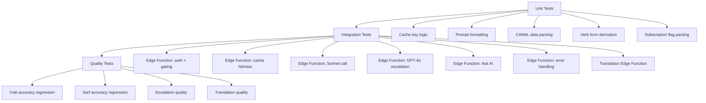

# Testing I'rab + Sarf Agents

Testing strategy for the i'rab/sarf analysis system: sarf pre-computation via CAMeL Tools, on-demand i'rab via Claude Sonnet with GPT-4o escalation, three-tier cache, Ask AI chatbot, translation, and subscription gating.

---

## Test Layers



**Unit tests** verify deterministic logic: cache key construction, prompt template rendering, CAMeL data parsing, verb form lookup, subscription status parsing. **Integration tests** exercise Edge Functions end-to-end. **Quality tests** evaluate Claude's grammar and translation output against curated fixture sets.

---

## Sarf Pre-Computation Testing

CAMeL Tools runs during ingestion. Tests verify the sarf data is correctly extracted and stored.

### CAMeL Output Parsing

| Scenario | Expected behavior |
|---|---|
| Standard noun | Extracts root, pattern, POS, case, state, gender, number, gloss |
| Verb with full features | Extracts aspect, mood, voice, person in addition to standard fields |
| Word with attached pronoun | Correctly identifies enclitic (`enc0`) and separates it from the base word |
| Word with proclitic (preposition/conjunction) | Correctly identifies proclitics (`prc0-3`) |
| Ambiguous disambiguation | Selects highest-scored analysis from CAMeL's ranked list |

### Verb Form Derivation

| Wazn input | Expected form |
|---|---|
| فَعَلَ | I |
| فَعَّلَ | II |
| فَاعَلَ | III |
| أَفْعَلَ | IV |
| تَفَعَّلَ | V |
| تَفَاعَلَ | VI |
| اِنْفَعَلَ | VII |
| اِفْتَعَلَ | VIII |
| اِفْعَلَّ | IX |
| اِسْتَفْعَلَ | X |
| Unknown/noun pattern | null (no form assigned) |

### Related Words

| Scenario | Expected behavior |
|---|---|
| Common root (ك-ت-ب) | Returns 4-6 derivatives from CAMeL lexicon |
| Rare root with few derivatives | Returns whatever is available, Claude fills remainder |
| No CAMeL lexicon match | Falls back to Claude for related words |

---

## Cache Testing

### Cache Schema

```
UNIQUE(word, sentence_hash, model_version)
```

### Local Cache Scenarios

| Scenario | Expected behavior |
|---|---|
| Local hit | Returns `result_json` from SQLite; no network call |
| Local miss | Calls Edge Function; writes response to local SQLite |

### Global Cache Scenarios

| Scenario | Expected behavior |
|---|---|
| Global hit | Edge Function returns from Postgres; no Claude call |
| Cold miss | Edge Function calls Sonnet, stores result, returns result |
| Cold miss with escalation | Sonnet reports low confidence, GPT-4o called, merged result cached |

### Cache Key Behavior

| Scenario | Expected behavior |
|---|---|
| Same word, different sentences | Different `sentence_hash` values, separate cache entries |
| Same word, same sentence | Cache hit after first analysis |
| Bumped `model_version` | Old entries no longer match; fresh Claude call |
| Word with vs without attached pronoun | Different `word` values, separate entries (كتابه vs كتابها) |

---

## I'rab Edge Function Testing

### Authentication

| Case | Expected response |
|---|---|
| Valid JWT | Proceeds to subscription check |
| Invalid JWT | 401 Unauthorized |
| Expired JWT | 401 Unauthorized |

### Subscription Gating

| Case | Expected response |
|---|---|
| Premium subscriber | Full `result_json` returned |
| Free user | 402 paywall response; no Claude call |
| Expired subscription | 402 paywall response |

### Sonnet Call

| Case | Expected behavior |
|---|---|
| Prompt includes CAMeL hints | Request body contains pre-computed sarf data |
| Prompt includes grammar rules | System prompt contains Ajrumiyyah + Alfiyyah reference |
| Valid response | Parsed into `result_json` with segments, explanation, confidence |
| Malformed response | Graceful error returned; nothing cached |
| Timeout | Graceful error returned; no partial write |

### GPT-4o Escalation

| Case | Expected behavior |
|---|---|
| Sonnet confidence: high | No escalation; result returned directly |
| Sonnet confidence: low | GPT-4o called with same prompt + CAMeL hints |
| Sonnet and GPT-4o agree | Primary parse returned; no alternative_parses |
| Sonnet and GPT-4o disagree | Primary parse + alternative_parses both included |
| GPT-4o timeout | Return Sonnet's result anyway; flag in response |

### Multi-Part Analysis

| Case | Expected behavior |
|---|---|
| Simple word (no clitics) | Single segment in `segments` array |
| Word + attached pronoun (كتابه) | Two segments: base word + pronoun, each with own role/case |
| Word + proclitic + pronoun (وكتابه) | Three segments: conjunction + noun + pronoun |

### Special Cases

| Case | Expected behavior |
|---|---|
| مبني (indeclinable) word | `is_mabni: true`; explanation notes word does not change form |
| Hidden case ending (إعراب تقديري) | `is_taqdiiri: true`; explanation notes case is estimated |
| Ambiguous parse | `alternative_parses` populated; primary parse is most likely |

### Error Handling

| Error | Expected behavior |
|---|---|
| Sonnet timeout | Structured error response; nothing cached |
| GPT-4o timeout | Return Sonnet result; nothing cached for escalation |
| Malformed Claude JSON | Structured error response; nothing cached |
| Postgres write failure | Return result to client anyway; log failure |

---

## Translation Edge Function Testing

### Request/Response

| Case | Expected behavior |
|---|---|
| Valid sentence + JWT + subscription | Returns English translation |
| Cache hit on `text_hash` | Returns cached translation; no Claude call |
| Cache miss | Calls Sonnet; caches result; returns translation |

### Quality

| Case | Expected behavior |
|---|---|
| Standard classical prose | Faithful translation preserving register |
| Hadith terminology | Transliterated + parenthetical gloss |
| Fiqh vocabulary | Transliterated + parenthetical gloss |
| Proper names | Transliterated; not translated |
| Quranic phrases | Established English equivalents used |

---

## Ask AI Testing

### Request Lifecycle

| Case | Expected behavior |
|---|---|
| First message | Context includes: word, sentence, i'rab analysis, sarf data, paragraph, book metadata |
| Follow-up message | Context includes all above + conversation history (last N messages) |
| Subscription check | Same 402 gating as i'rab |

### Context Accumulation

| Case | Expected behavior |
|---|---|
| Conversation history grows | Client sends full thread; Edge Function is stateless |
| Long conversation | Client truncates older messages to fit token limits |
| New word tapped | Conversation resets; new context for new word |

---

## Report Button Testing

| Case | Expected behavior |
|---|---|
| User submits report | Row written to `irab_reports` with word, sentence_hash, model_version, result_json, user_id |
| Duplicate report (same user, same word) | Allowed; multiple reports from same user are fine |
| Unauthenticated report | Rejected (user_id is required) |

---

## Prompt Quality Testing

### Regression Fixture Set

Each fixture is a `(word, sentence, camel_data, expected_irab)` tuple. The `camel_data` field includes the pre-computed sarf features that would be sent as hints.

```json
{
  "word": "كتابَ",
  "sentence": "قرأ الطالبُ كتابَ النحوِ",
  "camel_data": {
    "pos": "noun",
    "cas": "a",
    "stt": "c",
    "root": "k.t.b",
    "pattern": "kitAb",
    "gloss": "book;writing"
  },
  "expected": {
    "role": "مفعول به",
    "role_en": "Direct object",
    "case": "منصوب",
    "case_en": "Accusative",
    "case_reason": "direct object of قرأ"
  }
}
```

### Evaluation

| Step | Description |
|---|---|
| Run fixtures | Call Edge Function for each fixture |
| Compare output | Diff `result_json` segments against expected |
| Score accuracy | Track pass rate per `model_version` |
| Log regressions | Flag fixtures that pass in version N and fail in version N+1 |
| Track escalation rate | Monitor what percentage of fixtures trigger GPT-4o escalation |

Results are tracked by `model_version` so prompt changes have quantified accuracy impact before deployment.

---

## Key Files

| File | Description |
|---|---|
| `supabase/functions/irab/index.ts` | I'rab Edge Function (planned) |
| `supabase/functions/translation/index.ts` | Translation Edge Function (planned) |
| `tests/irab/fixtures/` | Grammar regression fixture set (planned) |
| `tests/irab/cache.test.ts` | Cache key and tier behavior unit tests (planned) |
| `tests/irab/edge-function.test.ts` | Edge Function integration tests (planned) |
| `tests/irab/escalation.test.ts` | GPT-4o escalation integration tests (planned) |
| `tests/irab/quality.test.ts` | Prompt accuracy regression tests (planned) |
| `tests/irab/sarf.test.ts` | CAMeL output parsing and verb form derivation (planned) |
| `tests/translation/quality.test.ts` | Translation quality tests (planned) |

---

## Gotchas

- **Context-dependent i'rab** -- every fixture must include the full sentence and CAMeL hints. The grammar role depends on context.
- **Prompt quality requires domain expertise** -- incorrect expected values produce misleading accuracy scores. Have a qualified Arabic grammar reviewer sign off on new fixtures.
- **Escalation tests cost real money** -- GPT-4o escalation tests make actual API calls. Use a small fixture set for CI and a larger set for periodic quality audits.
- **CAMeL accuracy is ~80%** -- some fixtures may test scenarios where CAMeL provides wrong hints. Include fixtures where CAMeL's case is wrong to verify Claude can override it.
- **Cold start latency** -- integration tests asserting response time should warm the Edge Function first.
- **RevenueCat webhook lag** -- mock the Supabase `subscription_status` flag directly in tests; the webhook pipeline is a separate concern.

---

See also: [I'rab + Sarf Agents](../agents/irab.md) -- [Translation Agents](../agents/translation.md) -- [Reader App Testing](reader-app.md)
