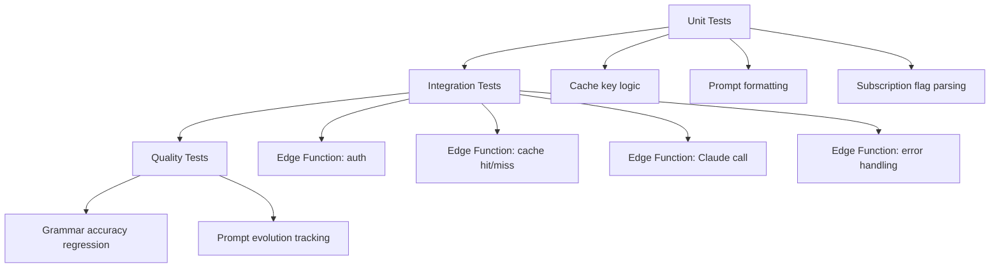

# Testing I'irab Agents

The Suhoof I'irab system delivers Arabic grammar analysis through a three-tier cache backed by a Supabase Edge Function and Claude. This document covers the testing strategy for that system -- Edge Function correctness, cache behavior at each tier, Claude prompt quality, and subscription gating. Tests range from unit-level cache logic to end-to-end grammar accuracy evaluation.

## Test Layers



**Unit tests** verify deterministic logic in isolation: cache key construction, prompt template rendering, and subscription status parsing. **Integration tests** exercise the Edge Function end-to-end against a live or emulated Supabase instance. **Quality tests** evaluate Claude's grammar output against a curated fixture set -- these require Arabic grammar expertise to maintain.

---

## Cache Testing

The three-tier cache is: local SQLite on device → global `irab_cache` table in Postgres → Claude API. Each tier has distinct test scenarios.

### Cache Schema

The `irab_cache` table uniqueness constraint drives invalidation behavior:

```
UNIQUE(word, sentence_hash, model_version)
```

| Column | Role |
|---|---|
| `word` | The tapped word |
| `sentence_hash` | Hash of the surrounding sentence -- same word in different sentences gets separate entries |
| `model_version` | Prompt/model version string -- bumping this causes a cache miss on all old entries |
| `result_json` | Structured grammar analysis returned to the client |

### Local Cache Scenarios

| Scenario | Expected behavior |
|---|---|
| Local hit | Returns `result_json` from SQLite; no network call made |
| Local miss | Calls Edge Function; on response, writes entry to local SQLite |

Test a local hit by pre-seeding the SQLite cache with a fixture entry, tapping the same word, and asserting no outbound network request fires.

### Global Cache Scenarios

| Scenario | Expected behavior |
|---|---|
| Global hit | Edge Function returns `result_json` from Postgres; no Claude call made |
| Cold miss | Edge Function calls Claude, stores result in `irab_cache`, returns result |

Test a global hit by inserting a row directly into the test `irab_cache` table, then calling the Edge Function with the matching `word` and `sentence_hash`. Assert the Claude API is never invoked.

Test a cold miss by ensuring no matching row exists, calling the function, and asserting both a Claude API call and a new `irab_cache` row.

### Cache Key Behavior

| Scenario | Expected behavior |
|---|---|
| Same word, different sentences | Different `sentence_hash` values → separate cache entries, each triggers its own Claude call on first use |
| Same word, same sentence | Identical `sentence_hash` → cache hit after first analysis |
| Bumped `model_version` | Old entries no longer match; cold miss forces a fresh Claude call |

Context-dependency is the core property being tested here. The `sentence_hash` ensures that the word "كان" analyzed in one sentence does not bleed its result into a different grammatical context.

---

## Edge Function Testing

The Edge Function (`supabase/functions/irab-analysis`) runs five responsibilities in order: verify JWT, check subscription, check global cache, call Claude on miss, return result.

### Authentication

| Case | Expected response |
|---|---|
| Valid JWT | Proceeds to subscription check |
| Invalid JWT | `401 Unauthorized` |
| Expired JWT | `401 Unauthorized` |

### Subscription Gating

| Case | Expected response |
|---|---|
| Premium subscriber | Full `result_json` returned |
| Free user | Paywall response -- no `result_json`, no Claude call |
| Expired subscription | Treated as free -- paywall response |

The function reads subscription status from Supabase, not from RevenueCat directly. RevenueCat webhooks write status into the user record; the function trusts that stored value.

### Cache Behavior

| Case | Expected behavior |
|---|---|
| Cache hit | Returns `result_json` from Postgres; Claude not called |
| Cache miss | Calls Claude; writes result to `irab_cache`; returns result |

### Claude API Integration

| Case | Expected behavior |
|---|---|
| Correct prompt sent | Prompt includes the word and its full sentence context |
| Valid response | Parsed into `result_json` and stored |
| Malformed response | Graceful error returned; nothing written to cache |
| Timeout | Graceful error returned to client; no partial write |

### Error Handling

| Error | Expected behavior |
|---|---|
| Claude timeout | Returns structured error response; does not cache |
| Malformed Claude JSON | Returns structured error response; does not cache |
| Postgres write failure | Returns result to client anyway if Claude succeeded; logs failure |

---

## Prompt Quality Testing

Prompt quality tests evaluate whether Claude's grammar analysis is correct -- not just that it returns a parseable response. These tests are slower, cost API credits, and require a human with Arabic grammar expertise to build and maintain the fixture set.

### Regression Fixture Set

Each fixture is a `(word, sentence, expected_irab)` triple where `expected_irab` describes the grammatically correct analysis for that specific occurrence of the word in that sentence.

```json
{
  "word": "كتابَ",
  "sentence": "قرأ الطالبُ كتابَ النحوِ",
  "expected": {
    "case": "accusative",
    "role": "maf'ul bihi",
    "reason": "direct object of قرأ"
  }
}
```

Fixtures must include the full sentence. A word's i'rab is always context-dependent -- the fixture is meaningless without the surrounding clause.

### Evaluation Approach

| Step | Description |
|---|---|
| Run fixtures | Call the Edge Function (or Claude directly) for each fixture pair |
| Compare output | Diff `result_json` fields against `expected_irab` |
| Score accuracy | Track pass rate per prompt version |
| Log regressions | Flag any fixture that passes in version N and fails in version N+1 |

Track results by `model_version` so prompt changes have a quantified accuracy impact before deployment.

---

## Subscription Gating

The subscription check sits between JWT verification and cache lookup. The Edge Function reads a `subscription_status` flag from the Supabase user record -- this flag is written by RevenueCat webhooks.

### Gating Matrix

| User state | RevenueCat status | Supabase flag | Edge Function response |
|---|---|---|---|
| Never subscribed | None | `free` | Paywall |
| Active subscription | Active | `premium` | Full analysis |
| Expired subscription | Expired | `free` | Paywall |
| Webhook lag | Active | `free` (stale) | Paywall (until webhook arrives) |

### Webhook Lag

RevenueCat delivers subscription events asynchronously. The Supabase flag can lag behind the true subscription state by seconds to minutes after a purchase. Tests that check subscription behavior should mock the Supabase flag directly rather than going through RevenueCat, since the integration test boundary is the Edge Function -- not the webhook pipeline.

---

## Key Files

| File | Description |
|---|---|
| `supabase/functions/irab-analysis/index.ts` | Edge Function entry point (planned) |
| `supabase/functions/irab-analysis/prompt.ts` | Claude prompt template (planned) |
| `reader/TECHNICAL_SPEC.md` | Full system design including cache schema and i'rab flow |
| `tests/irab/fixtures/` | Grammar regression fixture set (planned) |
| `tests/irab/cache.test.ts` | Cache key and tier behavior unit tests (planned) |
| `tests/irab/edge-function.test.ts` | Edge Function integration tests (planned) |
| `tests/irab/quality.test.ts` | Prompt accuracy regression tests (planned) |

---

## Gotchas

- **Context-dependent i'rab** -- every fixture must include the full sentence. Never test a word in isolation; the grammar case depends on its role in the surrounding clause.
- **Prompt quality requires domain expertise** -- incorrect expected values in the fixture set produce misleading accuracy scores. Have a qualified Arabic grammar reviewer sign off on new fixtures.
- **Cold start latency** -- Edge Functions on Supabase cold start adds latency to the first call after idle. Integration tests that assert on response time should account for this or warm the function first.
- **RevenueCat webhook lag** -- do not test subscription gating through the real RevenueCat webhook pipeline in integration tests. Mock the Supabase `subscription_status` flag directly; the webhook pipeline is a separate concern.
- **`model_version` discipline** -- any change to the Claude prompt or model must bump `model_version` in the Edge Function. Failing to do so means stale cached analyses from the old prompt are served for all previously seen words.
- **Sentence hash stability** -- the hashing algorithm for `sentence_hash` must be identical on client and server. A mismatch causes permanent cache misses for every lookup.

---

See also: [`../agents/irab.md`](../agents/irab.md) for the agent design, [`reader-app.md`](reader-app.md) for the full reader architecture.
