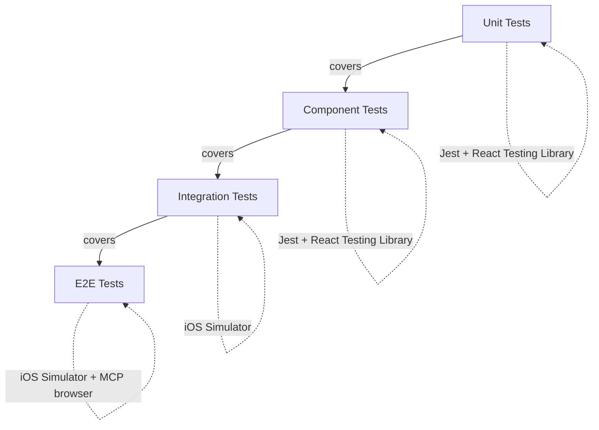
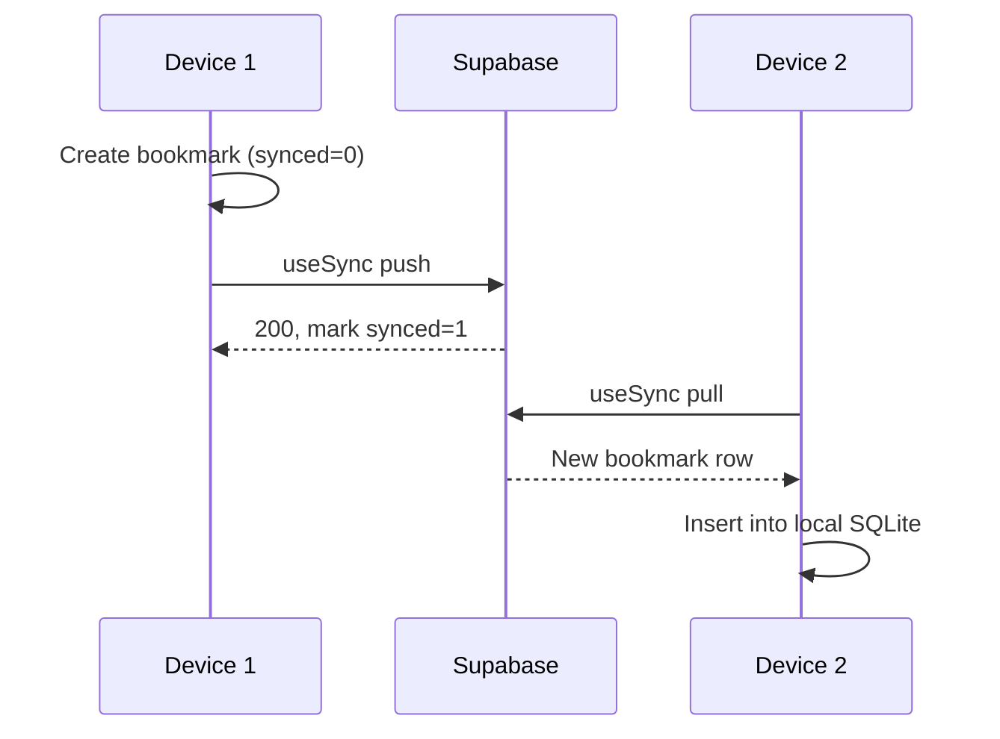
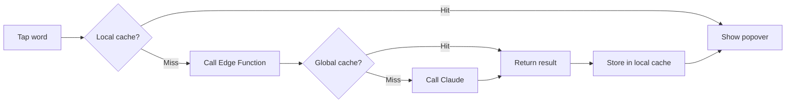

# Reader App Testing

The reader app is an Expo/TypeScript iPad application with an offline-first SQLite data layer, Arabic text rendering, and bidirectional Supabase sync. Testing spans four layers -- unit, component, integration, and E2E -- with dedicated attention to Arabic-specific rendering challenges (RTL layout, diacritics, font correctness) that standard testing tooling does not cover by default.

## Test Layers

| Layer | Tooling | Runs on |
|---|---|---|
| Unit | Jest + React Testing Library | Node (local CI) |
| Component | Jest + React Testing Library | Node (local CI) |
| Integration | Jest + Expo test runner | iOS Simulator |
| E2E | AI-powered MCP browser | iOS Simulator |

## Unit Tests

Unit tests cover hooks and library utilities in isolation. Mock SQLite, Supabase, and network calls at the module boundary.

### Hooks

**`useIrab`** (`reader/hooks/useIrab.ts`)

| Scenario | What to verify |
|---|---|
| Cache hit (local SQLite) | Returns cached result instantly, no Edge Function call |
| Cache miss -- local, hit -- Postgres | Calls Edge Function, stores result in local `irab_cache` |
| Full cache miss | Edge Function calls Claude, result stored globally and locally |
| Popover state | Opens on tap, closes on dismiss, does not reopen stale data |
| Auth error | Edge Function 401 surfaces an error state, does not crash |
| Subscription gate | 402/403 from Edge Function shows upgrade prompt |

**`useSync`** (`reader/hooks/useSync.ts`)

| Scenario | What to verify |
|---|---|
| Push local changes | All rows with `synced = 0` are pushed to Supabase |
| Mark as synced | `synced` flag set to `1` after successful push |
| Pull remote changes | Remote rows merged into local SQLite by `updated_at` |
| Conflict resolution | Last-write-wins: higher `updated_at` wins |
| Tombstone propagation | Rows with `deleted_at` set are deleted on the other device |
| Offline -- no push attempted | Sync skips gracefully when network is unavailable |

**`useBookPages`** (`reader/hooks/useBookPages.ts`)

| Scenario | What to verify |
|---|---|
| Pagination | Correct page loaded by `page_number` and `volume` |
| Loading state | Returns loading flag while SQLite query is in flight |
| Book not downloaded | Returns appropriate empty/error state, not a crash |
| Content parsing | `\n\n` split into paragraphs, `\t` split into poetry hemistichs |

**`useReadingPosition`** (`reader/hooks/useReadingPosition.ts`)

| Scenario | What to verify |
|---|---|
| Debounce | Position write to SQLite fires once after scroll settles, not on every frame |
| Persistence | Position survives app reopen (reads from `reading_positions` on mount) |
| Sync on change | `synced = 0` set on local write so `useSync` picks it up |

### Utilities

**`arabic.ts`** (`reader/lib/arabic.ts`)

- Diacritic stripping: `stripHarakat` removes all harakat without corrupting base characters.
- Diacritic preservation: utility functions pass through correct Unicode codepoints for tashkeel marks.
- Mixed-direction: functions handle strings containing Arabic, Latin, and numerals.

**`db.ts`** (`reader/lib/db.ts`)

- Schema migrations run in order without errors on a fresh database.
- CRUD operations return correct rows for `bookmarks`, `highlights`, `text_notes`, `reading_positions`.
- `synced` flag defaults to `0` on insert.
- Soft-delete via `deleted_at` is correctly reflected in queries that exclude deleted rows.

**`download.ts`** (`reader/lib/download.ts`)

- Download populates all four book tables (`books`, `pages`, `chapters`, `annotations`) in local SQLite.
- Partial download (interrupted) leaves the database consistent -- no orphaned pages without a book row.
- Re-download of an existing book updates content without duplicating rows.

## Component Tests

Component tests mount the component with React Testing Library and verify rendered output and user interactions.

### `TappableText`

(`reader/components/arabic/TappableText.tsx`)

- Each Arabic word is a discrete tap target; tap fires with the correct word string and sentence context.
- Layout flows right-to-left; the first word in an RTL string appears on the right edge.
- Diacritics render without being clipped by adjacent tap targets or container bounds.
- Rendering a 1000-word page does not produce a measurable frame drop in the test renderer.

### `IrabPopover`

(`reader/components/arabic/IrabPopover.tsx`)

- Displays the word's grammatical analysis from the `result_json` structure.
- Shows a loading skeleton while `useIrab` is pending.
- Shows an error state (with retry option) when the Edge Function call fails.
- Shows an upgrade prompt when the user lacks a premium subscription.
- Dismisses on outside tap.

### `AnnotatedSegment`

(`reader/components/arabic/AnnotatedSegment.tsx`)

Each annotation type has distinct rendering requirements:

| Annotation type | Required rendering behavior |
|---|---|
| `hadith` | Card container, save-to-collection button present |
| `isnad` | Smaller, muted text style applied |
| `matn` | Prominent, larger text style applied |
| `quran` | Special font active, ornamental frame visible |
| `poetry` | Centered layout, hemistichs separated by tab stop |
| `biography` | Collapsible section; collapses and expands on toggle |

### `PageView`

(`reader/components/arabic/PageView.tsx`)

- Renders page content from the `content` string, splitting on `\n\n` and `\t`.
- Applies `fontSize`, `lineHeight`, `theme`, and `fontFamily` from `user_prefs`.
- Scroll position can be set programmatically and read back accurately.
- Font size change re-renders without scroll position jumping.
- Dark/sepia themes apply correct background and text color tokens.

## Integration Tests

Integration tests run on the iOS Simulator against a test Supabase project and a local SQLite instance. They exercise full data flows across multiple modules.

### Sync Flow

Verify: bookmark created on Device 1 appears on Device 2 after both sync. Verify tombstone: delete on Device 1 → sync → Device 2 removes the row.

### Download Flow

1. Fetch book catalog from Supabase (`books` table).
2. Tap download on a test book.
3. Verify `books`, `pages`, `chapters`, and `annotations` rows exist in local SQLite.
4. Verify `pages.content` contains correct Arabic text with `\n\n` paragraph separators.

### Offline Flow

1. Load a downloaded book.
2. Disable network (Simulator: Network Link Conditioner → 100% loss).
3. Navigate pages -- verify content loads from SQLite.
4. Add a bookmark -- verify it writes to SQLite with `synced = 0`.
5. Add a highlight -- same.
6. Restore network -- verify `useSync` pushes all `synced = 0` rows.

### I'rab Flow

Mock the Edge Function with a test double. Verify:
- Local cache hit skips the network call entirely.
- Cache miss hits the mock Edge Function, result is stored in `irab_cache`.
- Popover displays the `result_json` fields correctly.
- Second tap on the same word is served from local cache with no network call.

## E2E Tests

E2E tests run full user flows on the iOS Simulator using the AI-powered **MCP browser** testing approach, which drives the Simulator UI without requiring deterministic selectors.

### Core Flows

| Flow | Steps |
|---|---|
| Browse and download | Open library → find test book → tap Download → verify book appears in shelf |
| Read | Open downloaded book → scroll to page 5 → verify Arabic text renders |
| I'rab lookup | Tap a word → verify popover appears with grammatical analysis |
| Bookmark | Long-press → tap Bookmark → navigate away → return → bookmark visible |
| Font change | Open settings → change font size to 28 → return to reader → verify larger text |
| Theme change | Switch to sepia → verify background color changes |
| Recitation | Open recitation panel → verify WebSocket connection established → verify word highlighting on audio input |

### Simulator Configuration

- Device: iPad Pro 12.9" (6th generation) Simulator.
- iOS: latest stable available in Xcode.
- Network: default (online) for most tests; Network Link Conditioner for offline tests.
- Locale: device locale set to Arabic (`ar`) to validate system-level RTL behavior.

## Arabic-Specific Testing

Standard React Native test tooling does not validate Arabic rendering correctness. These checks require visual inspection or specialized assertions on the iOS Simulator.

### RTL Correctness

- Text flows right-to-left at the paragraph level.
- Punctuation (Arabic comma ،, Arabic full stop ؟) appears on the correct side of the sentence.
- Mixed-direction runs (Arabic sentence with an embedded English word or numeral) render in correct Unicode bidirectional order.
- `flexDirection: 'row'` containers are not used where `row-reverse` is required for RTL.

### Diacritic Rendering

- **Harakat** (fatha, kasra, damma, shadda, sukun, tanwin forms) appear above and below base letters without being clipped by container bounds.
- Line height is sufficient (minimum `1.8`) to prevent diacritics from overlapping the line above or below.
- `stripHarakat` used in search and cache key generation does not corrupt the base text.
- Tashkeel marks survive round-trip through local SQLite (stored as TEXT, retrieved as-is).

### Font Rendering

All three supported fonts must render the full Arabic Unicode block correctly, including extended characters from classical texts:

| Font | Check |
|---|---|
| `NotoNaskhArabic` | Default; verify harakat spacing and ligature formation |
| `Amiri` | Verify classical ligatures, hamza forms, and kashida |
| `ScheherazadeNew` | Verify compatibility with rare OpenITI characters |

Switch between fonts in Settings and visually confirm the same page of text.

### Performance

- A page with 1000+ words renders initial layout within 300ms on the Simulator.
- Scrolling through `TappableText` maintains 60fps (no dropped frames visible in Xcode's Core Animation instrument).
- Switching pages does not produce a white flash before content appears.

### Mixed Direction

- Pages containing Arabic text with inline English (transliterations, citations, footnotes) render without bidi algorithm errors.
- Numerals (page numbers, hadith numbers) in Arabic text appear in correct reading position.

---

## Key Files

| File | Purpose |
|---|---|
| `reader/__tests__/` | Planned test root; one subdirectory per layer (`unit/`, `component/`, `integration/`, `e2e/`) |
| `reader/hooks/useIrab.ts` | Three-tier i'rab cache logic |
| `reader/hooks/useSync.ts` | Bidirectional Supabase sync with tombstone support |
| `reader/hooks/useBookPages.ts` | SQLite page queries and pagination |
| `reader/hooks/useReadingPosition.ts` | Debounced position persistence |
| `reader/lib/db.ts` | SQLite schema, migrations, CRUD |
| `reader/lib/arabic.ts` | Diacritic and text utilities |
| `reader/lib/download.ts` | Book download and local storage |
| `reader/components/arabic/TappableText.tsx` | Word-level tap targets, RTL layout |
| `reader/components/arabic/IrabPopover.tsx` | Grammatical analysis display |
| `reader/components/arabic/AnnotatedSegment.tsx` | Per-annotation-type rendering |
| `reader/components/arabic/PageView.tsx` | Full page with user prefs applied |
| `reader/TECHNICAL_SPEC.md` | Authoritative spec: schema, hooks, components, folder structure |

## Gotchas

**Simulator vs. real device rendering.** The Simulator renders Arabic text using macOS CoreText, not iOS CoreText on actual hardware. Diacritic clipping, ligature formation, and font metric differences may appear on a physical device but not in Simulator tests. Font rendering tests require a real iPad for final sign-off.

**RTL flexbox quirks.** React Native's `flexDirection: 'row'` does not automatically reverse for RTL. Components that lay out word spans or toolbar items must explicitly use `row-reverse` or `I18nManager.isRTL` guards. Failing to do so produces visually reversed layouts that only appear wrong on Arabic locale devices.

**SQLite behavioral differences.** The `expo-sqlite` driver in Jest runs against a Node-compatible SQLite shim, not the actual iOS SQLite build. Collation, `LIKE` behavior on Arabic strings, and BLOB handling may differ. Integration tests on the Simulator use the real driver and are the ground truth.

**Diacritic clipping with insufficient line height.** `lineHeight` values below `1.8` cause shadda and tanwin marks to be clipped by the line box. This is invisible in snapshot tests but visible on device. All `PageView` tests must assert that `lineHeight` is never set below `1.8`.

**Apple Pencil annotation requires a physical device.** `user_pencil_strokes` and PKDrawing serialization cannot be tested on Simulator -- the Pencil input stack is not emulated. Pencil tests require a physical iPad Pro.

**Offline testing on Simulator.** Network Link Conditioner must be configured before launching the app in offline tests -- toggling it while the app is running may not immediately affect already-open SQLite connections or WebSocket sessions.

---

See also: [`../reader/app.md`](../reader/app.md), [`irab-agents.md`](irab-agents.md), [`recitation-system.md`](recitation-system.md)
