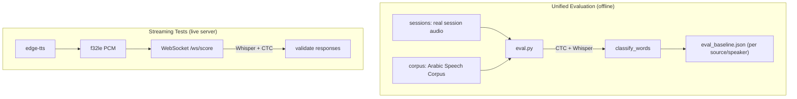

The recitation system has two testing layers: a unified offline evaluation (`eval.py`, the single source of truth for accuracy) and automated streaming tests (`test_streaming.py`) that drive the live WebSocket server with TTS audio. Evaluation is mutation-based: real audio is held fixed and the reference text is mutated to induce errors on demand.

## Test Architecture



| Layer | Mode | Models used | Requires server |
|---|---|---|---|
| Unified evaluation | Offline | CTC + Whisper | No |
| Streaming tests | Live | CTC + Whisper | Yes |

---

## Unified Evaluation

`eval.py` is the single source of truth for accuracy. It runs the production scoring path (CTC + Whisper + `classify_words`, `streaming=False`) over every data source and writes one structured report broken out per source/speaker.

```
python recitation/eval.py                    # all sources
python recitation/eval.py --source sessions  # real-audio sessions only
python recitation/eval.py --source corpus --limit 200
python recitation/eval.py --report eval_baseline.json
```

### Methodology: mutation-based

We always know the exact text the audio corresponds to, so errors are induced by mutating the reference text the model scores against while holding the real audio fixed. This generates any error type at any position without new recordings. Per data item, `eval.py` runs:

- **FP check**: score audio against the correct text. Any flag is a false positive.
- **Mutation suite**: for each eligible word, generate i3rab, tashkeel, and word-swap mutations and verify the target word is flagged with the correct type.

| Mutation kind | Expected `error_type` |
|---|---|
| `i3rab` | `"i3rab"` |
| `tashkeel` | `"tashkeel"` or `"diacritic"` |
| `word` | `"wrong"` or `"skipped"` |

The run is seeded (`random.seed(42)`) so counts are reproducible.

### Data sources

1. **sessions** - real human audio from saved reading sessions (`test_data/sessions/`). The full reading is force-aligned, sliced per phrase, and each phrase segment runs the FP + mutation suite. Covers Ajrumiyyah and Daa-Dawa. Single speaker (in-domain).
2. **corpus** - the Arabic Speech Corpus (Nawar Halabi), a held-out second MSA speaker. Each utterance is scored against its own transcript and mutated. See below.

### Reporting

`eval.py` prints a per-source summary (FP rate, detection-by-type, correct-type rate) and, with `--report`, writes `eval_baseline.json`. Metrics are never blended across sources; the per-speaker split is what reveals generalization. This report is the Phase 2 scoreboard.

Current baseline (see `eval_baseline.json` for exact figures): sessions ~1.8% FP / ~93% detection; corpus (unseen speaker) low FP with high detection. Note that mutation-based detection is easier than genuine human mispronunciations, so treat detection as an upper bound. The FP rate on the unseen speaker is the key generalization signal.

---

## External Corpus

The corpus lives at `recitation/data/asc/` (gitignored). Download and unzip:

```
https://en.arabicspeechcorpus.com/arabic-speech-corpus.zip
```

`eval_corpus.py` loads it. The corpus transcript is in Buckwalter transliteration (with this corpus's non-standard `^` for tha), which `eval_corpus.py` converts to diacritized Arabic, normalizing combining-mark order to the project convention (consonant + vowel + shadda, matching `passage.json`). The corpus was not used to train the existing models (those used ClArTTS), so it is leakage-free. Free for research use per its README.

---

## Test Data

The **manifest** at `recitation/test_data/manifest.jsonl` has one JSON object per line:

```jsonl
{"file": "recordings/20260327_113121_p2.webm", "phrase_idx": 2, "notes": "correct reading", "timestamp": "20260327_113121"}
```

| Field | Type | Description |
|---|---|---|
| `file` | string | Path relative to `recitation/test_data/` |
| `phrase_idx` | int | Index into the passage's `phrases` array |
| `notes` | string | Free-text description of what was said |
| `timestamp` | string | Recording timestamp (`YYYYMMDD_HHMMSS`) |

### Directory layout

```
recitation/test_data/
  manifest.jsonl          -- recording metadata
  recordings/             -- .webm audio files (browser MediaRecorder output)
  sessions/               -- full session captures
    20260401_104623_ajrumiyyah/
      audio.raw           -- raw f32le PCM @ 16kHz
      meta.json           -- passage_id, phrases array, timestamp
      scores.json         -- per-phrase scoring results
```

The saved sessions are what `eval.py --source sessions` consumes. In worktrees, `models/` and the audio under `test_data/` are symlinked from the main checkout and gitignored.

### Data quality

The recordings are real-world audio from a single speaker on a laptop microphone. Some entries have background noise, slight mispronunciations not reflected in the notes, or imprecise descriptions. Treat the dataset as realistic rather than lab-perfect.

---

## Streaming Tests

`test_streaming.py` generates Arabic speech via `edge-tts`, streams it through the live WebSocket server, and validates the responses. It requires the server running at `ws://localhost:8000/ws/score`.

```
# Start the server first
uvicorn recitation.server:app --host 0.0.0.0 --port 8000

python recitation/test_streaming.py [--verbose] [--server=ws://HOST:PORT/ws/score]
```

TTS audio is cached in `recitation/.tts_cache/` keyed by a SHA-256 hash of voice and text.

### Test scenarios

| Test function | What it validates |
|---|---|
| `test_correct_reading` | Full correct phrase -> zero errors flagged |
| `test_correct_multi_phrase` | First 4 phrases correct -> FP rate < 2% |
| `test_partial_phrase` | Trimmed audio (40% of phrase) -> intermediate responses show fewer words |
| `test_wrong_diacritics` | Final damma swapped to kasra -> i3rab error detected |
| `test_tashkeel_error` | Internal fatha swapped to kasra -> tashkeel error detected |
| `test_latency` | Time to first scored response < 3 seconds |
| `test_second_phrase` | Audio of phrase 1 -> `matched_phrase_idx` == 1 (cursor advanced) |
| `test_streaming_progressive` | At least one intermediate response before `"done"` |
| `test_streaming_no_flicker` | No word changes status between consecutive intermediate responses |

The simulator sends audio in 1-second chunks at half real-time speed and collects both intermediate and final responses.

---

## Build Tools (not tests)

`recitation/training/` holds one offline tool that regenerates a model artifact; it is not part of the test path:

| Script | Role |
|---|---|
| `training/build_gmm.py` | Regenerates `models/gmm/` (MixGoP GMMs, loaded by `scorer.py`). |

The live `.pkl` GBM classifiers (`models/error_classifier.pkl`, `models/type_classifier.pkl`) and the GMMs are committed and loaded at runtime. Their original training scripts were removed because their input pipeline (`signal_dump.json` via a now-deleted dumper) no longer exists; the decision layer is slated for rework in Phase 2, which will rebuild any needed trainers from scratch.

---

## Key Files

| Path | Purpose |
|---|---|
| `recitation/eval.py` | Unified evaluation - single source of truth (sessions + corpus). |
| `recitation/eval_corpus.py` | Arabic Speech Corpus loader (Buckwalter -> Arabic). |
| `recitation/eval_baseline.json` | Committed baseline report, per source/speaker. |
| `recitation/test_streaming.py` | TTS-based streaming test suite. |
| `recitation/test_data/manifest.jsonl` | Recording index. |
| `recitation/test_data/recordings/` | `.webm` audio files from browser recording. |
| `recitation/test_data/sessions/` | Full session captures (raw PCM + meta + scores). |
| `recitation/arabic.py` | Diacritic constants and mutation generators. |
| `recitation/server.py` | `classify_words` - production classification function. |

---

## Gotchas

- **Server must be running for streaming tests.** `test_streaming.py` connects to `ws://localhost:8000/ws/score` and fails immediately if the server is down.

- **`edge-tts` requires a network connection.** `test_streaming.py` calls Microsoft's TTS API for audio not already cached. Cached files persist in `recitation/.tts_cache/`.

- **Sukoon on the final letter is always correct.** The scoring pipeline treats any final-letter sukoon (pausal/waqf form) as acceptable.

- **Test data imperfections.** Some recordings have background noise or slight mispronunciations not reflected in the notes. A miss does not always mean the system is wrong.

- **sklearn version skew.** The GBM `.pkl` classifiers were trained on scikit-learn 1.7.2; the current env is 1.8.0, which emits `InconsistentVersionWarning` at load. Harmless for now, but a clean retrain (Phase 2) removes it.

- **Mutation detection is an upper bound.** Mutating reference text against fixed correct audio is easier than catching real human mispronunciations. The FP rate, especially on the unseen corpus speaker, is the more trustworthy generalization signal.

---

See also: [`../recitation/system.md`](../recitation/system.md) for the scoring pipeline, engine architecture, and error classification logic.
