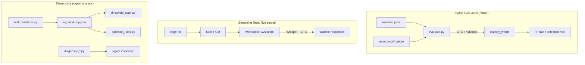

The recitation system has three testing layers: batch evaluation against 78 real-world recordings, automated streaming tests using TTS audio through the live WebSocket server, and a suite of diagnostic scripts for signal analysis and threshold tuning. All test data comes from real readings with intentional errors -- not synthetic lab audio.

## Test Architecture



| Layer | Mode | Models used | Requires server |
|---|---|---|---|
| Batch evaluation | Offline | CTC + Whisper | No |
| Streaming tests | Live | CTC + Whisper | Yes |
| Diagnostics | Offline | CTC only (mostly) | No |

---

## Batch Evaluation

**`evaluate.py`** runs all 78 recordings through the production scoring pipeline offline. It loads each `.webm` file, decodes it through `RecitationEngine`, scores it against the expected phrase with CTC + Whisper, then calls `classify_words` (the same function as production, with `streaming=False`).

```
python recitation/evaluate.py [--verbose]
```

`evaluate.py` reads the manifest to determine which phrase each recording targets and what errors -- if any -- were intentionally made. It parses the free-text `notes` field to extract structured expected errors (word index + error type). Notes that are unparseable are tracked but not counted against detection rate.

**Current metrics (reference baseline):**

| Metric | Value |
|---|---|
| False positive rate | 1.8% |
| Detection rate | 76% |

The FP rate is the primary constraint. Detection rate is lower than the 90% target because CTC alone struggles with subtle diacritic differences in natural speech -- see the diagnostic scripts for signal analysis.

### How notes are parsed

`evaluate.py` converts English-language notes into structured `(word_idx, error_type)` pairs using `parse_note_errors`. Notes like `"sukoon on the ending of kalam and wad3"` are treated as correct (pausal form is always acceptable). Notes referencing specific vowel changes like `"kasra on the kaf in murakab"` map to `(word_idx, "tashkeel")` using `_TRANSLIT_MAP`, a hardcoded transliteration index for Ajrumiyyah phrases.

---

## Test Data

The **manifest** at `recitation/test_data/manifest.jsonl` has one JSON object per line:

```jsonl
{"file": "recordings/20260327_113121_p2.webm", "phrase_idx": 2, "notes": "correct reading", "timestamp": "20260327_113121"}
{"file": "recordings/20260327_113158_p2.webm", "phrase_idx": 2, "notes": "sukoon on the ending of kalam, lafth, and wad3. kasra on the kaf in murakab.", "timestamp": "20260327_113158"}
```

| Field | Type | Description |
|---|---|---|
| `file` | string | Path relative to `recitation/test_data/` |
| `phrase_idx` | int | Index into the passage's `phrases` array |
| `notes` | string | Free-text description of what was said |
| `timestamp` | string | Recording timestamp (`YYYYMMDD_HHMMSS`) |

Note: `passage_id` is not present in all entries -- `evaluate.py` defaults to `"ajrumiyyah"` when absent.

### Directory layout

```
recitation/test_data/
  manifest.jsonl          -- 78 recording entries
  recordings/             -- .webm audio files (browser MediaRecorder output)
  sessions/               -- full session captures
    20260401_104623_ajrumiyyah/
      audio.raw           -- raw f32le PCM @ 16kHz
      meta.json           -- passage_id, phrases array, timestamp
      scores.json         -- per-phrase scoring results
```

The 78 recordings cover all 17 phrases of the Ajrumiyyah passage. Each phrase has multiple takes: at least one correct reading and several with intentional i3rab or tashkeel errors.

### Adding recordings

Open `record.html` in a browser, select a passage and phrase, record a take, and click save. The page writes a new `.webm` into `recordings/` and appends an entry to `manifest.jsonl`. Fill in the `notes` field accurately -- the batch evaluator depends on it.

### Data quality

The recordings are real-world audio from a single speaker on a laptop microphone. Some entries have background noise, slight mispronunciations not reflected in the notes, or imprecise descriptions of what was said. Treat the dataset as realistic rather than lab-perfect.

---

## Streaming Tests

**`test_streaming.py`** generates Arabic speech via `edge-tts`, streams it through the live WebSocket server, and validates the responses. It requires the server to be running at `ws://localhost:8000/ws/score` (the default).

```
# Start the server first
uvicorn recitation.server:app --host 0.0.0.0 --port 8000

# Run all 9 tests
python recitation/test_streaming.py [--verbose] [--server=ws://HOST:PORT/ws/score]
```

TTS audio is cached in `recitation/.tts_cache/` as raw f32le files keyed by a SHA-256 hash of the voice and text. Repeated runs skip generation if the cache file exists.

### Test scenarios

| Test function | What it validates |
|---|---|
| `test_correct_reading` | Full correct phrase → zero errors flagged |
| `test_correct_multi_phrase` | First 4 phrases correct → FP rate < 2% |
| `test_partial_phrase` | Trimmed audio (40% of phrase) → intermediate responses show fewer words |
| `test_wrong_diacritics` | Final damma swapped to kasra on multiple words → i3rab error detected |
| `test_tashkeel_error` | Internal fatha swapped to kasra on one word → tashkeel error detected |
| `test_latency` | Time to first scored response < 3 seconds |
| `test_second_phrase` | Audio of phrase 1 → `matched_phrase_idx` == 1 (cursor advanced) |
| `test_streaming_progressive` | At least one intermediate response received before `"done"` |
| `test_streaming_no_flicker` | No word changes status between consecutive intermediate responses |

The simulator sends audio in 1-second chunks at half real-time speed (0.5s delay per chunk). It collects both intermediate responses (during streaming) and the final response (after `"done"`).

---

## Mutation Tests

**`test_mutations.py`** scores correct audio against mutated reference text rather than generating new recordings. It takes a real `.webm` of a correct reading and scores it against three variants of the phrase:

1. **Correct reference** -- expects no errors (validates FP rate).
2. **I3rab mutation** -- the final diacritic (case ending) of one or more words is swapped to a different vowel.
3. **Tashkeel mutation** -- an internal diacritic is swapped.
4. **Word substitution** -- a word in the reference is replaced with a different word.

```
python recitation/test_mutations.py [--verbose] [--passage=ajrumiyyah]
```

Mutation generators use `generate_i3rab_alternatives` and `generate_tashkeel_alternatives` from `recitation/arabic.py`. The expected error type for each mutation kind maps as:

| Mutation kind | Expected `error_type` |
|---|---|
| `i3rab` | `"i3rab"` |
| `tashkeel` | `"tashkeel"` or `"diacritic"` |
| `word` | `"wrong"` or `"skipped"` |

---

## Tashkeel Measurement

**`measure_tashkeel.py`** measures tashkeel detection rate systematically across all phrases and all swappable words. For each phrase, it generates TTS audio for the correct text, then for each word with swappable internal diacritics, generates a modified version with exactly one diacritic changed. It scores both through the engine and records whether the changed word is flagged.

```
python recitation/measure_tashkeel.py [--verbose] [--passage PASSAGE_ID]
```

Like `test_streaming.py`, it caches TTS output in `recitation/.tts_cache/`. It also measures the FP rate by running the correct phrase through and checking that nothing is flagged. The TTS voice is `ar-SA-HamedNeural` (Microsoft Azure via `edge-tts`).

---

## Diagnostic Scripts

These scripts run offline against the mutation test infrastructure or cached signal data. They do not require a running server.

| Script | Purpose |
|---|---|
| `diagnostic_ctc.py` | Investigates why CTC scoring misses diacritic mutations -- compares full hypothesis scores, frame-level posteriors, and local ratio methods |
| `diagnostic_framescan.py` | Tests frame-scan diacritic signal at `eff < -1.5` -- alignment-independent scan of a wide frame region for diacritic evidence |
| `diagnostic_local_pd.py` | Analyzes `local_pd` signal values for correct and mutated words where `eff <= -1.5` |
| `diagnostic_local_pd2.py` | Deeper combo analysis of `local_pd` combined with existing signals at the same threshold |
| `diagnostic_lpd_extended.py` | Extends `local_pd` analysis to the `-1.5 < eff <= -1.0` range where the signal was previously not computed |
| `diagnostic_classifier.py` | Fits logistic regression and decision tree on the full signal vector -- shows the theoretical detection ceiling with the current model |
| `diagnostic_cv.py` | Cross-validated classifier ceiling and decision tree rule extraction from `signal_dump.json` |
| `diagnostic_rescored.py` | Analyzes windowed rescore signals (`pc`, `sf`, `i3d`, `tash_d`) -- checks if re-aligning words in a 3-word window improves signal discrimination |
| `diagnostic_rules.py` | Shows which classification rules catch mutations at `eff < -1.5` and what signals remain for uncaught cases |
| `diagnostic_fp_fix.py` | Checks the impact of tightening specific rules to fix known false positives |
| `analyze_misses.py` | Detailed signal vector analysis of tashkeel detection misses -- categorizes what separates caught from missed cases |
| `diagnose_tts.py` | Per-phrase, per-word TTS tashkeel detection breakdown -- helps diagnose why full-passage TTS detection is lower than mutation test detection |

---

## Threshold Tuning

Three scripts manage threshold search. They all operate on cached signal data from `signal_dump.json` (produced by `dump_signals.py`) rather than re-running the CTC model.

| Script | Role |
|---|---|
| `threshold_scan.py` | Scans individual and combined signal thresholds, optimizing `detection_rate - 5 * FP_rate` |
| `optimize_thresholds.py` | Tries many `classify_words` configurations on `signal_dump.json` to find the best FP/detection tradeoff |
| `optimize_rules.py` | Comprehensive rule optimization -- simulates the full classification rule set with configurable thresholds |

The system maintains **dual thresholds**: one set for streaming mode and a separate, typically looser set for batch evaluation mode. `classify_words` receives a `streaming` boolean that selects which thresholds apply. Threshold changes cascade -- a change to the CTC `eff` threshold affects which signals are even computed downstream, which changes what the rule optimizer sees. Always re-run `threshold_scan.py` after changing any upstream signal.

---

## Key Files

| Path | Purpose |
|---|---|
| `recitation/evaluate.py` | Batch evaluation harness -- runs all 78 recordings |
| `recitation/test_streaming.py` | TTS-based streaming test suite (9 tests) |
| `recitation/test_mutations.py` | Mutation test -- correct audio vs mutated reference text |
| `recitation/measure_tashkeel.py` | Systematic tashkeel detection measurement via TTS |
| `recitation/test_data/manifest.jsonl` | 78-entry recording index |
| `recitation/test_data/recordings/` | `.webm` audio files from browser recording |
| `recitation/test_data/sessions/` | Full session captures (raw PCM + meta + scores) |
| `recitation/threshold_scan.py` | Threshold search over combined signals |
| `recitation/optimize_thresholds.py` | Offline `classify_words` config optimizer |
| `recitation/optimize_rules.py` | Comprehensive classification rule optimizer |
| `recitation/dump_signals.py` | Produces `signal_dump.json` for offline threshold work |
| `recitation/arabic.py` | Diacritic constants and mutation generators |
| `recitation/server.py` | `classify_words` -- production classification function |

---

## Gotchas

- **Server must be running for streaming tests.** `test_streaming.py` connects to `ws://localhost:8000/ws/score`. It fails immediately if the server is not up. Start with `uvicorn recitation.server:app --host 0.0.0.0 --port 8000`.

- **`evaluate.py` uses CTC + Whisper, not CTC only.** Despite the docstring referencing CTC scoring, `score_with_whisper` also runs a Whisper transcription for wrong-word detection -- the same path as production. Whisper results are only trusted when at least 50% of phrase words match.

- **Threshold changes cascade.** The `eff` signal gates downstream computation. Changing the `eff` threshold changes which words enter the signal pipeline at all, making it impossible to optimize downstream signals in isolation. Always scan from the top of the signal chain.

- **Test data imperfections.** Some recordings have background noise, slight mispronunciations not reflected in the notes, or notes that don't fully capture what was said. A miss on a recording does not always mean the system is wrong.

- **`edge-tts` requires a network connection.** `test_streaming.py` and `measure_tashkeel.py` call Microsoft's TTS API for audio that is not already cached. Cached files persist in `recitation/.tts_cache/` across runs.

- **Sukoon on the final letter is always correct.** `classify_recording` and the scoring pipeline treat any final-letter sukoon (pausal/waqf form) as acceptable. Recordings noted as "sukoon on the ending of X" count as correct readings.

- **`manifest.jsonl` entries without `passage_id` default to `"ajrumiyyah"`.** All 78 current entries are from the Ajrumiyyah passage, but `evaluate.py` reads `passage_id` with a fallback for forward compatibility.

---

See also: [`../recitation/system.md`](../recitation/system.md) for the scoring pipeline, engine architecture, and error classification logic.
